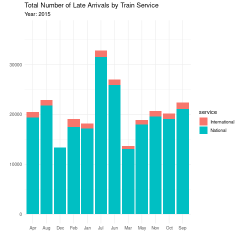

```r
library(tidyverse)     # for data cleaning and plotting
library(gardenR)       # for Lisa's garden data
library(lubridate)     # for date manipulation
library(openintro)     # for the abbr2state() function
library(palmerpenguins)# for Palmer penguin data
library(maps)          # for map data
library(ggmap)         # for mapping points on maps
library(gplots)        # for col2hex() function
library(RColorBrewer)  # for color palettes
library(sf)            # for working with spatial data
library(leaflet)       # for highly customizable mapping
library(ggthemes)      # for more themes (including theme_map())
library(plotly)        # for the ggplotly() - basic interactivity
library(gganimate)     # for adding animation layers to ggplots
library(transformr)    # for "tweening" (gganimate)
library(gifski)        # need the library for creating gifs but don't need to load each time
library(shiny)         # for creating interactive apps
theme_set(theme_minimal())
```


```r
# SNCF Train data
small_trains <- read_csv("https://raw.githubusercontent.com/rfordatascience/tidytuesday/master/data/2019/2019-02-26/small_trains.csv") 

# Lisa's garden data
data("garden_harvest")

# Lisa's Mallorca cycling data
mallorca_bike_day7 <- read_csv("https://www.dropbox.com/s/zc6jan4ltmjtvy0/mallorca_bike_day7.csv?dl=1") %>% 
  select(1:4, speed)

# Heather Lendway's Ironman 70.3 Pan Am championships Panama data
panama_swim <- read_csv("https://raw.githubusercontent.com/llendway/gps-data/master/data/panama_swim_20160131.csv")

panama_bike <- read_csv("https://raw.githubusercontent.com/llendway/gps-data/master/data/panama_bike_20160131.csv")

panama_run <- read_csv("https://raw.githubusercontent.com/llendway/gps-data/master/data/panama_run_20160131.csv")

#COVID-19 data from the New York Times
covid19 <- read_csv("https://raw.githubusercontent.com/nytimes/covid-19-data/master/us-states.csv")
```

## Put your homework on GitHub!

Go [here](https://github.com/llendway/github_for_collaboration/blob/master/github_for_collaboration.md) or to previous homework to remind yourself how to get set up. 

Once your repository is created, you should always open your **project** rather than just opening an .Rmd file. You can do that by either clicking on the .Rproj file in your repository folder on your computer. Or, by going to the upper right hand corner in R Studio and clicking the arrow next to where it says Project: (None). You should see your project come up in that list if you've used it recently. You could also go to File --> Open Project and navigate to your .Rproj file. 

## Instructions

* Put your name at the top of the document. 

* **For ALL graphs, you should include appropriate labels and alt text.** 

* Feel free to change the default theme, which I currently have set to `theme_minimal()`. 

* Use good coding practice. Read the short sections on good code with [pipes](https://style.tidyverse.org/pipes.html) and [ggplot2](https://style.tidyverse.org/ggplot2.html). **This is part of your grade!**

* **NEW!!** With animated graphs, add `eval=FALSE` to the code chunk that creates the animation and saves it using `anim_save()`. Add another code chunk to reread the gif back into the file. See the [tutorial](https://animation-and-interactivity-in-r.netlify.app/) for help. 

* When you are finished with ALL the exercises, uncomment the options at the top so your document looks nicer. Don't do it before then, or else you might miss some important warnings and messages.

## Warm-up exercises from tutorial

  1. Choose 2 graphs you have created for ANY assignment in this class and add interactivity using the `ggplotly()` function.


```r
lettuce_harvest_graph <- garden_harvest %>% 
  filter(vegetable %in% c("lettuce")) %>% 
  group_by(variety) %>% 
  ggplot(aes(y = fct_rev(fct_infreq(variety)))) +
  geom_bar(aes(text = variety)) +
  labs(title = "Harvests of Lettuce Varieties",
       x = "Number of Harvests",
       y = "")

ggplotly(lettuce_harvest_graph,
         tooltip = c("text", "x"))
```

```{=html}
<div id="htmlwidget-44cb077abd39802191f9" style="width:672px;height:480px;" class="plotly html-widget"></div>
<script type="application/json" data-for="htmlwidget-44cb077abd39802191f9">{"x":{"data":[{"orientation":"v","width":[27,29,1,3,9],"base":[3.55,4.55,0.55,1.55,2.55],"x":[13.5,14.5,0.5,1.5,4.5],"y":[0.9,0.9,0.9,0.9,0.9],"text":["count: 27<br />Farmer's Market Blend","count: 29<br />Lettuce Mixture","count:  1<br />mustard greens","count:  3<br />reseed","count:  9<br />Tatsoi"],"type":"bar","marker":{"autocolorscale":false,"color":"rgba(89,89,89,1)","line":{"width":1.88976377952756,"color":"transparent"}},"showlegend":false,"xaxis":"x","yaxis":"y","hoverinfo":"text","frame":null}],"layout":{"margin":{"t":43.7625570776256,"r":7.30593607305936,"b":40.1826484018265,"l":133.698630136986},"font":{"color":"rgba(0,0,0,1)","family":"","size":14.6118721461187},"title":{"text":"Harvests of Lettuce Varieties","font":{"color":"rgba(0,0,0,1)","family":"","size":17.5342465753425},"x":0,"xref":"paper"},"xaxis":{"domain":[0,1],"automargin":true,"type":"linear","autorange":false,"range":[-1.45,30.45],"tickmode":"array","ticktext":["0","10","20","30"],"tickvals":[0,10,20,30],"categoryorder":"array","categoryarray":["0","10","20","30"],"nticks":null,"ticks":"","tickcolor":null,"ticklen":3.65296803652968,"tickwidth":0,"showticklabels":true,"tickfont":{"color":"rgba(77,77,77,1)","family":"","size":11.689497716895},"tickangle":-0,"showline":false,"linecolor":null,"linewidth":0,"showgrid":true,"gridcolor":"rgba(235,235,235,1)","gridwidth":0.66417600664176,"zeroline":false,"anchor":"y","title":{"text":"Number of Harvests","font":{"color":"rgba(0,0,0,1)","family":"","size":14.6118721461187}},"hoverformat":".2f"},"yaxis":{"domain":[0,1],"automargin":true,"type":"linear","autorange":false,"range":[0.4,5.6],"tickmode":"array","ticktext":["mustard greens","reseed","Tatsoi","Farmer's Market Blend","Lettuce Mixture"],"tickvals":[1,2,3,4,5],"categoryorder":"array","categoryarray":["mustard greens","reseed","Tatsoi","Farmer's Market Blend","Lettuce Mixture"],"nticks":null,"ticks":"","tickcolor":null,"ticklen":3.65296803652968,"tickwidth":0,"showticklabels":true,"tickfont":{"color":"rgba(77,77,77,1)","family":"","size":11.689497716895},"tickangle":-0,"showline":false,"linecolor":null,"linewidth":0,"showgrid":true,"gridcolor":"rgba(235,235,235,1)","gridwidth":0.66417600664176,"zeroline":false,"anchor":"x","title":{"text":"","font":{"color":"rgba(0,0,0,1)","family":"","size":14.6118721461187}},"hoverformat":".2f"},"shapes":[{"type":"rect","fillcolor":null,"line":{"color":null,"width":0,"linetype":[]},"yref":"paper","xref":"paper","x0":0,"x1":1,"y0":0,"y1":1}],"showlegend":false,"legend":{"bgcolor":null,"bordercolor":null,"borderwidth":0,"font":{"color":"rgba(0,0,0,1)","family":"","size":11.689497716895}},"hovermode":"closest","barmode":"relative"},"config":{"doubleClick":"reset","showSendToCloud":false},"source":"A","attrs":{"65ec57e5ea82":{"y":{},"text":{},"type":"bar"}},"cur_data":"65ec57e5ea82","visdat":{"65ec57e5ea82":["function (y) ","x"]},"highlight":{"on":"plotly_click","persistent":false,"dynamic":false,"selectize":false,"opacityDim":0.2,"selected":{"opacity":1},"debounce":0},"shinyEvents":["plotly_hover","plotly_click","plotly_selected","plotly_relayout","plotly_brushed","plotly_brushing","plotly_clickannotation","plotly_doubleclick","plotly_deselect","plotly_afterplot","plotly_sunburstclick"],"base_url":"https://plot.ly"},"evals":[],"jsHooks":[]}</script>
```


```r
logged_covid_graph <- covid19 %>% 
  filter(state %in% c("Minnesota", 
                      "Wisconsin", 
                      "Iowa", 
                      "North Dakota", 
                      "South Dakota")) %>% 
  ggplot(aes(x = date,
             y = cases,
             colour = state)) +
  scale_y_log10() +
  geom_line() +
  labs(title = "Logged Cumulative Covid-19 Case Count Since 2020",
       x = "",
       y = "Log of Cases") +
  theme(legend.position = "none")

ggplotly(logged_covid_graph)
```

```{=html}
<div id="htmlwidget-959da309299219bed6a5" style="width:672px;height:480px;" class="plotly html-widget"></div>
<script type="application/json" data-for="htmlwidget-959da309299219bed6a5">{"x":{"data":[{"x":[18329,18330,18331,18332,18333,18334,18335,18336,18337,18338,18339,18340,18341,18342,18343,18344,18345,18346,18347,18348,18349,18350,18351,18352,18353,18354,18355,18356,18357,18358,18359,18360,18361,18362,18363,18364,18365,18366,18367,18368,18369,18370,18371,18372,18373,18374,18375,18376,18377,18378,18379,18380,18381,18382,18383,18384,18385,18386,18387,18388,18389,18390,18391,18392,18393,18394,18395,18396,18397,18398,18399,18400,18401,18402,18403,18404,18405,18406,18407,18408,18409,18410,18411,18412,18413,18414,18415,18416,18417,18418,18419,18420,18421,18422,18423,18424,18425,18426,18427,18428,18429,18430,18431,18432,18433,18434,18435,18436,18437,18438,18439,18440,18441,18442,18443,18444,18445,18446,18447,18448,18449,18450,18451,18452,18453,18454,18455,18456,18457,18458,18459,18460,18461,18462,18463,18464,18465,18466,18467,18468,18469,18470,18471,18472,18473,18474,18475,18476,18477,18478,18479,18480,18481,18482,18483,18484,18485,18486,18487,18488,18489,18490,18491,18492,18493,18494,18495,18496,18497,18498,18499,18500,18501,18502,18503,18504,18505,18506,18507,18508,18509,18510,18511,18512,18513,18514,18515,18516,18517,18518,18519,18520,18521,18522,18523,18524,18525,18526,18527,18528,18529,18530,18531,18532,18533,18534,18535,18536,18537,18538,18539,18540,18541,18542,18543,18544,18545,18546,18547,18548,18549,18550,18551,18552,18553,18554,18555,18556,18557,18558,18559,18560,18561,18562,18563,18564,18565,18566,18567,18568,18569,18570,18571,18572,18573,18574,18575,18576,18577,18578,18579,18580,18581,18582,18583,18584,18585,18586,18587,18588,18589,18590,18591,18592,18593,18594,18595,18596,18597,18598,18599,18600,18601,18602,18603,18604,18605,18606,18607,18608,18609,18610,18611,18612,18613,18614,18615,18616,18617,18618,18619,18620,18621,18622,18623,18624,18625,18626,18627,18628,18629,18630,18631,18632,18633,18634,18635,18636,18637,18638,18639,18640,18641,18642,18643,18644,18645,18646,18647,18648,18649,18650,18651,18652,18653,18654,18655,18656,18657,18658,18659,18660,18661,18662,18663,18664,18665,18666,18667,18668,18669,18670,18671,18672,18673,18674,18675,18676,18677,18678,18679,18680,18681,18682,18683,18684,18685,18686,18687,18688,18689,18690,18691,18692,18693,18694,18695,18696,18697,18698,18699,18700,18701,18702,18703,18704,18705,18706,18707,18708,18709,18710,18711,18712,18713,18714,18715,18716,18717,18718,18719,18720,18721,18722,18723,18724,18725,18726,18727,18728,18729,18730,18731,18732,18733,18734,18735,18736,18737,18738,18739,18740,18741,18742,18743,18744,18745,18746,18747,18748,18749,18750,18751,18752,18753,18754,18755,18756,18757,18758,18759,18760,18761,18762,18763,18764,18765,18766,18767,18768,18769,18770,18771,18772,18773,18774,18775,18776,18777,18778,18779,18780,18781,18782,18783,18784,18785,18786,18787,18788,18789,18790,18791,18792,18793,18794,18795,18796,18797,18798,18799,18800,18801,18802,18803,18804,18805,18806,18807,18808,18809,18810,18811,18812,18813,18814,18815,18816,18817,18818,18819,18820,18821,18822,18823,18824,18825,18826,18827,18828,18829,18830,18831,18832,18833,18834,18835,18836,18837,18838,18839,18840,18841,18842,18843,18844,18845,18846,18847,18848,18849,18850,18851,18852,18853,18854,18855,18856,18857,18858,18859,18860,18861,18862,18863,18864,18865,18866,18867,18868,18869,18870,18871,18872,18873,18874,18875,18876,18877,18878,18879,18880,18881,18882,18883,18884,18885,18886,18887,18888,18889,18890,18891,18892,18893,18894,18895,18896,18897,18898,18899,18900,18901,18902,18903,18904,18905,18906,18907,18908,18909,18910,18911,18912,18913,18914,18915,18916,18917,18918,18919,18920,18921,18922,18923,18924,18925,18926,18927,18928,18929,18930,18931,18932,18933,18934,18935,18936,18937,18938,18939,18940,18941,18942,18943,18944,18945,18946,18947,18948,18949,18950,18951,18952,18953,18954,18955,18956,18957,18958,18959,18960,18961,18962,18963,18964,18965,18966,18967,18968,18969,18970,18971,18972,18973,18974,18975,18976,18977,18978,18979,18980,18981,18982,18983,18984,18985,18986,18987,18988,18989,18990,18991,18992,18993,18994,18995,18996,18997,18998,18999,19000,19001,19002,19003,19004,19005,19006,19007,19008,19009,19010,19011,19012,19013,19014,19015,19016,19017,19018,19019,19020,19021,19022,19023,19024,19025,19026,19027,19028,19029,19030,19031,19032,19033,19034,19035,19036,19037,19038,19039,19040,19041,19042,19043,19044,19045,19046,19047,19048,19049,19050,19051,19052,19053,19054,19055,19056,19057,19058,19059,19060,19061,19062,19063,19064,19065,19066,19067,19068,19069,19070,19071,19072,19073,19074,19075,19076,19077,19078,19079,19080,19081],"y":[0.477121254719662,0.903089986991944,1.11394335230684,1.14612803567824,1.20411998265592,1.23044892137827,1.25527250510331,1.34242268082221,1.34242268082221,1.46239799789896,1.57978359661681,1.64345267648619,1.65321251377534,1.83250891270624,1.95424250943932,2.02118929906994,2.09342168516224,2.16731733474818,2.25285303097989,2.37291200297011,2.47421626407626,2.52633927738984,2.62736585659273,2.69722934275972,2.73957234445009,2.78816837114117,2.84447717574568,2.89542254603941,2.93851972517649,2.97589113640179,3.02036128264771,3.05880548667591,3.10380372095596,3.14238946611884,3.17897694729317,3.20057692675485,3.23299611039215,3.27852496473702,3.29994290002277,3.33061666729444,3.36772854608698,3.40019248859258,3.46463855909503,3.50174372962799,3.56122067893394,3.57564961475522,3.59538598080914,3.64923747234961,3.70833590268226,3.73957234445009,3.76849010517124,3.80454830838806,3.83524653999631,3.85400223312699,3.89669152656288,3.93656400513527,3.96232197272958,3.98690603138072,4.00479411038871,4.01720034352384,4.04371585806121,4.05907091309298,4.06710806905957,4.07769486588659,4.09247501292598,4.110993517378,4.12349230142265,4.13592733500547,4.14764541250174,4.15618557284098,4.16586726835294,4.17478641736734,4.18457787493202,4.20052219180211,4.2087100199064,4.21774707326279,4.22783530577559,4.24139704164965,4.24620304183788,4.25524837696186,4.26590220430176,4.27119083870129,4.27918767843215,4.28636663739959,4.29272113777454,4.29642384850378,4.30139898917356,4.30911893195556,4.32103889272605,4.32903157501084,4.33298351081623,4.33833694656107,4.34460838458057,4.34773971792005,4.35665675193585,4.36366837811077,4.37023543728318,4.37643095117788,4.37946868752591,4.38219721037745,4.38494449821624,4.3912174832394,4.39722718104316,4.4052438798633,4.40742489879441,4.41530729222557,4.41858299406699,4.42275394130135,4.42970384297257,4.43749688612982,4.44448199468561,4.45029530740263,4.45514952117983,4.46050695213822,4.4646683552929,4.47155572878716,4.48085457135213,4.48616117530454,4.49369500098879,4.49985197326719,4.50193518734897,4.50722150051566,4.51476019951882,4.52265285341277,4.53443227347588,4.5402668918263,4.54912592675811,4.55182801119153,4.55560223985133,4.56272099859894,4.57303414190742,4.5786735854795,4.58335749490251,4.58897721226055,4.59486747286269,4.59902017358505,4.6043124712485,4.61061758311221,4.6173568617094,4.62206888839004,4.62692519294668,4.63038718979553,4.63274065532786,4.63971552916208,4.64625664901382,4.65082215338993,4.65603108730464,4.66013471780159,4.66185999172781,4.6649332875498,4.67057979732887,4.67723271434346,4.68051680938126,4.68404602713643,4.6894775706267,4.69164721000077,4.69478940600594,4.69873542197285,4.70481946718017,4.70988025857601,4.71654587272709,4.719720651334,4.72287239000566,4.72591979564844,4.72868647836429,4.73665938999578,4.74296851931152,4.74815700486383,4.75159469981361,4.75542508997406,4.76046772007571,4.76984977048705,4.78876211389306,4.79815323506548,4.80506566605645,4.81022579511825,4.81459382751457,4.8185293976624,4.8225799405244,4.83054376146873,4.83731691932582,4.8431704645199,4.84639897303467,4.84841698480196,4.85136843759114,4.85487662739057,4.86062544432804,4.86569014305721,4.87042731674945,4.87317523127617,4.87546063063427,4.87922207620424,4.88468210420602,4.89134228793453,4.8967411070174,4.90192124937626,4.90531006211609,4.90851718764885,4.91208382576589,4.91884780293006,4.92424309334701,4.9295772865907,4.93403360846546,4.93763823409041,4.94079530012748,4.9456359679783,4.95059849258596,4.9565669913631,4.96134039797759,4.96521111142194,4.96728582285659,4.9697000679076,4.97270721594059,4.97865975736964,4.9856464848359,4.99132798998959,4.99606927207687,4.99974369063698,5.00195426455187,5.00659866366215,5.01243647699425,5.01800107107383,5.02426394852195,5.02815627887054,5.03073731444904,5.03388193566527,5.03826240710478,5.04314212729056,5.05015539662709,5.05536303904655,5.06051653177239,5.06534812884987,5.0689202004502,5.07500649428175,5.08246581303602,5.09072349694264,5.10027747204183,5.1099091192683,5.11759275348754,5.12286110449086,5.12896761563146,5.13771798123825,5.15471300078451,5.16514635391407,5.17793742400328,5.19196214143558,5.20387562327733,5.21438547852753,5.2264890622047,5.23905159771476,5.2525860640654,5.26377095110318,5.27024548986299,5.27783146119955,5.28599813038221,5.29563746096337,5.30443020490626,5.31369431145045,5.32056790808292,5.3256469991113,5.33201810188526,5.33802995844011,5.34495786365575,5.34893345329399,5.35230796284277,5.35637200687964,5.35924717448969,5.36292333124979,5.3674714689919,5.37320450115497,5.37789244430349,5.38297287945573,5.38629380882433,5.38861444607153,5.39090862492514,5.39135331134306,5.39581895486336,5.39972043590485,5.40416979893558,5.406555508204,5.40866217925277,5.40976748529236,5.41204537520958,5.41628094240931,5.4186492505196,5.42280151912571,5.42644456682888,5.42704607382133,5.42932584862183,5.43183640531466,5.43474769436656,5.43721290960729,5.43817197265157,5.43900566543229,5.43980463385875,5.44192910471367,5.44452881131714,5.44726193937617,5.44980534688916,5.45175574225018,5.45315774373568,5.45441034823449,5.45690628729077,5.45984162958218,5.46355855797207,5.46714767221426,5.46947149460749,5.47154253171199,5.47229119802627,5.4738867748484,5.47603996414551,5.47879873053849,5.48081007609906,5.48276928326568,5.48394086411219,5.48451479750667,5.48583779045807,5.48756538676512,5.48965900815622,5.49197767476417,5.4937298356749,5.49502370473856,5.4957385472391,5.49680100040051,5.49831331120613,5.49984373022144,5.5012291107535,5.50200217761592,5.50394041396089,5.50434578942408,5.50540369503213,5.50687558047395,5.5082710852602,5.50949285129722,5.51027282066973,5.51095498364919,5.51133513591006,5.51217591008966,5.51341738285851,5.51462876028335,5.51512112084348,5.51662129885426,5.51724737661557,5.51753633583928,5.51815319406862,5.51893224032077,5.51970464187508,5.52048615291076,5.52080700421368,5.52143231009469,5.52197447198739,5.52255768301109,5.52369705325112,5.52461029526283,5.52533251283734,5.52613242123833,5.52668812388431,5.52692698666235,5.52748811988799,5.52826862994268,5.52892826417795,5.52967156208321,5.53035468420962,5.53085384978562,5.53105974838113,5.53164238537275,5.53261553539746,5.53323552970647,5.53381906840859,5.53446145213191,5.53492044074901,5.53514975327805,5.53567759858378,5.53637029171091,5.53689665654351,5.53764282386375,5.53820160924394,5.53862902240894,5.53880614984443,5.53934964325474,5.54031070084841,5.54106727350939,5.54219281286234,5.54289386339056,5.54351427619178,5.54371301864337,5.54433970363012,5.54500510876556,5.54580422894781,5.54671165997958,5.54742269811965,5.54802930201552,5.54821984432852,5.54879342502321,5.54968606404806,5.55001788332905,5.55078340580059,5.55153904361086,5.55207049800556,5.55269132920907,5.55290780271114,5.55356628865754,5.55436194215204,5.55494078518723,5.55540886555887,5.55601891040967,5.55631818334042,5.55671126897291,5.55724486175327,5.55801218156555,5.55857778261375,5.55910908843578,5.55958587046985,5.55981449219218,5.56009561566687,5.56054025645185,5.56114075471579,5.56166893619109,5.56210363742287,5.56256406508174,5.56290995689084,5.56318433479735,5.56363057087986,5.56415218049211,5.56460215791003,5.56501146906489,5.56533178752209,5.56551134617117,5.56574041192063,5.5660719889377,5.56651644765059,5.56681799606279,5.56709109357517,5.56729698028764,5.56745926786275,5.5676015136093,5.56783770320076,5.56818646480362,5.56843054870356,5.56862759329483,5.56880813900041,5.56893471070834,5.56904718793354,5.5692275593249,5.56941604935317,5.56953542307802,5.56967348116927,5.56976120714953,5.56982318949156,5.56986996276081,5.56992725315139,5.57011660841922,5.57026382768121,5.57038296863802,5.57049156867923,5.57057679485255,5.57061765078556,5.57072152427695,5.57083237306949,5.5709315295914,5.57105865012812,5.57115542338692,5.57121604143142,5.57129996014278,5.57141998233733,5.57151900480446,5.57160286500027,5.57169369527611,5.57176588015174,5.57182641305557,5.57187180719717,5.57196839945093,5.57207427711821,5.57214174612124,5.57223246377475,5.57232432516362,5.57238710531455,5.57245452574002,5.57256377110384,5.57271016328689,5.57282515110873,5.57293430329442,5.57301092567339,5.57308057065259,5.57311190724988,5.57320242249843,5.57331379998984,5.57331379998984,5.57331379998984,5.57365007946322,5.57365007946322,5.57365007946322,5.57397104138377,5.57435310542386,5.57440286478337,5.57440286478337,5.57487124900491,5.57487124900491,5.57487124900491,5.5754164823593,5.57596449099896,5.57602559436539,5.57602559436539,5.576686805201,5.576686805201,5.576686805201,5.57736080238176,5.57844551040007,5.57854294405832,5.57854294405832,5.57955152994131,5.57955152994131,5.57955152994131,5.58105034443693,5.5825190193099,5.5825190193099,5.5825190193099,5.58432783142864,5.58432783142864,5.58432783142864,5.58608746597891,5.58801721978557,5.58801721978557,5.58801721978557,5.5901984957226,5.5901984957226,5.5901984957226,5.59215232070173,5.59435939685948,5.59435939685948,5.59435939685948,5.59678066993305,5.59678066993305,5.59678066993305,5.59936116875151,5.60214901257239,5.60214901257239,5.60214901257239,5.60500859018614,5.60500859018614,5.60500859018614,5.60718363843029,5.61107509923762,5.61107509923762,5.61107509923762,5.61445109725614,5.61445109725614,5.61445109725614,5.61782199543704,5.62029433011301,5.62029433011301,5.62029433011301,5.62445536642759,5.62445536642759,5.62445536642759,5.62858712747573,5.63253624764025,5.63253624764025,5.63253624764025,5.63772882585303,5.63772882585303,5.63772882585303,5.64134717484665,5.64461876952419,5.64461876952419,5.64461876952419,5.64901145185072,5.64901145185072,5.64901145185072,5.65228309488305,5.65519319858292,5.65519319858292,5.65519319858292,5.65856369698232,5.65856369698232,5.65856369698232,5.66172562868087,5.6643871523169,5.6643871523169,5.6643871523169,5.66726331626771,5.66726331626771,5.66726331626771,5.66974352567997,5.67198233872187,5.67198233872187,5.67198233872187,5.67424645010163,5.67424645010163,5.67424645010163,5.67597620294138,5.67825699533229,5.67825699533229,5.67825699533229,5.68047421163144,5.68047421163144,5.68047421163144,5.68233193628888,5.6846084091159,5.6846084091159,5.6846084091159,5.68675420977235,5.68675420977235,5.68675420977235,5.68920671241793,5.69149082735495,5.69149082735495,5.69149082735495,5.69408461102868,5.69408461102868,5.69408461102868,5.69692226302069,5.69938152047702,5.69938152047702,5.69938152047702,5.70205467465227,5.70205467465227,5.70205467465227,5.70461203127827,5.70736660607893,5.70736660607893,5.70736660607893,5.71065630072484,5.71065630072484,5.71065630072484,5.71341241346154,5.71626885023864,5.71626885023864,5.71626885023864,5.71626885023864,5.71838375733774,5.71838375733774,5.72053800847616,5.7243250322311,5.7243250322311,5.7243250322311,5.72804763859227,5.72804763859227,5.72804763859227,5.73137760968048,5.73434610283899,5.73434610283899,5.73703671413264,5.7374208657252,5.7374208657252,5.7374208657252,5.74007991122638,5.74304464819515,5.74304464819515,5.74304464819515,5.74587780596748,5.74587780596748,5.74587780596748,5.74846015131034,5.75124445144544,5.75124445144544,5.75124445144544,5.75124445144544,5.75124445144544,5.75434604189608,5.7562328105824,5.7600460826037,5.7600460826037,5.7600460826037,5.7600460826037,5.7600460826037,5.7600460826037,5.76892359115647,5.77546189607431,5.77546189607431,5.77546189607431,5.78390357927274,5.78390357927274,5.78390357927274,5.79173344491373,5.80023647726358,5.80023647726358,5.80023647726358,5.80983569009047,5.80983569009047,5.80983569009047,5.81766186872292,5.82588354137952,5.82588354137952,5.82588354137952,5.83401546990115,5.83401546990115,5.83401546990115,5.84130564964825,5.84718137113295,5.84718137113295,5.84718137113295,5.85265562779581,5.85265562779581,5.85265562779581,5.85715331299836,5.85889134600081,5.86028528900682,5.86028528900682,5.86314434625267,5.86314434625267,5.86314434625267,5.86519461600799,5.86653661755853,5.86729243839132,5.86729243839132,5.86897693716561,5.86897693716561,5.86897693716561,5.87019782990199,5.87115536853151,5.87144040881209,5.87144040881209,5.87246512407649,5.87246512407649,5.87246512407649,5.87321884754742,5.87372912316484,5.87393469123655,5.87393469123655,5.87439425417739,5.87439425417739,5.87439425417739,5.87741339091296,5.87766557572788,5.87795960638336,5.87795960638336,5.87826148549273,5.87826148549273,5.87826148549273,5.87850341227693,5.87866940755779,5.87872797898268,5.87872797898268,5.87896849837064,5.87896849837064,5.87896849837064,5.879105632371,5.87924788464961,5.87928745462063,5.87928745462063,5.87941187581857,5.87941187581857,5.87941187581857,5.879558612614,5.87966061132904,5.8797058727475,5.8797058727475,5.8798376196458,5.8798376196458,5.8798376196458,5.87993439950934,5.87993439950934],"text":["date: 2020-03-08<br />cases:       3<br />state: Iowa","date: 2020-03-09<br />cases:       8<br />state: Iowa","date: 2020-03-10<br />cases:      13<br />state: Iowa","date: 2020-03-11<br />cases:      14<br />state: Iowa","date: 2020-03-12<br />cases:      16<br />state: Iowa","date: 2020-03-13<br />cases:      17<br />state: Iowa","date: 2020-03-14<br />cases:      18<br />state: Iowa","date: 2020-03-15<br />cases:      22<br />state: Iowa","date: 2020-03-16<br />cases:      22<br />state: Iowa","date: 2020-03-17<br />cases:      29<br />state: Iowa","date: 2020-03-18<br />cases:      38<br />state: Iowa","date: 2020-03-19<br />cases:      44<br />state: Iowa","date: 2020-03-20<br />cases:      45<br />state: Iowa","date: 2020-03-21<br />cases:      68<br />state: Iowa","date: 2020-03-22<br />cases:      90<br />state: Iowa","date: 2020-03-23<br />cases:     105<br />state: Iowa","date: 2020-03-24<br />cases:     124<br />state: Iowa","date: 2020-03-25<br />cases:     147<br />state: Iowa","date: 2020-03-26<br />cases:     179<br />state: Iowa","date: 2020-03-27<br />cases:     236<br />state: Iowa","date: 2020-03-28<br />cases:     298<br />state: Iowa","date: 2020-03-29<br />cases:     336<br />state: Iowa","date: 2020-03-30<br />cases:     424<br />state: Iowa","date: 2020-03-31<br />cases:     498<br />state: Iowa","date: 2020-04-01<br />cases:     549<br />state: Iowa","date: 2020-04-02<br />cases:     614<br />state: Iowa","date: 2020-04-03<br />cases:     699<br />state: Iowa","date: 2020-04-04<br />cases:     786<br />state: Iowa","date: 2020-04-05<br />cases:     868<br />state: Iowa","date: 2020-04-06<br />cases:     946<br />state: Iowa","date: 2020-04-07<br />cases:    1048<br />state: Iowa","date: 2020-04-08<br />cases:    1145<br />state: Iowa","date: 2020-04-09<br />cases:    1270<br />state: Iowa","date: 2020-04-10<br />cases:    1388<br />state: Iowa","date: 2020-04-11<br />cases:    1510<br />state: Iowa","date: 2020-04-12<br />cases:    1587<br />state: Iowa","date: 2020-04-13<br />cases:    1710<br />state: Iowa","date: 2020-04-14<br />cases:    1899<br />state: Iowa","date: 2020-04-15<br />cases:    1995<br />state: Iowa","date: 2020-04-16<br />cases:    2141<br />state: Iowa","date: 2020-04-17<br />cases:    2332<br />state: Iowa","date: 2020-04-18<br />cases:    2513<br />state: Iowa","date: 2020-04-19<br />cases:    2915<br />state: Iowa","date: 2020-04-20<br />cases:    3175<br />state: Iowa","date: 2020-04-21<br />cases:    3641<br />state: Iowa","date: 2020-04-22<br />cases:    3764<br />state: Iowa","date: 2020-04-23<br />cases:    3939<br />state: Iowa","date: 2020-04-24<br />cases:    4459<br />state: Iowa","date: 2020-04-25<br />cases:    5109<br />state: Iowa","date: 2020-04-26<br />cases:    5490<br />state: Iowa","date: 2020-04-27<br />cases:    5868<br />state: Iowa","date: 2020-04-28<br />cases:    6376<br />state: Iowa","date: 2020-04-29<br />cases:    6843<br />state: Iowa","date: 2020-04-30<br />cases:    7145<br />state: Iowa","date: 2020-05-01<br />cases:    7883<br />state: Iowa","date: 2020-05-02<br />cases:    8641<br />state: Iowa","date: 2020-05-03<br />cases:    9169<br />state: Iowa","date: 2020-05-04<br />cases:    9703<br />state: Iowa","date: 2020-05-05<br />cases:   10111<br />state: Iowa","date: 2020-05-06<br />cases:   10404<br />state: Iowa","date: 2020-05-07<br />cases:   11059<br />state: Iowa","date: 2020-05-08<br />cases:   11457<br />state: Iowa","date: 2020-05-09<br />cases:   11671<br />state: Iowa","date: 2020-05-10<br />cases:   11959<br />state: Iowa","date: 2020-05-11<br />cases:   12373<br />state: Iowa","date: 2020-05-12<br />cases:   12912<br />state: Iowa","date: 2020-05-13<br />cases:   13289<br />state: Iowa","date: 2020-05-14<br />cases:   13675<br />state: Iowa","date: 2020-05-15<br />cases:   14049<br />state: Iowa","date: 2020-05-16<br />cases:   14328<br />state: Iowa","date: 2020-05-17<br />cases:   14651<br />state: Iowa","date: 2020-05-18<br />cases:   14955<br />state: Iowa","date: 2020-05-19<br />cases:   15296<br />state: Iowa","date: 2020-05-20<br />cases:   15868<br />state: Iowa","date: 2020-05-21<br />cases:   16170<br />state: Iowa","date: 2020-05-22<br />cases:   16510<br />state: Iowa","date: 2020-05-23<br />cases:   16898<br />state: Iowa","date: 2020-05-24<br />cases:   17434<br />state: Iowa","date: 2020-05-25<br />cases:   17628<br />state: Iowa","date: 2020-05-26<br />cases:   17999<br />state: Iowa","date: 2020-05-27<br />cases:   18446<br />state: Iowa","date: 2020-05-28<br />cases:   18672<br />state: Iowa","date: 2020-05-29<br />cases:   19019<br />state: Iowa","date: 2020-05-30<br />cases:   19336<br />state: Iowa","date: 2020-05-31<br />cases:   19621<br />state: Iowa","date: 2020-06-01<br />cases:   19789<br />state: Iowa","date: 2020-06-02<br />cases:   20017<br />state: Iowa","date: 2020-06-03<br />cases:   20376<br />state: Iowa","date: 2020-06-04<br />cases:   20943<br />state: Iowa","date: 2020-06-05<br />cases:   21332<br />state: Iowa","date: 2020-06-06<br />cases:   21527<br />state: Iowa","date: 2020-06-07<br />cases:   21794<br />state: Iowa","date: 2020-06-08<br />cases:   22111<br />state: Iowa","date: 2020-06-09<br />cases:   22271<br />state: Iowa","date: 2020-06-10<br />cases:   22733<br />state: Iowa","date: 2020-06-11<br />cases:   23103<br />state: Iowa","date: 2020-06-12<br />cases:   23455<br />state: Iowa","date: 2020-06-13<br />cases:   23792<br />state: Iowa","date: 2020-06-14<br />cases:   23959<br />state: Iowa","date: 2020-06-15<br />cases:   24110<br />state: Iowa","date: 2020-06-16<br />cases:   24263<br />state: Iowa","date: 2020-06-17<br />cases:   24616<br />state: Iowa","date: 2020-06-18<br />cases:   24959<br />state: Iowa","date: 2020-06-19<br />cases:   25424<br />state: Iowa","date: 2020-06-20<br />cases:   25552<br />state: Iowa","date: 2020-06-21<br />cases:   26020<br />state: Iowa","date: 2020-06-22<br />cases:   26217<br />state: Iowa","date: 2020-06-23<br />cases:   26470<br />state: Iowa","date: 2020-06-24<br />cases:   26897<br />state: Iowa","date: 2020-06-25<br />cases:   27384<br />state: Iowa","date: 2020-06-26<br />cases:   27828<br />state: Iowa","date: 2020-06-27<br />cases:   28203<br />state: Iowa","date: 2020-06-28<br />cases:   28520<br />state: Iowa","date: 2020-06-29<br />cases:   28874<br />state: Iowa","date: 2020-06-30<br />cases:   29152<br />state: Iowa","date: 2020-07-01<br />cases:   29618<br />state: Iowa","date: 2020-07-02<br />cases:   30259<br />state: Iowa","date: 2020-07-03<br />cases:   30631<br />state: Iowa","date: 2020-07-04<br />cases:   31167<br />state: Iowa","date: 2020-07-05<br />cases:   31612<br />state: Iowa","date: 2020-07-06<br />cases:   31764<br />state: Iowa","date: 2020-07-07<br />cases:   32153<br />state: Iowa","date: 2020-07-08<br />cases:   32716<br />state: Iowa","date: 2020-07-09<br />cases:   33316<br />state: Iowa","date: 2020-07-10<br />cases:   34232<br />state: Iowa","date: 2020-07-11<br />cases:   34695<br />state: Iowa","date: 2020-07-12<br />cases:   35410<br />state: Iowa","date: 2020-07-13<br />cases:   35631<br />state: Iowa","date: 2020-07-14<br />cases:   35942<br />state: Iowa","date: 2020-07-15<br />cases:   36536<br />state: Iowa","date: 2020-07-16<br />cases:   37414<br />state: Iowa","date: 2020-07-17<br />cases:   37903<br />state: Iowa","date: 2020-07-18<br />cases:   38314<br />state: Iowa","date: 2020-07-19<br />cases:   38813<br />state: Iowa","date: 2020-07-20<br />cases:   39343<br />state: Iowa","date: 2020-07-21<br />cases:   39721<br />state: Iowa","date: 2020-07-22<br />cases:   40208<br />state: Iowa","date: 2020-07-23<br />cases:   40796<br />state: Iowa","date: 2020-07-24<br />cases:   41434<br />state: Iowa","date: 2020-07-25<br />cases:   41886<br />state: Iowa","date: 2020-07-26<br />cases:   42357<br />state: Iowa","date: 2020-07-27<br />cases:   42696<br />state: Iowa","date: 2020-07-28<br />cases:   42928<br />state: Iowa","date: 2020-07-29<br />cases:   43623<br />state: Iowa","date: 2020-07-30<br />cases:   44285<br />state: Iowa","date: 2020-07-31<br />cases:   44753<br />state: Iowa","date: 2020-08-01<br />cases:   45293<br />state: Iowa","date: 2020-08-02<br />cases:   45723<br />state: Iowa","date: 2020-08-03<br />cases:   45905<br />state: Iowa","date: 2020-08-04<br />cases:   46231<br />state: Iowa","date: 2020-08-05<br />cases:   46836<br />state: Iowa","date: 2020-08-06<br />cases:   47559<br />state: Iowa","date: 2020-08-07<br />cases:   47920<br />state: Iowa","date: 2020-08-08<br />cases:   48311<br />state: Iowa","date: 2020-08-09<br />cases:   48919<br />state: Iowa","date: 2020-08-10<br />cases:   49164<br />state: Iowa","date: 2020-08-11<br />cases:   49521<br />state: Iowa","date: 2020-08-12<br />cases:   49973<br />state: Iowa","date: 2020-08-13<br />cases:   50678<br />state: Iowa","date: 2020-08-14<br />cases:   51272<br />state: Iowa","date: 2020-08-15<br />cases:   52065<br />state: Iowa","date: 2020-08-16<br />cases:   52447<br />state: Iowa","date: 2020-08-17<br />cases:   52829<br />state: Iowa","date: 2020-08-18<br />cases:   53201<br />state: Iowa","date: 2020-08-19<br />cases:   53541<br />state: Iowa","date: 2020-08-20<br />cases:   54533<br />state: Iowa","date: 2020-08-21<br />cases:   55331<br />state: Iowa","date: 2020-08-22<br />cases:   55996<br />state: Iowa","date: 2020-08-23<br />cases:   56441<br />state: Iowa","date: 2020-08-24<br />cases:   56941<br />state: Iowa","date: 2020-08-25<br />cases:   57606<br />state: Iowa","date: 2020-08-26<br />cases:   58864<br />state: Iowa","date: 2020-08-27<br />cases:   61484<br />state: Iowa","date: 2020-08-28<br />cases:   62828<br />state: Iowa","date: 2020-08-29<br />cases:   63836<br />state: Iowa","date: 2020-08-30<br />cases:   64599<br />state: Iowa","date: 2020-08-31<br />cases:   65252<br />state: Iowa","date: 2020-09-01<br />cases:   65846<br />state: Iowa","date: 2020-09-02<br />cases:   66463<br />state: Iowa","date: 2020-09-03<br />cases:   67693<br />state: Iowa","date: 2020-09-04<br />cases:   68757<br />state: Iowa","date: 2020-09-05<br />cases:   69690<br />state: Iowa","date: 2020-09-06<br />cases:   70210<br />state: Iowa","date: 2020-09-07<br />cases:   70537<br />state: Iowa","date: 2020-09-08<br />cases:   71018<br />state: Iowa","date: 2020-09-09<br />cases:   71594<br />state: Iowa","date: 2020-09-10<br />cases:   72548<br />state: Iowa","date: 2020-09-11<br />cases:   73399<br />state: Iowa","date: 2020-09-12<br />cases:   74204<br />state: Iowa","date: 2020-09-13<br />cases:   74675<br />state: Iowa","date: 2020-09-14<br />cases:   75069<br />state: Iowa","date: 2020-09-15<br />cases:   75722<br />state: Iowa","date: 2020-09-16<br />cases:   76680<br />state: Iowa","date: 2020-09-17<br />cases:   77865<br />state: Iowa","date: 2020-09-18<br />cases:   78839<br />state: Iowa","date: 2020-09-19<br />cases:   79785<br />state: Iowa","date: 2020-09-20<br />cases:   80410<br />state: Iowa","date: 2020-09-21<br />cases:   81006<br />state: Iowa","date: 2020-09-22<br />cases:   81674<br />state: Iowa","date: 2020-09-23<br />cases:   82956<br />state: Iowa","date: 2020-09-24<br />cases:   83993<br />state: Iowa","date: 2020-09-25<br />cases:   85031<br />state: Iowa","date: 2020-09-26<br />cases:   85908<br />state: Iowa","date: 2020-09-27<br />cases:   86624<br />state: Iowa","date: 2020-09-28<br />cases:   87256<br />state: Iowa","date: 2020-09-29<br />cases:   88234<br />state: Iowa","date: 2020-09-30<br />cases:   89248<br />state: Iowa","date: 2020-10-01<br />cases:   90483<br />state: Iowa","date: 2020-10-02<br />cases:   91483<br />state: Iowa","date: 2020-10-03<br />cases:   92302<br />state: Iowa","date: 2020-10-04<br />cases:   92744<br />state: Iowa","date: 2020-10-05<br />cases:   93261<br />state: Iowa","date: 2020-10-06<br />cases:   93909<br />state: Iowa","date: 2020-10-07<br />cases:   95205<br />state: Iowa","date: 2020-10-08<br />cases:   96749<br />state: Iowa","date: 2020-10-09<br />cases:   98023<br />state: Iowa","date: 2020-10-10<br />cases:   99099<br />state: Iowa","date: 2020-10-11<br />cases:   99941<br />state: Iowa","date: 2020-10-12<br />cases:  100451<br />state: Iowa","date: 2020-10-13<br />cases:  101531<br />state: Iowa","date: 2020-10-14<br />cases:  102905<br />state: Iowa","date: 2020-10-15<br />cases:  104232<br />state: Iowa","date: 2020-10-16<br />cases:  105746<br />state: Iowa","date: 2020-10-17<br />cases:  106698<br />state: Iowa","date: 2020-10-18<br />cases:  107334<br />state: Iowa","date: 2020-10-19<br />cases:  108114<br />state: Iowa","date: 2020-10-20<br />cases:  109210<br />state: Iowa","date: 2020-10-21<br />cases:  110444<br />state: Iowa","date: 2020-10-22<br />cases:  112242<br />state: Iowa","date: 2020-10-23<br />cases:  113596<br />state: Iowa","date: 2020-10-24<br />cases:  114952<br />state: Iowa","date: 2020-10-25<br />cases:  116238<br />state: Iowa","date: 2020-10-26<br />cases:  117198<br />state: Iowa","date: 2020-10-27<br />cases:  118852<br />state: Iowa","date: 2020-10-28<br />cases:  120911<br />state: Iowa","date: 2020-10-29<br />cases:  123232<br />state: Iowa","date: 2020-10-30<br />cases:  125973<br />state: Iowa","date: 2020-10-31<br />cases:  128798<br />state: Iowa","date: 2020-11-01<br />cases:  131097<br />state: Iowa","date: 2020-11-02<br />cases:  132697<br />state: Iowa","date: 2020-11-03<br />cases:  134576<br />state: Iowa","date: 2020-11-04<br />cases:  137315<br />state: Iowa","date: 2020-11-05<br />cases:  142795<br />state: Iowa","date: 2020-11-06<br />cases:  146267<br />state: Iowa","date: 2020-11-07<br />cases:  150639<br />state: Iowa","date: 2020-11-08<br />cases:  155583<br />state: Iowa","date: 2020-11-09<br />cases:  159910<br />state: Iowa","date: 2020-11-10<br />cases:  163827<br />state: Iowa","date: 2020-11-11<br />cases:  168457<br />state: Iowa","date: 2020-11-12<br />cases:  173401<br />state: Iowa","date: 2020-11-13<br />cases:  178890<br />state: Iowa","date: 2020-11-14<br />cases:  183557<br />state: Iowa","date: 2020-11-15<br />cases:  186314<br />state: Iowa","date: 2020-11-16<br />cases:  189597<br />state: Iowa","date: 2020-11-17<br />cases:  193196<br />state: Iowa","date: 2020-11-18<br />cases:  197532<br />state: Iowa","date: 2020-11-19<br />cases:  201572<br />state: Iowa","date: 2020-11-20<br />cases:  205918<br />state: Iowa","date: 2020-11-21<br />cases:  209203<br />state: Iowa","date: 2020-11-22<br />cases:  211664<br />state: Iowa","date: 2020-11-23<br />cases:  214792<br />state: Iowa","date: 2020-11-24<br />cases:  217786<br />state: Iowa","date: 2020-11-25<br />cases:  221288<br />state: Iowa","date: 2020-11-26<br />cases:  223323<br />state: Iowa","date: 2020-11-27<br />cases:  225065<br />state: Iowa","date: 2020-11-28<br />cases:  227181<br />state: Iowa","date: 2020-11-29<br />cases:  228690<br />state: Iowa","date: 2020-11-30<br />cases:  230634<br />state: Iowa","date: 2020-12-01<br />cases:  233062<br />state: Iowa","date: 2020-12-02<br />cases:  236159<br />state: Iowa","date: 2020-12-03<br />cases:  238722<br />state: Iowa","date: 2020-12-04<br />cases:  241531<br />state: Iowa","date: 2020-12-05<br />cases:  243385<br />state: Iowa","date: 2020-12-06<br />cases:  244689<br />state: Iowa","date: 2020-12-07<br />cases:  245985<br />state: Iowa","date: 2020-12-08<br />cases:  246237<br />state: Iowa","date: 2020-12-09<br />cases:  248782<br />state: Iowa","date: 2020-12-10<br />cases:  251027<br />state: Iowa","date: 2020-12-11<br />cases:  253612<br />state: Iowa","date: 2020-12-12<br />cases:  255009<br />state: Iowa","date: 2020-12-13<br />cases:  256249<br />state: Iowa","date: 2020-12-14<br />cases:  256902<br />state: Iowa","date: 2020-12-15<br />cases:  258253<br />state: Iowa","date: 2020-12-16<br />cases:  260784<br />state: Iowa","date: 2020-12-17<br />cases:  262210<br />state: Iowa","date: 2020-12-18<br />cases:  264729<br />state: Iowa","date: 2020-12-19<br />cases:  266959<br />state: Iowa","date: 2020-12-20<br />cases:  267329<br />state: Iowa","date: 2020-12-21<br />cases:  268736<br />state: Iowa","date: 2020-12-22<br />cases:  270294<br />state: Iowa","date: 2020-12-23<br />cases:  272112<br />state: Iowa","date: 2020-12-24<br />cases:  273661<br />state: Iowa","date: 2020-12-25<br />cases:  274266<br />state: Iowa","date: 2020-12-26<br />cases:  274793<br />state: Iowa","date: 2020-12-27<br />cases:  275299<br />state: Iowa","date: 2020-12-28<br />cases:  276649<br />state: Iowa","date: 2020-12-29<br />cases:  278310<br />state: Iowa","date: 2020-12-30<br />cases:  280067<br />state: Iowa","date: 2020-12-31<br />cases:  281712<br />state: Iowa","date: 2021-01-01<br />cases:  282980<br />state: Iowa","date: 2021-01-02<br />cases:  283895<br />state: Iowa","date: 2021-01-03<br />cases:  284715<br />state: Iowa","date: 2021-01-04<br />cases:  286356<br />state: Iowa","date: 2021-01-05<br />cases:  288298<br />state: Iowa","date: 2021-01-06<br />cases:  290776<br />state: Iowa","date: 2021-01-07<br />cases:  293189<br />state: Iowa","date: 2021-01-08<br />cases:  294762<br />state: Iowa","date: 2021-01-09<br />cases:  296171<br />state: Iowa","date: 2021-01-10<br />cases:  296682<br />state: Iowa","date: 2021-01-11<br />cases:  297774<br />state: Iowa","date: 2021-01-12<br />cases:  299254<br />state: Iowa","date: 2021-01-13<br />cases:  301161<br />state: Iowa","date: 2021-01-14<br />cases:  302559<br />state: Iowa","date: 2021-01-15<br />cases:  303927<br />state: Iowa","date: 2021-01-16<br />cases:  304748<br />state: Iowa","date: 2021-01-17<br />cases:  305151<br />state: Iowa","date: 2021-01-18<br />cases:  306082<br />state: Iowa","date: 2021-01-19<br />cases:  307302<br />state: Iowa","date: 2021-01-20<br />cases:  308787<br />state: Iowa","date: 2021-01-21<br />cases:  310440<br />state: Iowa","date: 2021-01-22<br />cases:  311695<br />state: Iowa","date: 2021-01-23<br />cases:  312625<br />state: Iowa","date: 2021-01-24<br />cases:  313140<br />state: Iowa","date: 2021-01-25<br />cases:  313907<br />state: Iowa","date: 2021-01-26<br />cases:  315002<br />state: Iowa","date: 2021-01-27<br />cases:  316114<br />state: Iowa","date: 2021-01-28<br />cases:  317124<br />state: Iowa","date: 2021-01-29<br />cases:  317689<br />state: Iowa","date: 2021-01-30<br />cases:  319110<br />state: Iowa","date: 2021-01-31<br />cases:  319408<br />state: Iowa","date: 2021-02-01<br />cases:  320187<br />state: Iowa","date: 2021-02-02<br />cases:  321274<br />state: Iowa","date: 2021-02-03<br />cases:  322308<br />state: Iowa","date: 2021-02-04<br />cases:  323216<br />state: Iowa","date: 2021-02-05<br />cases:  323797<br />state: Iowa","date: 2021-02-06<br />cases:  324306<br />state: Iowa","date: 2021-02-07<br />cases:  324590<br />state: Iowa","date: 2021-02-08<br />cases:  325219<br />state: Iowa","date: 2021-02-09<br />cases:  326150<br />state: Iowa","date: 2021-02-10<br />cases:  327061<br />state: Iowa","date: 2021-02-11<br />cases:  327432<br />state: Iowa","date: 2021-02-12<br />cases:  328565<br />state: Iowa","date: 2021-02-13<br />cases:  329039<br />state: Iowa","date: 2021-02-14<br />cases:  329258<br />state: Iowa","date: 2021-02-15<br />cases:  329726<br />state: Iowa","date: 2021-02-16<br />cases:  330318<br />state: Iowa","date: 2021-02-17<br />cases:  330906<br />state: Iowa","date: 2021-02-18<br />cases:  331502<br />state: Iowa","date: 2021-02-19<br />cases:  331747<br />state: Iowa","date: 2021-02-20<br />cases:  332225<br />state: Iowa","date: 2021-02-21<br />cases:  332640<br />state: Iowa","date: 2021-02-22<br />cases:  333087<br />state: Iowa","date: 2021-02-23<br />cases:  333962<br />state: Iowa","date: 2021-02-24<br />cases:  334665<br />state: Iowa","date: 2021-02-25<br />cases:  335222<br />state: Iowa","date: 2021-02-26<br />cases:  335840<br />state: Iowa","date: 2021-02-27<br />cases:  336270<br />state: Iowa","date: 2021-02-28<br />cases:  336455<br />state: Iowa","date: 2021-03-01<br />cases:  336890<br />state: Iowa","date: 2021-03-02<br />cases:  337496<br />state: Iowa","date: 2021-03-03<br />cases:  338009<br />state: Iowa","date: 2021-03-04<br />cases:  338588<br />state: Iowa","date: 2021-03-05<br />cases:  339121<br />state: Iowa","date: 2021-03-06<br />cases:  339511<br />state: Iowa","date: 2021-03-07<br />cases:  339672<br />state: Iowa","date: 2021-03-08<br />cases:  340128<br />state: Iowa","date: 2021-03-09<br />cases:  340891<br />state: Iowa","date: 2021-03-10<br />cases:  341378<br />state: Iowa","date: 2021-03-11<br />cases:  341837<br />state: Iowa","date: 2021-03-12<br />cases:  342343<br />state: Iowa","date: 2021-03-13<br />cases:  342705<br />state: Iowa","date: 2021-03-14<br />cases:  342886<br />state: Iowa","date: 2021-03-15<br />cases:  343303<br />state: Iowa","date: 2021-03-16<br />cases:  343851<br />state: Iowa","date: 2021-03-17<br />cases:  344268<br />state: Iowa","date: 2021-03-18<br />cases:  344860<br />state: Iowa","date: 2021-03-19<br />cases:  345304<br />state: Iowa","date: 2021-03-20<br />cases:  345644<br />state: Iowa","date: 2021-03-21<br />cases:  345785<br />state: Iowa","date: 2021-03-22<br />cases:  346218<br />state: Iowa","date: 2021-03-23<br />cases:  346985<br />state: Iowa","date: 2021-03-24<br />cases:  347590<br />state: Iowa","date: 2021-03-25<br />cases:  348492<br />state: Iowa","date: 2021-03-26<br />cases:  349055<br />state: Iowa","date: 2021-03-27<br />cases:  349554<br />state: Iowa","date: 2021-03-28<br />cases:  349714<br />state: Iowa","date: 2021-03-29<br />cases:  350219<br />state: Iowa","date: 2021-03-30<br />cases:  350756<br />state: Iowa","date: 2021-03-31<br />cases:  351402<br />state: Iowa","date: 2021-04-01<br />cases:  352137<br />state: Iowa","date: 2021-04-02<br />cases:  352714<br />state: Iowa","date: 2021-04-03<br />cases:  353207<br />state: Iowa","date: 2021-04-04<br />cases:  353362<br />state: Iowa","date: 2021-04-05<br />cases:  353829<br />state: Iowa","date: 2021-04-06<br />cases:  354557<br />state: Iowa","date: 2021-04-07<br />cases:  354828<br />state: Iowa","date: 2021-04-08<br />cases:  355454<br />state: Iowa","date: 2021-04-09<br />cases:  356073<br />state: Iowa","date: 2021-04-10<br />cases:  356509<br />state: Iowa","date: 2021-04-11<br />cases:  357019<br />state: Iowa","date: 2021-04-12<br />cases:  357197<br />state: Iowa","date: 2021-04-13<br />cases:  357739<br />state: Iowa","date: 2021-04-14<br />cases:  358395<br />state: Iowa","date: 2021-04-15<br />cases:  358873<br />state: Iowa","date: 2021-04-16<br />cases:  359260<br />state: Iowa","date: 2021-04-17<br />cases:  359765<br />state: Iowa","date: 2021-04-18<br />cases:  360013<br />state: Iowa","date: 2021-04-19<br />cases:  360339<br />state: Iowa","date: 2021-04-20<br />cases:  360782<br />state: Iowa","date: 2021-04-21<br />cases:  361420<br />state: Iowa","date: 2021-04-22<br />cases:  361891<br />state: Iowa","date: 2021-04-23<br />cases:  362334<br />state: Iowa","date: 2021-04-24<br />cases:  362732<br />state: Iowa","date: 2021-04-25<br />cases:  362923<br />state: Iowa","date: 2021-04-26<br />cases:  363158<br />state: Iowa","date: 2021-04-27<br />cases:  363530<br />state: Iowa","date: 2021-04-28<br />cases:  364033<br />state: Iowa","date: 2021-04-29<br />cases:  364476<br />state: Iowa","date: 2021-04-30<br />cases:  364841<br />state: Iowa","date: 2021-05-01<br />cases:  365228<br />state: Iowa","date: 2021-05-02<br />cases:  365519<br />state: Iowa","date: 2021-05-03<br />cases:  365750<br />state: Iowa","date: 2021-05-04<br />cases:  366126<br />state: Iowa","date: 2021-05-05<br />cases:  366566<br />state: Iowa","date: 2021-05-06<br />cases:  366946<br />state: Iowa","date: 2021-05-07<br />cases:  367292<br />state: Iowa","date: 2021-05-08<br />cases:  367563<br />state: Iowa","date: 2021-05-09<br />cases:  367715<br />state: Iowa","date: 2021-05-10<br />cases:  367909<br />state: Iowa","date: 2021-05-11<br />cases:  368190<br />state: Iowa","date: 2021-05-12<br />cases:  368567<br />state: Iowa","date: 2021-05-13<br />cases:  368823<br />state: Iowa","date: 2021-05-14<br />cases:  369055<br />state: Iowa","date: 2021-05-15<br />cases:  369230<br />state: Iowa","date: 2021-05-16<br />cases:  369368<br />state: Iowa","date: 2021-05-17<br />cases:  369489<br />state: Iowa","date: 2021-05-18<br />cases:  369690<br />state: Iowa","date: 2021-05-19<br />cases:  369987<br />state: Iowa","date: 2021-05-20<br />cases:  370195<br />state: Iowa","date: 2021-05-21<br />cases:  370363<br />state: Iowa","date: 2021-05-22<br />cases:  370517<br />state: Iowa","date: 2021-05-23<br />cases:  370625<br />state: Iowa","date: 2021-05-24<br />cases:  370721<br />state: Iowa","date: 2021-05-25<br />cases:  370875<br />state: Iowa","date: 2021-05-26<br />cases:  371036<br />state: Iowa","date: 2021-05-27<br />cases:  371138<br />state: Iowa","date: 2021-05-28<br />cases:  371256<br />state: Iowa","date: 2021-05-29<br />cases:  371331<br />state: Iowa","date: 2021-05-30<br />cases:  371384<br />state: Iowa","date: 2021-05-31<br />cases:  371424<br />state: Iowa","date: 2021-06-01<br />cases:  371473<br />state: Iowa","date: 2021-06-02<br />cases:  371635<br />state: Iowa","date: 2021-06-03<br />cases:  371761<br />state: Iowa","date: 2021-06-04<br />cases:  371863<br />state: Iowa","date: 2021-06-05<br />cases:  371956<br />state: Iowa","date: 2021-06-06<br />cases:  372029<br />state: Iowa","date: 2021-06-07<br />cases:  372064<br />state: Iowa","date: 2021-06-08<br />cases:  372153<br />state: Iowa","date: 2021-06-09<br />cases:  372248<br />state: Iowa","date: 2021-06-10<br />cases:  372333<br />state: Iowa","date: 2021-06-11<br />cases:  372442<br />state: Iowa","date: 2021-06-12<br />cases:  372525<br />state: Iowa","date: 2021-06-13<br />cases:  372577<br />state: Iowa","date: 2021-06-14<br />cases:  372649<br />state: Iowa","date: 2021-06-15<br />cases:  372752<br />state: Iowa","date: 2021-06-16<br />cases:  372837<br />state: Iowa","date: 2021-06-17<br />cases:  372909<br />state: Iowa","date: 2021-06-18<br />cases:  372987<br />state: Iowa","date: 2021-06-19<br />cases:  373049<br />state: Iowa","date: 2021-06-20<br />cases:  373101<br />state: Iowa","date: 2021-06-21<br />cases:  373140<br />state: Iowa","date: 2021-06-22<br />cases:  373223<br />state: Iowa","date: 2021-06-23<br />cases:  373314<br />state: Iowa","date: 2021-06-24<br />cases:  373372<br />state: Iowa","date: 2021-06-25<br />cases:  373450<br />state: Iowa","date: 2021-06-26<br />cases:  373529<br />state: Iowa","date: 2021-06-27<br />cases:  373583<br />state: Iowa","date: 2021-06-28<br />cases:  373641<br />state: Iowa","date: 2021-06-29<br />cases:  373735<br />state: Iowa","date: 2021-06-30<br />cases:  373861<br />state: Iowa","date: 2021-07-01<br />cases:  373960<br />state: Iowa","date: 2021-07-02<br />cases:  374054<br />state: Iowa","date: 2021-07-03<br />cases:  374120<br />state: Iowa","date: 2021-07-04<br />cases:  374180<br />state: Iowa","date: 2021-07-05<br />cases:  374207<br />state: Iowa","date: 2021-07-06<br />cases:  374285<br />state: Iowa","date: 2021-07-07<br />cases:  374381<br />state: Iowa","date: 2021-07-08<br />cases:  374381<br />state: Iowa","date: 2021-07-09<br />cases:  374381<br />state: Iowa","date: 2021-07-10<br />cases:  374671<br />state: Iowa","date: 2021-07-11<br />cases:  374671<br />state: Iowa","date: 2021-07-12<br />cases:  374671<br />state: Iowa","date: 2021-07-13<br />cases:  374948<br />state: Iowa","date: 2021-07-14<br />cases:  375278<br />state: Iowa","date: 2021-07-15<br />cases:  375321<br />state: Iowa","date: 2021-07-16<br />cases:  375321<br />state: Iowa","date: 2021-07-17<br />cases:  375726<br />state: Iowa","date: 2021-07-18<br />cases:  375726<br />state: Iowa","date: 2021-07-19<br />cases:  375726<br />state: Iowa","date: 2021-07-20<br />cases:  376198<br />state: Iowa","date: 2021-07-21<br />cases:  376673<br />state: Iowa","date: 2021-07-22<br />cases:  376726<br />state: Iowa","date: 2021-07-23<br />cases:  376726<br />state: Iowa","date: 2021-07-24<br />cases:  377300<br />state: Iowa","date: 2021-07-25<br />cases:  377300<br />state: Iowa","date: 2021-07-26<br />cases:  377300<br />state: Iowa","date: 2021-07-27<br />cases:  377886<br />state: Iowa","date: 2021-07-28<br />cases:  378831<br />state: Iowa","date: 2021-07-29<br />cases:  378916<br />state: Iowa","date: 2021-07-30<br />cases:  378916<br />state: Iowa","date: 2021-07-31<br />cases:  379797<br />state: Iowa","date: 2021-08-01<br />cases:  379797<br />state: Iowa","date: 2021-08-02<br />cases:  379797<br />state: Iowa","date: 2021-08-03<br />cases:  381110<br />state: Iowa","date: 2021-08-04<br />cases:  382401<br />state: Iowa","date: 2021-08-05<br />cases:  382401<br />state: Iowa","date: 2021-08-06<br />cases:  382401<br />state: Iowa","date: 2021-08-07<br />cases:  383997<br />state: Iowa","date: 2021-08-08<br />cases:  383997<br />state: Iowa","date: 2021-08-09<br />cases:  383997<br />state: Iowa","date: 2021-08-10<br />cases:  385556<br />state: Iowa","date: 2021-08-11<br />cases:  387273<br />state: Iowa","date: 2021-08-12<br />cases:  387273<br />state: Iowa","date: 2021-08-13<br />cases:  387273<br />state: Iowa","date: 2021-08-14<br />cases:  389223<br />state: Iowa","date: 2021-08-15<br />cases:  389223<br />state: Iowa","date: 2021-08-16<br />cases:  389223<br />state: Iowa","date: 2021-08-17<br />cases:  390978<br />state: Iowa","date: 2021-08-18<br />cases:  392970<br />state: Iowa","date: 2021-08-19<br />cases:  392970<br />state: Iowa","date: 2021-08-20<br />cases:  392970<br />state: Iowa","date: 2021-08-21<br />cases:  395167<br />state: Iowa","date: 2021-08-22<br />cases:  395167<br />state: Iowa","date: 2021-08-23<br />cases:  395167<br />state: Iowa","date: 2021-08-24<br />cases:  397522<br />state: Iowa","date: 2021-08-25<br />cases:  400082<br />state: Iowa","date: 2021-08-26<br />cases:  400082<br />state: Iowa","date: 2021-08-27<br />cases:  400082<br />state: Iowa","date: 2021-08-28<br />cases:  402725<br />state: Iowa","date: 2021-08-29<br />cases:  402725<br />state: Iowa","date: 2021-08-30<br />cases:  402725<br />state: Iowa","date: 2021-08-31<br />cases:  404747<br />state: Iowa","date: 2021-09-01<br />cases:  408390<br />state: Iowa","date: 2021-09-02<br />cases:  408390<br />state: Iowa","date: 2021-09-03<br />cases:  408390<br />state: Iowa","date: 2021-09-04<br />cases:  411577<br />state: Iowa","date: 2021-09-05<br />cases:  411577<br />state: Iowa","date: 2021-09-06<br />cases:  411577<br />state: Iowa","date: 2021-09-07<br />cases:  414784<br />state: Iowa","date: 2021-09-08<br />cases:  417152<br />state: Iowa","date: 2021-09-09<br />cases:  417152<br />state: Iowa","date: 2021-09-10<br />cases:  417152<br />state: Iowa","date: 2021-09-11<br />cases:  421168<br />state: Iowa","date: 2021-09-12<br />cases:  421168<br />state: Iowa","date: 2021-09-13<br />cases:  421168<br />state: Iowa","date: 2021-09-14<br />cases:  425194<br />state: Iowa","date: 2021-09-15<br />cases:  429078<br />state: Iowa","date: 2021-09-16<br />cases:  429078<br />state: Iowa","date: 2021-09-17<br />cases:  429078<br />state: Iowa","date: 2021-09-18<br />cases:  434239<br />state: Iowa","date: 2021-09-19<br />cases:  434239<br />state: Iowa","date: 2021-09-20<br />cases:  434239<br />state: Iowa","date: 2021-09-21<br />cases:  437872<br />state: Iowa","date: 2021-09-22<br />cases:  441183<br />state: Iowa","date: 2021-09-23<br />cases:  441183<br />state: Iowa","date: 2021-09-24<br />cases:  441183<br />state: Iowa","date: 2021-09-25<br />cases:  445668<br />state: Iowa","date: 2021-09-26<br />cases:  445668<br />state: Iowa","date: 2021-09-27<br />cases:  445668<br />state: Iowa","date: 2021-09-28<br />cases:  449038<br />state: Iowa","date: 2021-09-29<br />cases:  452057<br />state: Iowa","date: 2021-09-30<br />cases:  452057<br />state: Iowa","date: 2021-10-01<br />cases:  452057<br />state: Iowa","date: 2021-10-02<br />cases:  455579<br />state: Iowa","date: 2021-10-03<br />cases:  455579<br />state: Iowa","date: 2021-10-04<br />cases:  455579<br />state: Iowa","date: 2021-10-05<br />cases:  458908<br />state: Iowa","date: 2021-10-06<br />cases:  461729<br />state: Iowa","date: 2021-10-07<br />cases:  461729<br />state: Iowa","date: 2021-10-08<br />cases:  461729<br />state: Iowa","date: 2021-10-09<br />cases:  464797<br />state: Iowa","date: 2021-10-10<br />cases:  464797<br />state: Iowa","date: 2021-10-11<br />cases:  464797<br />state: Iowa","date: 2021-10-12<br />cases:  467459<br />state: Iowa","date: 2021-10-13<br />cases:  469875<br />state: Iowa","date: 2021-10-14<br />cases:  469875<br />state: Iowa","date: 2021-10-15<br />cases:  469875<br />state: Iowa","date: 2021-10-16<br />cases:  472331<br />state: Iowa","date: 2021-10-17<br />cases:  472331<br />state: Iowa","date: 2021-10-18<br />cases:  472331<br />state: Iowa","date: 2021-10-19<br />cases:  474216<br />state: Iowa","date: 2021-10-20<br />cases:  476713<br />state: Iowa","date: 2021-10-21<br />cases:  476713<br />state: Iowa","date: 2021-10-22<br />cases:  476713<br />state: Iowa","date: 2021-10-23<br />cases:  479153<br />state: Iowa","date: 2021-10-24<br />cases:  479153<br />state: Iowa","date: 2021-10-25<br />cases:  479153<br />state: Iowa","date: 2021-10-26<br />cases:  481207<br />state: Iowa","date: 2021-10-27<br />cases:  483736<br />state: Iowa","date: 2021-10-28<br />cases:  483736<br />state: Iowa","date: 2021-10-29<br />cases:  483736<br />state: Iowa","date: 2021-10-30<br />cases:  486132<br />state: Iowa","date: 2021-10-31<br />cases:  486132<br />state: Iowa","date: 2021-11-01<br />cases:  486132<br />state: Iowa","date: 2021-11-02<br />cases:  488885<br />state: Iowa","date: 2021-11-03<br />cases:  491463<br />state: Iowa","date: 2021-11-04<br />cases:  491463<br />state: Iowa","date: 2021-11-05<br />cases:  491463<br />state: Iowa","date: 2021-11-06<br />cases:  494407<br />state: Iowa","date: 2021-11-07<br />cases:  494407<br />state: Iowa","date: 2021-11-08<br />cases:  494407<br />state: Iowa","date: 2021-11-09<br />cases:  497648<br />state: Iowa","date: 2021-11-10<br />cases:  500474<br />state: Iowa","date: 2021-11-11<br />cases:  500474<br />state: Iowa","date: 2021-11-12<br />cases:  500474<br />state: Iowa","date: 2021-11-13<br />cases:  503564<br />state: Iowa","date: 2021-11-14<br />cases:  503564<br />state: Iowa","date: 2021-11-15<br />cases:  503564<br />state: Iowa","date: 2021-11-16<br />cases:  506538<br />state: Iowa","date: 2021-11-17<br />cases:  509761<br />state: Iowa","date: 2021-11-18<br />cases:  509761<br />state: Iowa","date: 2021-11-19<br />cases:  509761<br />state: Iowa","date: 2021-11-20<br />cases:  513637<br />state: Iowa","date: 2021-11-21<br />cases:  513637<br />state: Iowa","date: 2021-11-22<br />cases:  513637<br />state: Iowa","date: 2021-11-23<br />cases:  516907<br />state: Iowa","date: 2021-11-24<br />cases:  520318<br />state: Iowa","date: 2021-11-25<br />cases:  520318<br />state: Iowa","date: 2021-11-26<br />cases:  520318<br />state: Iowa","date: 2021-11-27<br />cases:  520318<br />state: Iowa","date: 2021-11-28<br />cases:  522858<br />state: Iowa","date: 2021-11-29<br />cases:  522858<br />state: Iowa","date: 2021-11-30<br />cases:  525458<br />state: Iowa","date: 2021-12-01<br />cases:  530060<br />state: Iowa","date: 2021-12-02<br />cases:  530060<br />state: Iowa","date: 2021-12-03<br />cases:  530060<br />state: Iowa","date: 2021-12-04<br />cases:  534623<br />state: Iowa","date: 2021-12-05<br />cases:  534623<br />state: Iowa","date: 2021-12-06<br />cases:  534623<br />state: Iowa","date: 2021-12-07<br />cases:  538738<br />state: Iowa","date: 2021-12-08<br />cases:  542433<br />state: Iowa","date: 2021-12-09<br />cases:  542433<br />state: Iowa","date: 2021-12-10<br />cases:  545804<br />state: Iowa","date: 2021-12-11<br />cases:  546287<br />state: Iowa","date: 2021-12-12<br />cases:  546287<br />state: Iowa","date: 2021-12-13<br />cases:  546287<br />state: Iowa","date: 2021-12-14<br />cases:  549642<br />state: Iowa","date: 2021-12-15<br />cases:  553407<br />state: Iowa","date: 2021-12-16<br />cases:  553407<br />state: Iowa","date: 2021-12-17<br />cases:  553407<br />state: Iowa","date: 2021-12-18<br />cases:  557029<br />state: Iowa","date: 2021-12-19<br />cases:  557029<br />state: Iowa","date: 2021-12-20<br />cases:  557029<br />state: Iowa","date: 2021-12-21<br />cases:  560351<br />state: Iowa","date: 2021-12-22<br />cases:  563955<br />state: Iowa","date: 2021-12-23<br />cases:  563955<br />state: Iowa","date: 2021-12-24<br />cases:  563955<br />state: Iowa","date: 2021-12-25<br />cases:  563955<br />state: Iowa","date: 2021-12-26<br />cases:  563955<br />state: Iowa","date: 2021-12-27<br />cases:  567997<br />state: Iowa","date: 2021-12-28<br />cases:  570470<br />state: Iowa","date: 2021-12-29<br />cases:  575501<br />state: Iowa","date: 2021-12-30<br />cases:  575501<br />state: Iowa","date: 2021-12-31<br />cases:  575501<br />state: Iowa","date: 2022-01-01<br />cases:  575501<br />state: Iowa","date: 2022-01-02<br />cases:  575501<br />state: Iowa","date: 2022-01-03<br />cases:  575501<br />state: Iowa","date: 2022-01-04<br />cases:  587386<br />state: Iowa","date: 2022-01-05<br />cases:  596296<br />state: Iowa","date: 2022-01-06<br />cases:  596296<br />state: Iowa","date: 2022-01-07<br />cases:  596296<br />state: Iowa","date: 2022-01-08<br />cases:  608000<br />state: Iowa","date: 2022-01-09<br />cases:  608000<br />state: Iowa","date: 2022-01-10<br />cases:  608000<br />state: Iowa","date: 2022-01-11<br />cases:  619061<br />state: Iowa","date: 2022-01-12<br />cases:  631301<br />state: Iowa","date: 2022-01-13<br />cases:  631301<br />state: Iowa","date: 2022-01-14<br />cases:  631301<br />state: Iowa","date: 2022-01-15<br />cases:  645410<br />state: Iowa","date: 2022-01-16<br />cases:  645410<br />state: Iowa","date: 2022-01-17<br />cases:  645410<br />state: Iowa","date: 2022-01-18<br />cases:  657146<br />state: Iowa","date: 2022-01-19<br />cases:  669705<br />state: Iowa","date: 2022-01-20<br />cases:  669705<br />state: Iowa","date: 2022-01-21<br />cases:  669705<br />state: Iowa","date: 2022-01-22<br />cases:  682363<br />state: Iowa","date: 2022-01-23<br />cases:  682363<br />state: Iowa","date: 2022-01-24<br />cases:  682363<br />state: Iowa","date: 2022-01-25<br />cases:  693914<br />state: Iowa","date: 2022-01-26<br />cases:  703366<br />state: Iowa","date: 2022-01-27<br />cases:  703366<br />state: Iowa","date: 2022-01-28<br />cases:  703366<br />state: Iowa","date: 2022-01-29<br />cases:  712288<br />state: Iowa","date: 2022-01-30<br />cases:  712288<br />state: Iowa","date: 2022-01-31<br />cases:  712288<br />state: Iowa","date: 2022-02-01<br />cases:  719703<br />state: Iowa","date: 2022-02-02<br />cases:  722589<br />state: Iowa","date: 2022-02-03<br />cases:  724912<br />state: Iowa","date: 2022-02-04<br />cases:  724912<br />state: Iowa","date: 2022-02-05<br />cases:  729700<br />state: Iowa","date: 2022-02-06<br />cases:  729700<br />state: Iowa","date: 2022-02-07<br />cases:  729700<br />state: Iowa","date: 2022-02-08<br />cases:  733153<br />state: Iowa","date: 2022-02-09<br />cases:  735422<br />state: Iowa","date: 2022-02-10<br />cases:  736703<br />state: Iowa","date: 2022-02-11<br />cases:  736703<br />state: Iowa","date: 2022-02-12<br />cases:  739566<br />state: Iowa","date: 2022-02-13<br />cases:  739566<br />state: Iowa","date: 2022-02-14<br />cases:  739566<br />state: Iowa","date: 2022-02-15<br />cases:  741648<br />state: Iowa","date: 2022-02-16<br />cases:  743285<br />state: Iowa","date: 2022-02-17<br />cases:  743773<br />state: Iowa","date: 2022-02-18<br />cases:  743773<br />state: Iowa","date: 2022-02-19<br />cases:  745530<br />state: Iowa","date: 2022-02-20<br />cases:  745530<br />state: Iowa","date: 2022-02-21<br />cases:  745530<br />state: Iowa","date: 2022-02-22<br />cases:  746825<br />state: Iowa","date: 2022-02-23<br />cases:  747703<br />state: Iowa","date: 2022-02-24<br />cases:  748057<br />state: Iowa","date: 2022-02-25<br />cases:  748057<br />state: Iowa","date: 2022-02-26<br />cases:  748849<br />state: Iowa","date: 2022-02-27<br />cases:  748849<br />state: Iowa","date: 2022-02-28<br />cases:  748849<br />state: Iowa","date: 2022-03-01<br />cases:  754073<br />state: Iowa","date: 2022-03-02<br />cases:  754511<br />state: Iowa","date: 2022-03-03<br />cases:  755022<br />state: Iowa","date: 2022-03-04<br />cases:  755022<br />state: Iowa","date: 2022-03-05<br />cases:  755547<br />state: Iowa","date: 2022-03-06<br />cases:  755547<br />state: Iowa","date: 2022-03-07<br />cases:  755547<br />state: Iowa","date: 2022-03-08<br />cases:  755968<br />state: Iowa","date: 2022-03-09<br />cases:  756257<br />state: Iowa","date: 2022-03-10<br />cases:  756359<br />state: Iowa","date: 2022-03-11<br />cases:  756359<br />state: Iowa","date: 2022-03-12<br />cases:  756778<br />state: Iowa","date: 2022-03-13<br />cases:  756778<br />state: Iowa","date: 2022-03-14<br />cases:  756778<br />state: Iowa","date: 2022-03-15<br />cases:  757017<br />state: Iowa","date: 2022-03-16<br />cases:  757265<br />state: Iowa","date: 2022-03-17<br />cases:  757334<br />state: Iowa","date: 2022-03-18<br />cases:  757334<br />state: Iowa","date: 2022-03-19<br />cases:  757551<br />state: Iowa","date: 2022-03-20<br />cases:  757551<br />state: Iowa","date: 2022-03-21<br />cases:  757551<br />state: Iowa","date: 2022-03-22<br />cases:  757807<br />state: Iowa","date: 2022-03-23<br />cases:  757985<br />state: Iowa","date: 2022-03-24<br />cases:  758064<br />state: Iowa","date: 2022-03-25<br />cases:  758064<br />state: Iowa","date: 2022-03-26<br />cases:  758294<br />state: Iowa","date: 2022-03-27<br />cases:  758294<br />state: Iowa","date: 2022-03-28<br />cases:  758294<br />state: Iowa","date: 2022-03-29<br />cases:  758463<br />state: Iowa","date: 2022-03-30<br />cases:  758463<br />state: Iowa"],"type":"scatter","mode":"lines","line":{"width":1.88976377952756,"color":"rgba(248,118,109,1)","dash":"solid"},"hoveron":"points","name":"Iowa","legendgroup":"Iowa","showlegend":true,"xaxis":"x","yaxis":"y","hoverinfo":"text","frame":null},{"x":[18327,18328,18329,18330,18331,18332,18333,18334,18335,18336,18337,18338,18339,18340,18341,18342,18343,18344,18345,18346,18347,18348,18349,18350,18351,18352,18353,18354,18355,18356,18357,18358,18359,18360,18361,18362,18363,18364,18365,18366,18367,18368,18369,18370,18371,18372,18373,18374,18375,18376,18377,18378,18379,18380,18381,18382,18383,18384,18385,18386,18387,18388,18389,18390,18391,18392,18393,18394,18395,18396,18397,18398,18399,18400,18401,18402,18403,18404,18405,18406,18407,18408,18409,18410,18411,18412,18413,18414,18415,18416,18417,18418,18419,18420,18421,18422,18423,18424,18425,18426,18427,18428,18429,18430,18431,18432,18433,18434,18435,18436,18437,18438,18439,18440,18441,18442,18443,18444,18445,18446,18447,18448,18449,18450,18451,18452,18453,18454,18455,18456,18457,18458,18459,18460,18461,18462,18463,18464,18465,18466,18467,18468,18469,18470,18471,18472,18473,18474,18475,18476,18477,18478,18479,18480,18481,18482,18483,18484,18485,18486,18487,18488,18489,18490,18491,18492,18493,18494,18495,18496,18497,18498,18499,18500,18501,18502,18503,18504,18505,18506,18507,18508,18509,18510,18511,18512,18513,18514,18515,18516,18517,18518,18519,18520,18521,18522,18523,18524,18525,18526,18527,18528,18529,18530,18531,18532,18533,18534,18535,18536,18537,18538,18539,18540,18541,18542,18543,18544,18545,18546,18547,18548,18549,18550,18551,18552,18553,18554,18555,18556,18557,18558,18559,18560,18561,18562,18563,18564,18565,18566,18567,18568,18569,18570,18571,18572,18573,18574,18575,18576,18577,18578,18579,18580,18581,18582,18583,18584,18585,18586,18587,18588,18589,18590,18591,18592,18593,18594,18595,18596,18597,18598,18599,18600,18601,18602,18603,18604,18605,18606,18607,18608,18609,18610,18611,18612,18613,18614,18615,18616,18617,18618,18619,18620,18621,18622,18623,18624,18625,18626,18627,18628,18629,18630,18631,18632,18633,18634,18635,18636,18637,18638,18639,18640,18641,18642,18643,18644,18645,18646,18647,18648,18649,18650,18651,18652,18653,18654,18655,18656,18657,18658,18659,18660,18661,18662,18663,18664,18665,18666,18667,18668,18669,18670,18671,18672,18673,18674,18675,18676,18677,18678,18679,18680,18681,18682,18683,18684,18685,18686,18687,18688,18689,18690,18691,18692,18693,18694,18695,18696,18697,18698,18699,18700,18701,18702,18703,18704,18705,18706,18707,18708,18709,18710,18711,18712,18713,18714,18715,18716,18717,18718,18719,18720,18721,18722,18723,18724,18725,18726,18727,18728,18729,18730,18731,18732,18733,18734,18735,18736,18737,18738,18739,18740,18741,18742,18743,18744,18745,18746,18747,18748,18749,18750,18751,18752,18753,18754,18755,18756,18757,18758,18759,18760,18761,18762,18763,18764,18765,18766,18767,18768,18769,18770,18771,18772,18773,18774,18775,18776,18777,18778,18779,18780,18781,18782,18783,18784,18785,18786,18787,18788,18789,18790,18791,18792,18793,18794,18795,18796,18797,18798,18799,18800,18801,18802,18803,18804,18805,18806,18807,18808,18809,18810,18811,18812,18813,18814,18815,18816,18817,18818,18819,18820,18821,18822,18823,18824,18825,18826,18827,18828,18829,18830,18831,18832,18833,18834,18835,18836,18837,18838,18839,18840,18841,18842,18843,18844,18845,18846,18847,18848,18849,18850,18851,18852,18853,18854,18855,18856,18857,18858,18859,18860,18861,18862,18863,18864,18865,18866,18867,18868,18869,18870,18871,18872,18873,18874,18875,18876,18877,18878,18879,18880,18881,18882,18883,18884,18885,18886,18887,18888,18889,18890,18891,18892,18893,18894,18895,18896,18897,18898,18899,18900,18901,18902,18903,18904,18905,18906,18907,18908,18909,18910,18911,18912,18913,18914,18915,18916,18917,18918,18919,18920,18921,18922,18923,18924,18925,18926,18927,18928,18929,18930,18931,18932,18933,18934,18935,18936,18937,18938,18939,18940,18941,18942,18943,18944,18945,18946,18947,18948,18949,18950,18951,18952,18953,18954,18955,18956,18957,18958,18959,18960,18961,18962,18963,18964,18965,18966,18967,18968,18969,18970,18971,18972,18973,18974,18975,18976,18977,18978,18979,18980,18981,18982,18983,18984,18985,18986,18987,18988,18989,18990,18991,18992,18993,18994,18995,18996,18997,18998,18999,19000,19001,19002,19003,19004,19005,19006,19007,19008,19009,19010,19011,19012,19013,19014,19015,19016,19017,19018,19019,19020,19021,19022,19023,19024,19025,19026,19027,19028,19029,19030,19031,19032,19033,19034,19035,19036,19037,19038,19039,19040,19041,19042,19043,19044,19045,19046,19047,19048,19049,19050,19051,19052,19053,19054,19055,19056,19057,19058,19059,19060,19061,19062,19063,19064,19065,19066,19067,19068,19069,19070,19071,19072,19073,19074,19075,19076,19077,19078,19079,19080,19081],"y":[0,0,0.301029995663981,0.301029995663981,0.477121254719662,0.698970004336019,0.954242509439325,1.14612803567824,1.32221929473392,1.54406804435028,1.73239375982297,1.77815125038364,1.88649072517248,1.94939000664491,2.06069784035361,2.13987908640124,2.23299611039215,2.37106786227174,2.42160392686983,2.46089784275655,2.53907609879278,2.59988307207369,2.64542226934909,2.70243053644553,2.76042248342321,2.79865064544527,2.83821922190763,2.87040390527903,2.89707700320942,2.93701610746481,2.97081161087252,2.99387691494121,3.02897770520878,3.06220580881971,3.09412159584056,3.12548126570059,3.15442397311465,3.20978301484852,3.21748394421391,3.2291697025391,3.25743856685981,3.28148788794008,3.31618009889345,3.34498141392726,3.37217528611506,3.39269695325967,3.40942586867144,3.43472854177976,3.46864266839151,3.50310943667137,3.53731527311201,3.55654370848351,3.58160836603206,3.62128016755041,3.66689221106654,3.7106250150608,3.75815462196739,3.79434860389608,3.82366981326814,3.8593785044256,3.89492497735954,3.93343666782628,3.97146140502459,4.00376202082825,4.03298119309737,4.05192391604611,4.07180839183313,4.09666673997538,4.11112803634512,4.12849619863271,4.15350998930084,4.1751927883866,4.19526295834206,4.21410173597323,4.2314186139083,4.24745769581481,4.26028609590986,4.27907348957394,4.2978480175435,4.31348757386476,4.32886867385293,4.34181028885651,4.3516803765279,4.36091513422368,4.37182490732889,4.38381536598043,4.39550112430563,4.40171064038908,4.40684663309767,4.41298105275754,4.41969145851848,4.43121897519885,4.43952216281396,4.44555750243137,4.4507877920729,4.45536265690629,4.46089784275655,4.46756371205596,4.47459501352264,4.48005008265044,4.48432831673979,4.4874777564389,4.49014115388969,4.49593267012304,4.50115515262057,4.50600415502658,4.51186999786615,4.51788177894836,4.52190918712611,4.52505777085774,4.52889100161899,4.53349243419519,4.53971577251825,4.5449109978823,4.55125476556594,4.55504605652502,4.56036102058164,4.56529279458401,4.57109129893898,4.5758918475106,4.5758918475106,4.58175629231084,4.58665480633993,4.59295357154787,4.59799119489885,4.60423685629542,4.61071338219195,4.61918727840529,4.62653539674894,4.63154522783431,4.63556416427314,4.64129559663631,4.64725579320122,4.65372371518337,4.65810683550639,4.66505539251443,4.67345406345942,4.67666617963347,4.68125028508305,4.68807260363274,4.69485079100485,4.70183555925006,4.70921058071784,4.71469012491786,4.7186760359724,4.72416933147266,4.73023300607769,4.73642040773697,4.74215931617876,4.74808719694039,4.75281643118827,4.7574112136493,4.76207808733464,4.76849750617297,4.77251240229164,4.77917786630726,4.78489532323675,4.78927744619529,4.79155030502733,4.79482949232996,4.79960931523774,4.80460960660797,4.80928356369802,4.81423427361097,4.81797501280078,4.82024744890188,4.8238913688176,4.8283633925808,4.8336506270239,4.83830115653326,4.84279639517558,4.84722706015004,4.84974485911963,4.85299815393922,4.85997244637035,4.86503879595364,4.87102388323143,4.87643724248031,4.88031615461507,4.88311609591147,4.88726274434619,4.89306788991497,4.8977260331921,4.90272067970448,4.9065451334718,4.90996766507406,4.91200937558698,4.91338994363176,4.9154051121484,4.91786246106501,4.92241402414563,4.92615201512008,4.92942403503108,4.93147312666748,4.93381617425738,4.93838961748048,4.94378625587269,4.94828089670164,4.95457534097299,4.95901275657604,4.96129767044773,4.96450476526902,4.96878171508521,4.97423988580654,4.98096185381413,4.98581254158043,4.98985010960318,4.9934318213942,4.99645475483326,5.00109737744136,5.00611932405229,5.01216206797082,5.01652776020474,5.02057671883264,5.02445693270912,5.02818070007458,5.03332321271954,5.03887835729103,5.04485713404735,5.05046096135044,5.05496524938548,5.05928692626923,5.06444301329692,5.06877565614429,5.07718251828598,5.08329832438187,5.0894281849883,5.09514144406239,5.09893431173923,5.10258461908814,5.10790496301482,5.11366264055573,5.12114931907715,5.1266345983982,5.13169884425924,5.13858371420282,5.14456486784291,5.1534001818713,5.1629197016136,5.17180248508858,5.17818817389776,5.18660039572558,5.1963143853536,5.20676382953101,5.21727069275679,5.23137018066919,5.24305790169455,5.25747697705569,5.26680065896085,5.27814745163087,5.28920085701287,5.30503090531139,5.31679828195377,5.33462261061779,5.3495436577407,5.36375108225209,5.3747575082443,5.383992995574,5.39787399089331,5.40952060119413,5.41996895876738,5.43170623918065,5.44178308511082,5.45174346433312,5.46144149750212,5.46144149750212,5.46991033807762,5.4829907130345,5.4955831864334,5.50354828182365,5.5083559664257,5.51525904094492,5.52333668443829,5.53024069161764,5.53824688467198,5.54520935827305,5.55170732659701,5.55541128326902,5.56083643093553,5.5649937323588,5.56940551480196,5.57456020570222,5.57850397321808,5.58194965837332,5.58458335863632,5.58711691089989,5.59020630624262,5.59322845270652,5.59626052445303,5.5992038196357,5.60137543829183,5.60322017800827,5.6048500379653,5.6068777250446,5.6068777250446,5.60917164673041,5.61185071068226,5.6129924798056,5.61402036368067,5.61612457562608,5.61842571636871,5.61842571636871,5.6210630179672,5.62387236601744,5.62710663654906,5.62871580520501,5.63109355402144,5.63310268624007,5.63549581038297,5.63797078935643,5.64012351832582,5.64109716179694,5.64240021219796,5.64386900475922,5.64542521703919,5.64702090716584,5.6484722298868,5.64977088175043,5.65071248147257,5.65160361277529,5.65278766254302,5.6540128079973,5.65546115325372,5.65693721877912,5.65806579937145,5.65882291184815,5.65949595707273,5.66028191776079,5.66152968692511,5.66258313463872,5.66359445837861,5.6645244557389,5.66520187316993,5.66576855071938,5.66636258016049,5.6676807809781,5.66865796448803,5.66958184025439,5.67041842300082,5.67094128073578,5.6714709127351,5.67207290838714,5.6729019439407,5.67386746288871,5.67473165944641,5.67544378777151,5.67599543464632,5.67640916789984,5.67710211140924,5.6779352865878,5.67884147589231,5.67963227583297,5.68042979676229,5.68093259769303,5.68138507360116,5.6820665170446,5.6829560250874,5.68398849016128,5.68471792597333,5.68543897013072,5.68600850151361,5.68638866871204,5.68708462998398,5.68792294705302,5.6886315779244,5.68947224389706,5.69026609329101,5.69068416536975,5.69212043236213,5.69291826808755,5.69387989211105,5.69484728352435,5.69588688728336,5.69675816552863,5.69747868526827,5.69809532361426,5.69899606122323,5.70029345253856,5.70153431081845,5.70272427521837,5.70354242235587,5.70453143027763,5.70526400622651,5.70638404088836,5.70797532857262,5.70941837611011,5.71088791363414,5.71192190137549,5.71322669416591,5.71429538372501,5.71567499313405,5.71745829581547,5.71956411912003,5.72127050172207,5.72127050172207,5.72241013742687,5.72488182010467,5.72651204552348,5.72856478975302,5.73070638858814,5.73267917442581,5.73410424170968,5.73569788201268,5.73678042416423,5.73812942138909,5.74029003779532,5.7420924698834,5.74399082818091,5.74543317095335,5.74643412834099,5.74735586653288,5.74859731174235,5.7501209826225,5.7517885620496,5.75340302298651,5.75459370393426,5.75550745480166,5.75632872283452,5.75747422512982,5.7589353466931,5.76035084908553,5.76163996658642,5.76292451926658,5.76375209589266,5.76449594238571,5.76542191274079,5.76665075151819,5.76772712567934,5.76867657196795,5.76927021644069,5.77014847391302,5.77057220643567,5.77124123002865,5.77198264864311,5.77293969629626,5.77357802136152,5.77416646912046,5.77459651827148,5.7749729179824,5.7754495144527,5.776079800231,5.77657334606349,5.77700609980375,5.7773245807695,5.77766384333452,5.7778398944224,5.7781526980295,5.77851373495978,5.77877329344993,5.77901752715371,5.77921902491932,5.77921902491932,5.77931504651431,5.77940743823124,5.77957773394823,5.77976022259512,5.77997218821816,5.78015811367746,5.7802978656832,5.78038788826136,5.78048797146089,5.78060386634543,5.78071973031076,5.78082621153966,5.78093122825877,5.78101464810053,5.78107935935464,5.78114118554543,5.78123606444012,5.78131295863905,5.78139558676033,5.7814695794735,5.7815406868036,5.78159742066567,5.78164840300368,5.78173527460801,5.78180131411826,5.78185083716167,5.78192044696441,5.78197856619059,5.78203524288305,5.78208402196151,5.78214355370688,5.78221598494604,5.78229557366422,5.78229557366422,5.78229557366422,5.7823980853837,5.78256363014075,5.78265246797176,5.78275203071663,5.78275203071663,5.78275203071663,5.78288593884234,5.78316221762288,5.78330458286974,5.78345405192099,5.7836299161172,5.7836299161172,5.7836299161172,5.78381571146792,5.78425915513734,5.78445395578625,5.78469501654536,5.78495945887622,5.78495945887622,5.78495945887622,5.78526076957715,5.78599287363332,5.78643268066094,5.78681812238489,5.78731450437316,5.78731450437316,5.78731450437316,5.78775651567317,5.78893372392146,5.78959199239408,5.79019857805838,5.79090484075265,5.79090484075265,5.79090484075265,5.79168994741296,5.79287055028104,5.7940060819134,5.79492003491699,5.7958411028151,5.7958411028151,5.7958411028151,5.79685382899932,5.79895916799977,5.79975740990031,5.80068340541117,5.80184875381942,5.80184875381942,5.80184875381942,5.80298910929453,5.80560415222915,5.80655439153016,5.80779268713179,5.80907667223786,5.80907667223786,5.80907667223786,5.81035821662645,5.81295143925844,5.81390175433029,5.81516650125186,5.81657998389676,5.81657998389676,5.81657998389676,5.81657998389676,5.81795189806678,5.821736841145,5.82252896937128,5.82385814268977,5.82385814268977,5.82385814268977,5.82560070929943,5.82857418901925,5.83033070969458,5.83191518414235,5.83359711643563,5.83359711643563,5.83359711643563,5.83515958354339,5.83915361949362,5.8401826540764,5.84161784260538,5.84340409435065,5.84340409435065,5.84340409435065,5.84513464329233,5.84896522500746,5.85023134403037,5.85198991600744,5.85424104461647,5.85424104461647,5.85424104461647,5.85638445918601,5.86067572638223,5.86299374250264,5.86457871181807,5.86673558320988,5.86673558320988,5.86673558320988,5.86861857976682,5.87325780771231,5.87463718499342,5.87632409113688,5.87824883953198,5.87824883953198,5.87824883953198,5.87988458061628,5.88311552749258,5.8841635638691,5.88549465460606,5.8866993620083,5.8866993620083,5.8866993620083,5.88837665144047,5.89202388488291,5.89302455552462,5.89451377676703,5.89634651026189,5.89634651026189,5.89634651026189,5.90206166407052,5.90587086387319,5.90745435809969,5.90943727732363,5.91122794276414,5.91122794276414,5.91122794276414,5.91347634861073,5.91725757059896,5.92001526121506,5.92267927607687,5.92518260911746,5.92518260911746,5.92518260911746,5.92788905048216,5.93344426120579,5.9351841958483,5.93760765030738,5.94018117182052,5.94018117182052,5.94018117182052,5.94252443226063,5.94816444694233,5.94998638591335,5.94998638591335,5.95199429311155,5.95199429311155,5.95199429311155,5.95417639513603,5.96023001748417,5.96192676450106,5.96443548149728,5.9671055005824,5.9671055005824,5.9671055005824,5.96995099499117,5.97569322564629,5.97708952984345,5.97879932226557,5.98086791614693,5.98086791614693,5.98086791614693,5.98251952420742,5.9865809609807,5.98757287263557,5.98925888191725,5.99096320367496,5.99096320367496,5.99096320367496,5.99245984503474,5.99571020262119,5.9969383144584,5.99841541220782,5.99841541220782,5.99841541220782,5.99841541220782,6.00021492257959,6.00447571439304,6.00670943566918,6.00960045092339,6.00960045092339,6.00960045092339,6.00960045092339,6.012468550423,6.01924510511129,6.02096175188328,6.02381852583102,6.02702529505789,6.02702529505789,6.02702529505789,6.03147633008639,6.04321840642807,6.04740649903464,6.05186109872553,6.05628954610633,6.05628954610633,6.05628954610633,6.05628954610633,6.06033061188875,6.0768748193486,6.08101191451365,6.0852456119707,6.0852456119707,6.0852456119707,6.08975820325802,6.10211627343326,6.1074270626201,6.11235930098444,6.11720995966121,6.11720995966121,6.11720995966121,6.1211995881978,6.12815361606672,6.12941595544487,6.13116874092637,6.13328592203052,6.13328592203052,6.13328592203052,6.13514346883354,6.13843817691105,6.13964362238387,6.14104664888291,6.1425649632231,6.1425649632231,6.1425649632231,6.14391713225261,6.14591828284114,6.14637117251614,6.14693662127159,6.14762439126215,6.14762439126215,6.14762439126215,6.14762439126215,6.1482397686431,6.14945098248066,6.14976487180592,6.15004287440823,6.15004287440823,6.15004287440823,6.15037446108921,6.1510117238329,6.15117702605775,6.15143267588565,6.15167653711949,6.15167653711949,6.15167653711949,6.15194689142706,6.15239201217064,6.15256657072043,6.15275053023243,6.15292066924343,6.15292066924343,6.15292066924343,6.15306570822119,6.15320947800621,6.15347735499219,6.15360665786079,6.15376091704788,6.15376091704788,6.15376091704788,6.15388861195254,6.15420052941417,6.15428578035627,6.15442610349581,6.1545730745641,6.1545730745641,6.1545730745641,6.15471421733656,6.15500913063956,6.15511458193729],"text":["date: 2020-03-06<br />cases:       1<br />state: Minnesota","date: 2020-03-07<br />cases:       1<br />state: Minnesota","date: 2020-03-08<br />cases:       2<br />state: Minnesota","date: 2020-03-09<br />cases:       2<br />state: Minnesota","date: 2020-03-10<br />cases:       3<br />state: Minnesota","date: 2020-03-11<br />cases:       5<br />state: Minnesota","date: 2020-03-12<br />cases:       9<br />state: Minnesota","date: 2020-03-13<br />cases:      14<br />state: Minnesota","date: 2020-03-14<br />cases:      21<br />state: Minnesota","date: 2020-03-15<br />cases:      35<br />state: Minnesota","date: 2020-03-16<br />cases:      54<br />state: Minnesota","date: 2020-03-17<br />cases:      60<br />state: Minnesota","date: 2020-03-18<br />cases:      77<br />state: Minnesota","date: 2020-03-19<br />cases:      89<br />state: Minnesota","date: 2020-03-20<br />cases:     115<br />state: Minnesota","date: 2020-03-21<br />cases:     138<br />state: Minnesota","date: 2020-03-22<br />cases:     171<br />state: Minnesota","date: 2020-03-23<br />cases:     235<br />state: Minnesota","date: 2020-03-24<br />cases:     264<br />state: Minnesota","date: 2020-03-25<br />cases:     289<br />state: Minnesota","date: 2020-03-26<br />cases:     346<br />state: Minnesota","date: 2020-03-27<br />cases:     398<br />state: Minnesota","date: 2020-03-28<br />cases:     442<br />state: Minnesota","date: 2020-03-29<br />cases:     504<br />state: Minnesota","date: 2020-03-30<br />cases:     576<br />state: Minnesota","date: 2020-03-31<br />cases:     629<br />state: Minnesota","date: 2020-04-01<br />cases:     689<br />state: Minnesota","date: 2020-04-02<br />cases:     742<br />state: Minnesota","date: 2020-04-03<br />cases:     789<br />state: Minnesota","date: 2020-04-04<br />cases:     865<br />state: Minnesota","date: 2020-04-05<br />cases:     935<br />state: Minnesota","date: 2020-04-06<br />cases:     986<br />state: Minnesota","date: 2020-04-07<br />cases:    1069<br />state: Minnesota","date: 2020-04-08<br />cases:    1154<br />state: Minnesota","date: 2020-04-09<br />cases:    1242<br />state: Minnesota","date: 2020-04-10<br />cases:    1335<br />state: Minnesota","date: 2020-04-11<br />cases:    1427<br />state: Minnesota","date: 2020-04-12<br />cases:    1621<br />state: Minnesota","date: 2020-04-13<br />cases:    1650<br />state: Minnesota","date: 2020-04-14<br />cases:    1695<br />state: Minnesota","date: 2020-04-15<br />cases:    1809<br />state: Minnesota","date: 2020-04-16<br />cases:    1912<br />state: Minnesota","date: 2020-04-17<br />cases:    2071<br />state: Minnesota","date: 2020-04-18<br />cases:    2213<br />state: Minnesota","date: 2020-04-19<br />cases:    2356<br />state: Minnesota","date: 2020-04-20<br />cases:    2470<br />state: Minnesota","date: 2020-04-21<br />cases:    2567<br />state: Minnesota","date: 2020-04-22<br />cases:    2721<br />state: Minnesota","date: 2020-04-23<br />cases:    2942<br />state: Minnesota","date: 2020-04-24<br />cases:    3185<br />state: Minnesota","date: 2020-04-25<br />cases:    3446<br />state: Minnesota","date: 2020-04-26<br />cases:    3602<br />state: Minnesota","date: 2020-04-27<br />cases:    3816<br />state: Minnesota","date: 2020-04-28<br />cases:    4181<br />state: Minnesota","date: 2020-04-29<br />cases:    4644<br />state: Minnesota","date: 2020-04-30<br />cases:    5136<br />state: Minnesota","date: 2020-05-01<br />cases:    5730<br />state: Minnesota","date: 2020-05-02<br />cases:    6228<br />state: Minnesota","date: 2020-05-03<br />cases:    6663<br />state: Minnesota","date: 2020-05-04<br />cases:    7234<br />state: Minnesota","date: 2020-05-05<br />cases:    7851<br />state: Minnesota","date: 2020-05-06<br />cases:    8579<br />state: Minnesota","date: 2020-05-07<br />cases:    9364<br />state: Minnesota","date: 2020-05-08<br />cases:   10087<br />state: Minnesota","date: 2020-05-09<br />cases:   10789<br />state: Minnesota","date: 2020-05-10<br />cases:   11270<br />state: Minnesota","date: 2020-05-11<br />cases:   11798<br />state: Minnesota","date: 2020-05-12<br />cases:   12493<br />state: Minnesota","date: 2020-05-13<br />cases:   12916<br />state: Minnesota","date: 2020-05-14<br />cases:   13443<br />state: Minnesota","date: 2020-05-15<br />cases:   14240<br />state: Minnesota","date: 2020-05-16<br />cases:   14969<br />state: Minnesota","date: 2020-05-17<br />cases:   15677<br />state: Minnesota","date: 2020-05-18<br />cases:   16372<br />state: Minnesota","date: 2020-05-19<br />cases:   17038<br />state: Minnesota","date: 2020-05-20<br />cases:   17679<br />state: Minnesota","date: 2020-05-21<br />cases:   18209<br />state: Minnesota","date: 2020-05-22<br />cases:   19014<br />state: Minnesota","date: 2020-05-23<br />cases:   19854<br />state: Minnesota","date: 2020-05-24<br />cases:   20582<br />state: Minnesota","date: 2020-05-25<br />cases:   21324<br />state: Minnesota","date: 2020-05-26<br />cases:   21969<br />state: Minnesota","date: 2020-05-27<br />cases:   22474<br />state: Minnesota","date: 2020-05-28<br />cases:   22957<br />state: Minnesota","date: 2020-05-29<br />cases:   23541<br />state: Minnesota","date: 2020-05-30<br />cases:   24200<br />state: Minnesota","date: 2020-05-31<br />cases:   24860<br />state: Minnesota","date: 2020-06-01<br />cases:   25218<br />state: Minnesota","date: 2020-06-02<br />cases:   25518<br />state: Minnesota","date: 2020-06-03<br />cases:   25881<br />state: Minnesota","date: 2020-06-04<br />cases:   26284<br />state: Minnesota","date: 2020-06-05<br />cases:   26991<br />state: Minnesota","date: 2020-06-06<br />cases:   27512<br />state: Minnesota","date: 2020-06-07<br />cases:   27897<br />state: Minnesota","date: 2020-06-08<br />cases:   28235<br />state: Minnesota","date: 2020-06-09<br />cases:   28534<br />state: Minnesota","date: 2020-06-10<br />cases:   28900<br />state: Minnesota","date: 2020-06-11<br />cases:   29347<br />state: Minnesota","date: 2020-06-12<br />cases:   29826<br />state: Minnesota","date: 2020-06-13<br />cases:   30203<br />state: Minnesota","date: 2020-06-14<br />cases:   30502<br />state: Minnesota","date: 2020-06-15<br />cases:   30724<br />state: Minnesota","date: 2020-06-16<br />cases:   30913<br />state: Minnesota","date: 2020-06-17<br />cases:   31328<br />state: Minnesota","date: 2020-06-18<br />cases:   31707<br />state: Minnesota","date: 2020-06-19<br />cases:   32063<br />state: Minnesota","date: 2020-06-20<br />cases:   32499<br />state: Minnesota","date: 2020-06-21<br />cases:   32952<br />state: Minnesota","date: 2020-06-22<br />cases:   33259<br />state: Minnesota","date: 2020-06-23<br />cases:   33501<br />state: Minnesota","date: 2020-06-24<br />cases:   33798<br />state: Minnesota","date: 2020-06-25<br />cases:   34158<br />state: Minnesota","date: 2020-06-26<br />cases:   34651<br />state: Minnesota","date: 2020-06-27<br />cases:   35068<br />state: Minnesota","date: 2020-06-28<br />cases:   35584<br />state: Minnesota","date: 2020-06-29<br />cases:   35896<br />state: Minnesota","date: 2020-06-30<br />cases:   36338<br />state: Minnesota","date: 2020-07-01<br />cases:   36753<br />state: Minnesota","date: 2020-07-02<br />cases:   37247<br />state: Minnesota","date: 2020-07-03<br />cases:   37661<br />state: Minnesota","date: 2020-07-04<br />cases:   37661<br />state: Minnesota","date: 2020-07-05<br />cases:   38173<br />state: Minnesota","date: 2020-07-06<br />cases:   38606<br />state: Minnesota","date: 2020-07-07<br />cases:   39170<br />state: Minnesota","date: 2020-07-08<br />cases:   39627<br />state: Minnesota","date: 2020-07-09<br />cases:   40201<br />state: Minnesota","date: 2020-07-10<br />cases:   40805<br />state: Minnesota","date: 2020-07-11<br />cases:   41609<br />state: Minnesota","date: 2020-07-12<br />cases:   42319<br />state: Minnesota","date: 2020-07-13<br />cases:   42810<br />state: Minnesota","date: 2020-07-14<br />cases:   43208<br />state: Minnesota","date: 2020-07-15<br />cases:   43782<br />state: Minnesota","date: 2020-07-16<br />cases:   44387<br />state: Minnesota","date: 2020-07-17<br />cases:   45053<br />state: Minnesota","date: 2020-07-18<br />cases:   45510<br />state: Minnesota","date: 2020-07-19<br />cases:   46244<br />state: Minnesota","date: 2020-07-20<br />cases:   47147<br />state: Minnesota","date: 2020-07-21<br />cases:   47497<br />state: Minnesota","date: 2020-07-22<br />cases:   48001<br />state: Minnesota","date: 2020-07-23<br />cases:   48761<br />state: Minnesota","date: 2020-07-24<br />cases:   49528<br />state: Minnesota","date: 2020-07-25<br />cases:   50331<br />state: Minnesota","date: 2020-07-26<br />cases:   51193<br />state: Minnesota","date: 2020-07-27<br />cases:   51843<br />state: Minnesota","date: 2020-07-28<br />cases:   52321<br />state: Minnesota","date: 2020-07-29<br />cases:   52987<br />state: Minnesota","date: 2020-07-30<br />cases:   53732<br />state: Minnesota","date: 2020-07-31<br />cases:   54503<br />state: Minnesota","date: 2020-08-01<br />cases:   55228<br />state: Minnesota","date: 2020-08-02<br />cases:   55987<br />state: Minnesota","date: 2020-08-03<br />cases:   56600<br />state: Minnesota","date: 2020-08-04<br />cases:   57202<br />state: Minnesota","date: 2020-08-05<br />cases:   57820<br />state: Minnesota","date: 2020-08-06<br />cases:   58681<br />state: Minnesota","date: 2020-08-07<br />cases:   59226<br />state: Minnesota","date: 2020-08-08<br />cases:   60142<br />state: Minnesota","date: 2020-08-09<br />cases:   60939<br />state: Minnesota","date: 2020-08-10<br />cases:   61557<br />state: Minnesota","date: 2020-08-11<br />cases:   61880<br />state: Minnesota","date: 2020-08-12<br />cases:   62349<br />state: Minnesota","date: 2020-08-13<br />cases:   63039<br />state: Minnesota","date: 2020-08-14<br />cases:   63769<br />state: Minnesota","date: 2020-08-15<br />cases:   64459<br />state: Minnesota","date: 2020-08-16<br />cases:   65198<br />state: Minnesota","date: 2020-08-17<br />cases:   65762<br />state: Minnesota","date: 2020-08-18<br />cases:   66107<br />state: Minnesota","date: 2020-08-19<br />cases:   66664<br />state: Minnesota","date: 2020-08-20<br />cases:   67354<br />state: Minnesota","date: 2020-08-21<br />cases:   68179<br />state: Minnesota","date: 2020-08-22<br />cases:   68913<br />state: Minnesota","date: 2020-08-23<br />cases:   69630<br />state: Minnesota","date: 2020-08-24<br />cases:   70344<br />state: Minnesota","date: 2020-08-25<br />cases:   70753<br />state: Minnesota","date: 2020-08-26<br />cases:   71285<br />state: Minnesota","date: 2020-08-27<br />cases:   72439<br />state: Minnesota","date: 2020-08-28<br />cases:   73289<br />state: Minnesota","date: 2020-08-29<br />cases:   74306<br />state: Minnesota","date: 2020-08-30<br />cases:   75238<br />state: Minnesota","date: 2020-08-31<br />cases:   75913<br />state: Minnesota","date: 2020-09-01<br />cases:   76404<br />state: Minnesota","date: 2020-09-02<br />cases:   77137<br />state: Minnesota","date: 2020-09-03<br />cases:   78175<br />state: Minnesota","date: 2020-09-04<br />cases:   79018<br />state: Minnesota","date: 2020-09-05<br />cases:   79932<br />state: Minnesota","date: 2020-09-06<br />cases:   80639<br />state: Minnesota","date: 2020-09-07<br />cases:   81277<br />state: Minnesota","date: 2020-09-08<br />cases:   81660<br />state: Minnesota","date: 2020-09-09<br />cases:   81920<br />state: Minnesota","date: 2020-09-10<br />cases:   82301<br />state: Minnesota","date: 2020-09-11<br />cases:   82768<br />state: Minnesota","date: 2020-09-12<br />cases:   83640<br />state: Minnesota","date: 2020-09-13<br />cases:   84363<br />state: Minnesota","date: 2020-09-14<br />cases:   85001<br />state: Minnesota","date: 2020-09-15<br />cases:   85403<br />state: Minnesota","date: 2020-09-16<br />cases:   85865<br />state: Minnesota","date: 2020-09-17<br />cases:   86774<br />state: Minnesota","date: 2020-09-18<br />cases:   87859<br />state: Minnesota","date: 2020-09-19<br />cases:   88773<br />state: Minnesota","date: 2020-09-20<br />cases:   90069<br />state: Minnesota","date: 2020-09-21<br />cases:   90994<br />state: Minnesota","date: 2020-09-22<br />cases:   91474<br />state: Minnesota","date: 2020-09-23<br />cases:   92152<br />state: Minnesota","date: 2020-09-24<br />cases:   93064<br />state: Minnesota","date: 2020-09-25<br />cases:   94241<br />state: Minnesota","date: 2020-09-26<br />cases:   95711<br />state: Minnesota","date: 2020-09-27<br />cases:   96786<br />state: Minnesota","date: 2020-09-28<br />cases:   97690<br />state: Minnesota","date: 2020-09-29<br />cases:   98499<br />state: Minnesota","date: 2020-09-30<br />cases:   99187<br />state: Minnesota","date: 2020-10-01<br />cases:  100253<br />state: Minnesota","date: 2020-10-02<br />cases:  101419<br />state: Minnesota","date: 2020-10-03<br />cases:  102840<br />state: Minnesota","date: 2020-10-04<br />cases:  103879<br />state: Minnesota","date: 2020-10-05<br />cases:  104852<br />state: Minnesota","date: 2020-10-06<br />cases:  105793<br />state: Minnesota","date: 2020-10-07<br />cases:  106704<br />state: Minnesota","date: 2020-10-08<br />cases:  107975<br />state: Minnesota","date: 2020-10-09<br />cases:  109365<br />state: Minnesota","date: 2020-10-10<br />cases:  110881<br />state: Minnesota","date: 2020-10-11<br />cases:  112321<br />state: Minnesota","date: 2020-10-12<br />cases:  113492<br />state: Minnesota","date: 2020-10-13<br />cases:  114627<br />state: Minnesota","date: 2020-10-14<br />cases:  115996<br />state: Minnesota","date: 2020-10-15<br />cases:  117159<br />state: Minnesota","date: 2020-10-16<br />cases:  119449<br />state: Minnesota","date: 2020-10-17<br />cases:  121143<br />state: Minnesota","date: 2020-10-18<br />cases:  122865<br />state: Minnesota","date: 2020-10-19<br />cases:  124492<br />state: Minnesota","date: 2020-10-20<br />cases:  125584<br />state: Minnesota","date: 2020-10-21<br />cases:  126644<br />state: Minnesota","date: 2020-10-22<br />cases:  128205<br />state: Minnesota","date: 2020-10-23<br />cases:  129916<br />state: Minnesota","date: 2020-10-24<br />cases:  132175<br />state: Minnesota","date: 2020-10-25<br />cases:  133855<br />state: Minnesota","date: 2020-10-26<br />cases:  135425<br />state: Minnesota","date: 2020-10-27<br />cases:  137589<br />state: Minnesota","date: 2020-10-28<br />cases:  139497<br />state: Minnesota","date: 2020-10-29<br />cases:  142364<br />state: Minnesota","date: 2020-10-30<br />cases:  145519<br />state: Minnesota","date: 2020-10-31<br />cases:  148526<br />state: Minnesota","date: 2020-11-01<br />cases:  150726<br />state: Minnesota","date: 2020-11-02<br />cases:  153674<br />state: Minnesota","date: 2020-11-03<br />cases:  157150<br />state: Minnesota","date: 2020-11-04<br />cases:  160977<br />state: Minnesota","date: 2020-11-05<br />cases:  164919<br />state: Minnesota","date: 2020-11-06<br />cases:  170361<br />state: Minnesota","date: 2020-11-07<br />cases:  175008<br />state: Minnesota","date: 2020-11-08<br />cases:  180916<br />state: Minnesota","date: 2020-11-09<br />cases:  184842<br />state: Minnesota","date: 2020-11-10<br />cases:  189735<br />state: Minnesota","date: 2020-11-11<br />cases:  194626<br />state: Minnesota","date: 2020-11-12<br />cases:  201851<br />state: Minnesota","date: 2020-11-13<br />cases:  207395<br />state: Minnesota","date: 2020-11-14<br />cases:  216084<br />state: Minnesota","date: 2020-11-15<br />cases:  223637<br />state: Minnesota","date: 2020-11-16<br />cases:  231074<br />state: Minnesota","date: 2020-11-17<br />cases:  237005<br />state: Minnesota","date: 2020-11-18<br />cases:  242099<br />state: Minnesota","date: 2020-11-19<br />cases:  249962<br />state: Minnesota","date: 2020-11-20<br />cases:  256756<br />state: Minnesota","date: 2020-11-21<br />cases:  263008<br />state: Minnesota","date: 2020-11-22<br />cases:  270213<br />state: Minnesota","date: 2020-11-23<br />cases:  276556<br />state: Minnesota","date: 2020-11-24<br />cases:  282972<br />state: Minnesota","date: 2020-11-25<br />cases:  289362<br />state: Minnesota","date: 2020-11-26<br />cases:  289362<br />state: Minnesota","date: 2020-11-27<br />cases:  295060<br />state: Minnesota","date: 2020-11-28<br />cases:  304082<br />state: Minnesota","date: 2020-11-29<br />cases:  313028<br />state: Minnesota","date: 2020-11-30<br />cases:  318822<br />state: Minnesota","date: 2020-12-01<br />cases:  322371<br />state: Minnesota","date: 2020-12-02<br />cases:  327536<br />state: Minnesota","date: 2020-12-03<br />cases:  333685<br />state: Minnesota","date: 2020-12-04<br />cases:  339032<br />state: Minnesota","date: 2020-12-05<br />cases:  345340<br />state: Minnesota","date: 2020-12-06<br />cases:  350921<br />state: Minnesota","date: 2020-12-07<br />cases:  356211<br />state: Minnesota","date: 2020-12-08<br />cases:  359262<br />state: Minnesota","date: 2020-12-09<br />cases:  363778<br />state: Minnesota","date: 2020-12-10<br />cases:  367277<br />state: Minnesota","date: 2020-12-11<br />cases:  371027<br />state: Minnesota","date: 2020-12-12<br />cases:  375457<br />state: Minnesota","date: 2020-12-13<br />cases:  378882<br />state: Minnesota","date: 2020-12-14<br />cases:  381900<br />state: Minnesota","date: 2020-12-15<br />cases:  384223<br />state: Minnesota","date: 2020-12-16<br />cases:  386471<br />state: Minnesota","date: 2020-12-17<br />cases:  389230<br />state: Minnesota","date: 2020-12-18<br />cases:  391948<br />state: Minnesota","date: 2020-12-19<br />cases:  394694<br />state: Minnesota","date: 2020-12-20<br />cases:  397378<br />state: Minnesota","date: 2020-12-21<br />cases:  399370<br />state: Minnesota","date: 2020-12-22<br />cases:  401070<br />state: Minnesota","date: 2020-12-23<br />cases:  402578<br />state: Minnesota","date: 2020-12-24<br />cases:  404462<br />state: Minnesota","date: 2020-12-25<br />cases:  404462<br />state: Minnesota","date: 2020-12-26<br />cases:  406604<br />state: Minnesota","date: 2020-12-27<br />cases:  409120<br />state: Minnesota","date: 2020-12-28<br />cases:  410197<br />state: Minnesota","date: 2020-12-29<br />cases:  411169<br />state: Minnesota","date: 2020-12-30<br />cases:  413166<br />state: Minnesota","date: 2020-12-31<br />cases:  415361<br />state: Minnesota","date: 2021-01-01<br />cases:  415361<br />state: Minnesota","date: 2021-01-02<br />cases:  417891<br />state: Minnesota","date: 2021-01-03<br />cases:  420603<br />state: Minnesota","date: 2021-01-04<br />cases:  423747<br />state: Minnesota","date: 2021-01-05<br />cases:  425320<br />state: Minnesota","date: 2021-01-06<br />cases:  427655<br />state: Minnesota","date: 2021-01-07<br />cases:  429638<br />state: Minnesota","date: 2021-01-08<br />cases:  432012<br />state: Minnesota","date: 2021-01-09<br />cases:  434481<br />state: Minnesota","date: 2021-01-10<br />cases:  436640<br />state: Minnesota","date: 2021-01-11<br />cases:  437620<br />state: Minnesota","date: 2021-01-12<br />cases:  438935<br />state: Minnesota","date: 2021-01-13<br />cases:  440422<br />state: Minnesota","date: 2021-01-14<br />cases:  442003<br />state: Minnesota","date: 2021-01-15<br />cases:  443630<br />state: Minnesota","date: 2021-01-16<br />cases:  445115<br />state: Minnesota","date: 2021-01-17<br />cases:  446448<br />state: Minnesota","date: 2021-01-18<br />cases:  447417<br />state: Minnesota","date: 2021-01-19<br />cases:  448336<br />state: Minnesota","date: 2021-01-20<br />cases:  449560<br />state: Minnesota","date: 2021-01-21<br />cases:  450830<br />state: Minnesota","date: 2021-01-22<br />cases:  452336<br />state: Minnesota","date: 2021-01-23<br />cases:  453876<br />state: Minnesota","date: 2021-01-24<br />cases:  455057<br />state: Minnesota","date: 2021-01-25<br />cases:  455851<br />state: Minnesota","date: 2021-01-26<br />cases:  456558<br />state: Minnesota","date: 2021-01-27<br />cases:  457385<br />state: Minnesota","date: 2021-01-28<br />cases:  458701<br />state: Minnesota","date: 2021-01-29<br />cases:  459815<br />state: Minnesota","date: 2021-01-30<br />cases:  460887<br />state: Minnesota","date: 2021-01-31<br />cases:  461875<br />state: Minnesota","date: 2021-02-01<br />cases:  462596<br />state: Minnesota","date: 2021-02-02<br />cases:  463200<br />state: Minnesota","date: 2021-02-03<br />cases:  463834<br />state: Minnesota","date: 2021-02-04<br />cases:  465244<br />state: Minnesota","date: 2021-02-05<br />cases:  466292<br />state: Minnesota","date: 2021-02-06<br />cases:  467285<br />state: Minnesota","date: 2021-02-07<br />cases:  468186<br />state: Minnesota","date: 2021-02-08<br />cases:  468750<br />state: Minnesota","date: 2021-02-09<br />cases:  469322<br />state: Minnesota","date: 2021-02-10<br />cases:  469973<br />state: Minnesota","date: 2021-02-11<br />cases:  470871<br />state: Minnesota","date: 2021-02-12<br />cases:  471919<br />state: Minnesota","date: 2021-02-13<br />cases:  472859<br />state: Minnesota","date: 2021-02-14<br />cases:  473635<br />state: Minnesota","date: 2021-02-15<br />cases:  474237<br />state: Minnesota","date: 2021-02-16<br />cases:  474689<br />state: Minnesota","date: 2021-02-17<br />cases:  475447<br />state: Minnesota","date: 2021-02-18<br />cases:  476360<br />state: Minnesota","date: 2021-02-19<br />cases:  477355<br />state: Minnesota","date: 2021-02-20<br />cases:  478225<br />state: Minnesota","date: 2021-02-21<br />cases:  479104<br />state: Minnesota","date: 2021-02-22<br />cases:  479659<br />state: Minnesota","date: 2021-02-23<br />cases:  480159<br />state: Minnesota","date: 2021-02-24<br />cases:  480913<br />state: Minnesota","date: 2021-02-25<br />cases:  481899<br />state: Minnesota","date: 2021-02-26<br />cases:  483046<br />state: Minnesota","date: 2021-02-27<br />cases:  483858<br />state: Minnesota","date: 2021-02-28<br />cases:  484662<br />state: Minnesota","date: 2021-03-01<br />cases:  485298<br />state: Minnesota","date: 2021-03-02<br />cases:  485723<br />state: Minnesota","date: 2021-03-03<br />cases:  486502<br />state: Minnesota","date: 2021-03-04<br />cases:  487442<br />state: Minnesota","date: 2021-03-05<br />cases:  488238<br />state: Minnesota","date: 2021-03-06<br />cases:  489184<br />state: Minnesota","date: 2021-03-07<br />cases:  490079<br />state: Minnesota","date: 2021-03-08<br />cases:  490551<br />state: Minnesota","date: 2021-03-09<br />cases:  492176<br />state: Minnesota","date: 2021-03-10<br />cases:  493081<br />state: Minnesota","date: 2021-03-11<br />cases:  494174<br />state: Minnesota","date: 2021-03-12<br />cases:  495276<br />state: Minnesota","date: 2021-03-13<br />cases:  496463<br />state: Minnesota","date: 2021-03-14<br />cases:  497460<br />state: Minnesota","date: 2021-03-15<br />cases:  498286<br />state: Minnesota","date: 2021-03-16<br />cases:  498994<br />state: Minnesota","date: 2021-03-17<br />cases:  500030<br />state: Minnesota","date: 2021-03-18<br />cases:  501526<br />state: Minnesota","date: 2021-03-19<br />cases:  502961<br />state: Minnesota","date: 2021-03-20<br />cases:  504341<br />state: Minnesota","date: 2021-03-21<br />cases:  505292<br />state: Minnesota","date: 2021-03-22<br />cases:  506444<br />state: Minnesota","date: 2021-03-23<br />cases:  507299<br />state: Minnesota","date: 2021-03-24<br />cases:  508609<br />state: Minnesota","date: 2021-03-25<br />cases:  510476<br />state: Minnesota","date: 2021-03-26<br />cases:  512175<br />state: Minnesota","date: 2021-03-27<br />cases:  513911<br />state: Minnesota","date: 2021-03-28<br />cases:  515136<br />state: Minnesota","date: 2021-03-29<br />cases:  516686<br />state: Minnesota","date: 2021-03-30<br />cases:  517959<br />state: Minnesota","date: 2021-03-31<br />cases:  519607<br />state: Minnesota","date: 2021-04-01<br />cases:  521745<br />state: Minnesota","date: 2021-04-02<br />cases:  524281<br />state: Minnesota","date: 2021-04-03<br />cases:  526345<br />state: Minnesota","date: 2021-04-04<br />cases:  526345<br />state: Minnesota","date: 2021-04-05<br />cases:  527728<br />state: Minnesota","date: 2021-04-06<br />cases:  530740<br />state: Minnesota","date: 2021-04-07<br />cases:  532736<br />state: Minnesota","date: 2021-04-08<br />cases:  535260<br />state: Minnesota","date: 2021-04-09<br />cases:  537906<br />state: Minnesota","date: 2021-04-10<br />cases:  540355<br />state: Minnesota","date: 2021-04-11<br />cases:  542131<br />state: Minnesota","date: 2021-04-12<br />cases:  544124<br />state: Minnesota","date: 2021-04-13<br />cases:  545482<br />state: Minnesota","date: 2021-04-14<br />cases:  547179<br />state: Minnesota","date: 2021-04-15<br />cases:  549908<br />state: Minnesota","date: 2021-04-16<br />cases:  552195<br />state: Minnesota","date: 2021-04-17<br />cases:  554614<br />state: Minnesota","date: 2021-04-18<br />cases:  556459<br />state: Minnesota","date: 2021-04-19<br />cases:  557743<br />state: Minnesota","date: 2021-04-20<br />cases:  558928<br />state: Minnesota","date: 2021-04-21<br />cases:  560528<br />state: Minnesota","date: 2021-04-22<br />cases:  562498<br />state: Minnesota","date: 2021-04-23<br />cases:  564662<br />state: Minnesota","date: 2021-04-24<br />cases:  566765<br />state: Minnesota","date: 2021-04-25<br />cases:  568321<br />state: Minnesota","date: 2021-04-26<br />cases:  569518<br />state: Minnesota","date: 2021-04-27<br />cases:  570596<br />state: Minnesota","date: 2021-04-28<br />cases:  572103<br />state: Minnesota","date: 2021-04-29<br />cases:  574031<br />state: Minnesota","date: 2021-04-30<br />cases:  575905<br />state: Minnesota","date: 2021-05-01<br />cases:  577617<br />state: Minnesota","date: 2021-05-02<br />cases:  579328<br />state: Minnesota","date: 2021-05-03<br />cases:  580433<br />state: Minnesota","date: 2021-05-04<br />cases:  581428<br />state: Minnesota","date: 2021-05-05<br />cases:  582669<br />state: Minnesota","date: 2021-05-06<br />cases:  584320<br />state: Minnesota","date: 2021-05-07<br />cases:  585770<br />state: Minnesota","date: 2021-05-08<br />cases:  587052<br />state: Minnesota","date: 2021-05-09<br />cases:  587855<br />state: Minnesota","date: 2021-05-10<br />cases:  589045<br />state: Minnesota","date: 2021-05-11<br />cases:  589620<br />state: Minnesota","date: 2021-05-12<br />cases:  590529<br />state: Minnesota","date: 2021-05-13<br />cases:  591538<br />state: Minnesota","date: 2021-05-14<br />cases:  592843<br />state: Minnesota","date: 2021-05-15<br />cases:  593715<br />state: Minnesota","date: 2021-05-16<br />cases:  594520<br />state: Minnesota","date: 2021-05-17<br />cases:  595109<br />state: Minnesota","date: 2021-05-18<br />cases:  595625<br />state: Minnesota","date: 2021-05-19<br />cases:  596279<br />state: Minnesota","date: 2021-05-20<br />cases:  597145<br />state: Minnesota","date: 2021-05-21<br />cases:  597824<br />state: Minnesota","date: 2021-05-22<br />cases:  598420<br />state: Minnesota","date: 2021-05-23<br />cases:  598859<br />state: Minnesota","date: 2021-05-24<br />cases:  599327<br />state: Minnesota","date: 2021-05-25<br />cases:  599570<br />state: Minnesota","date: 2021-05-26<br />cases:  600002<br />state: Minnesota","date: 2021-05-27<br />cases:  600501<br />state: Minnesota","date: 2021-05-28<br />cases:  600860<br />state: Minnesota","date: 2021-05-29<br />cases:  601198<br />state: Minnesota","date: 2021-05-30<br />cases:  601477<br />state: Minnesota","date: 2021-05-31<br />cases:  601477<br />state: Minnesota","date: 2021-06-01<br />cases:  601610<br />state: Minnesota","date: 2021-06-02<br />cases:  601738<br />state: Minnesota","date: 2021-06-03<br />cases:  601974<br />state: Minnesota","date: 2021-06-04<br />cases:  602227<br />state: Minnesota","date: 2021-06-05<br />cases:  602521<br />state: Minnesota","date: 2021-06-06<br />cases:  602779<br />state: Minnesota","date: 2021-06-07<br />cases:  602973<br />state: Minnesota","date: 2021-06-08<br />cases:  603098<br />state: Minnesota","date: 2021-06-09<br />cases:  603237<br />state: Minnesota","date: 2021-06-10<br />cases:  603398<br />state: Minnesota","date: 2021-06-11<br />cases:  603559<br />state: Minnesota","date: 2021-06-12<br />cases:  603707<br />state: Minnesota","date: 2021-06-13<br />cases:  603853<br />state: Minnesota","date: 2021-06-14<br />cases:  603969<br />state: Minnesota","date: 2021-06-15<br />cases:  604059<br />state: Minnesota","date: 2021-06-16<br />cases:  604145<br />state: Minnesota","date: 2021-06-17<br />cases:  604277<br />state: Minnesota","date: 2021-06-18<br />cases:  604384<br />state: Minnesota","date: 2021-06-19<br />cases:  604499<br />state: Minnesota","date: 2021-06-20<br />cases:  604602<br />state: Minnesota","date: 2021-06-21<br />cases:  604701<br />state: Minnesota","date: 2021-06-22<br />cases:  604780<br />state: Minnesota","date: 2021-06-23<br />cases:  604851<br />state: Minnesota","date: 2021-06-24<br />cases:  604972<br />state: Minnesota","date: 2021-06-25<br />cases:  605064<br />state: Minnesota","date: 2021-06-26<br />cases:  605133<br />state: Minnesota","date: 2021-06-27<br />cases:  605230<br />state: Minnesota","date: 2021-06-28<br />cases:  605311<br />state: Minnesota","date: 2021-06-29<br />cases:  605390<br />state: Minnesota","date: 2021-06-30<br />cases:  605458<br />state: Minnesota","date: 2021-07-01<br />cases:  605541<br />state: Minnesota","date: 2021-07-02<br />cases:  605642<br />state: Minnesota","date: 2021-07-03<br />cases:  605753<br />state: Minnesota","date: 2021-07-04<br />cases:  605753<br />state: Minnesota","date: 2021-07-05<br />cases:  605753<br />state: Minnesota","date: 2021-07-06<br />cases:  605896<br />state: Minnesota","date: 2021-07-07<br />cases:  606127<br />state: Minnesota","date: 2021-07-08<br />cases:  606251<br />state: Minnesota","date: 2021-07-09<br />cases:  606390<br />state: Minnesota","date: 2021-07-10<br />cases:  606390<br />state: Minnesota","date: 2021-07-11<br />cases:  606390<br />state: Minnesota","date: 2021-07-12<br />cases:  606577<br />state: Minnesota","date: 2021-07-13<br />cases:  606963<br />state: Minnesota","date: 2021-07-14<br />cases:  607162<br />state: Minnesota","date: 2021-07-15<br />cases:  607371<br />state: Minnesota","date: 2021-07-16<br />cases:  607617<br />state: Minnesota","date: 2021-07-17<br />cases:  607617<br />state: Minnesota","date: 2021-07-18<br />cases:  607617<br />state: Minnesota","date: 2021-07-19<br />cases:  607877<br />state: Minnesota","date: 2021-07-20<br />cases:  608498<br />state: Minnesota","date: 2021-07-21<br />cases:  608771<br />state: Minnesota","date: 2021-07-22<br />cases:  609109<br />state: Minnesota","date: 2021-07-23<br />cases:  609480<br />state: Minnesota","date: 2021-07-24<br />cases:  609480<br />state: Minnesota","date: 2021-07-25<br />cases:  609480<br />state: Minnesota","date: 2021-07-26<br />cases:  609903<br />state: Minnesota","date: 2021-07-27<br />cases:  610932<br />state: Minnesota","date: 2021-07-28<br />cases:  611551<br />state: Minnesota","date: 2021-07-29<br />cases:  612094<br />state: Minnesota","date: 2021-07-30<br />cases:  612794<br />state: Minnesota","date: 2021-07-31<br />cases:  612794<br />state: Minnesota","date: 2021-08-01<br />cases:  612794<br />state: Minnesota","date: 2021-08-02<br />cases:  613418<br />state: Minnesota","date: 2021-08-03<br />cases:  615083<br />state: Minnesota","date: 2021-08-04<br />cases:  616016<br />state: Minnesota","date: 2021-08-05<br />cases:  616877<br />state: Minnesota","date: 2021-08-06<br />cases:  617881<br />state: Minnesota","date: 2021-08-07<br />cases:  617881<br />state: Minnesota","date: 2021-08-08<br />cases:  617881<br />state: Minnesota","date: 2021-08-09<br />cases:  618999<br />state: Minnesota","date: 2021-08-10<br />cases:  620684<br />state: Minnesota","date: 2021-08-11<br />cases:  622309<br />state: Minnesota","date: 2021-08-12<br />cases:  623620<br />state: Minnesota","date: 2021-08-13<br />cases:  624944<br />state: Minnesota","date: 2021-08-14<br />cases:  624944<br />state: Minnesota","date: 2021-08-15<br />cases:  624944<br />state: Minnesota","date: 2021-08-16<br />cases:  626403<br />state: Minnesota","date: 2021-08-17<br />cases:  629447<br />state: Minnesota","date: 2021-08-18<br />cases:  630605<br />state: Minnesota","date: 2021-08-19<br />cases:  631951<br />state: Minnesota","date: 2021-08-20<br />cases:  633649<br />state: Minnesota","date: 2021-08-21<br />cases:  633649<br />state: Minnesota","date: 2021-08-22<br />cases:  633649<br />state: Minnesota","date: 2021-08-23<br />cases:  635315<br />state: Minnesota","date: 2021-08-24<br />cases:  639152<br />state: Minnesota","date: 2021-08-25<br />cases:  640552<br />state: Minnesota","date: 2021-08-26<br />cases:  642381<br />state: Minnesota","date: 2021-08-27<br />cases:  644283<br />state: Minnesota","date: 2021-08-28<br />cases:  644283<br />state: Minnesota","date: 2021-08-29<br />cases:  644283<br />state: Minnesota","date: 2021-08-30<br />cases:  646187<br />state: Minnesota","date: 2021-08-31<br />cases:  650057<br />state: Minnesota","date: 2021-09-01<br />cases:  651481<br />state: Minnesota","date: 2021-09-02<br />cases:  653381<br />state: Minnesota","date: 2021-09-03<br />cases:  655511<br />state: Minnesota","date: 2021-09-04<br />cases:  655511<br />state: Minnesota","date: 2021-09-05<br />cases:  655511<br />state: Minnesota","date: 2021-09-06<br />cases:  655511<br />state: Minnesota","date: 2021-09-07<br />cases:  657585<br />state: Minnesota","date: 2021-09-08<br />cases:  663341<br />state: Minnesota","date: 2021-09-09<br />cases:  664552<br />state: Minnesota","date: 2021-09-10<br />cases:  666589<br />state: Minnesota","date: 2021-09-11<br />cases:  666589<br />state: Minnesota","date: 2021-09-12<br />cases:  666589<br />state: Minnesota","date: 2021-09-13<br />cases:  669269<br />state: Minnesota","date: 2021-09-14<br />cases:  673867<br />state: Minnesota","date: 2021-09-15<br />cases:  676598<br />state: Minnesota","date: 2021-09-16<br />cases:  679071<br />state: Minnesota","date: 2021-09-17<br />cases:  681706<br />state: Minnesota","date: 2021-09-18<br />cases:  681706<br />state: Minnesota","date: 2021-09-19<br />cases:  681706<br />state: Minnesota","date: 2021-09-20<br />cases:  684163<br />state: Minnesota","date: 2021-09-21<br />cases:  690484<br />state: Minnesota","date: 2021-09-22<br />cases:  692122<br />state: Minnesota","date: 2021-09-23<br />cases:  694413<br />state: Minnesota","date: 2021-09-24<br />cases:  697275<br />state: Minnesota","date: 2021-09-25<br />cases:  697275<br />state: Minnesota","date: 2021-09-26<br />cases:  697275<br />state: Minnesota","date: 2021-09-27<br />cases:  700059<br />state: Minnesota","date: 2021-09-28<br />cases:  706261<br />state: Minnesota","date: 2021-09-29<br />cases:  708323<br />state: Minnesota","date: 2021-09-30<br />cases:  711197<br />state: Minnesota","date: 2021-10-01<br />cases:  714893<br />state: Minnesota","date: 2021-10-02<br />cases:  714893<br />state: Minnesota","date: 2021-10-03<br />cases:  714893<br />state: Minnesota","date: 2021-10-04<br />cases:  718430<br />state: Minnesota","date: 2021-10-05<br />cases:  725564<br />state: Minnesota","date: 2021-10-06<br />cases:  729447<br />state: Minnesota","date: 2021-10-07<br />cases:  732114<br />state: Minnesota","date: 2021-10-08<br />cases:  735759<br />state: Minnesota","date: 2021-10-09<br />cases:  735759<br />state: Minnesota","date: 2021-10-10<br />cases:  735759<br />state: Minnesota","date: 2021-10-11<br />cases:  738956<br />state: Minnesota","date: 2021-10-12<br />cases:  746892<br />state: Minnesota","date: 2021-10-13<br />cases:  749268<br />state: Minnesota","date: 2021-10-14<br />cases:  752184<br />state: Minnesota","date: 2021-10-15<br />cases:  755525<br />state: Minnesota","date: 2021-10-16<br />cases:  755525<br />state: Minnesota","date: 2021-10-17<br />cases:  755525<br />state: Minnesota","date: 2021-10-18<br />cases:  758376<br />state: Minnesota","date: 2021-10-19<br />cases:  764039<br />state: Minnesota","date: 2021-10-20<br />cases:  765885<br />state: Minnesota","date: 2021-10-21<br />cases:  768236<br />state: Minnesota","date: 2021-10-22<br />cases:  770370<br />state: Minnesota","date: 2021-10-23<br />cases:  770370<br />state: Minnesota","date: 2021-10-24<br />cases:  770370<br />state: Minnesota","date: 2021-10-25<br />cases:  773351<br />state: Minnesota","date: 2021-10-26<br />cases:  779873<br />state: Minnesota","date: 2021-10-27<br />cases:  781672<br />state: Minnesota","date: 2021-10-28<br />cases:  784357<br />state: Minnesota","date: 2021-10-29<br />cases:  787674<br />state: Minnesota","date: 2021-10-30<br />cases:  787674<br />state: Minnesota","date: 2021-10-31<br />cases:  787674<br />state: Minnesota","date: 2021-11-01<br />cases:  798108<br />state: Minnesota","date: 2021-11-02<br />cases:  805139<br />state: Minnesota","date: 2021-11-03<br />cases:  808080<br />state: Minnesota","date: 2021-11-04<br />cases:  811778<br />state: Minnesota","date: 2021-11-05<br />cases:  815132<br />state: Minnesota","date: 2021-11-06<br />cases:  815132<br />state: Minnesota","date: 2021-11-07<br />cases:  815132<br />state: Minnesota","date: 2021-11-08<br />cases:  819363<br />state: Minnesota","date: 2021-11-09<br />cases:  826528<br />state: Minnesota","date: 2021-11-10<br />cases:  831793<br />state: Minnesota","date: 2021-11-11<br />cases:  836911<br />state: Minnesota","date: 2021-11-12<br />cases:  841749<br />state: Minnesota","date: 2021-11-13<br />cases:  841749<br />state: Minnesota","date: 2021-11-14<br />cases:  841749<br />state: Minnesota","date: 2021-11-15<br />cases:  847011<br />state: Minnesota","date: 2021-11-16<br />cases:  857915<br />state: Minnesota","date: 2021-11-17<br />cases:  861359<br />state: Minnesota","date: 2021-11-18<br />cases:  866179<br />state: Minnesota","date: 2021-11-19<br />cases:  871327<br />state: Minnesota","date: 2021-11-20<br />cases:  871327<br />state: Minnesota","date: 2021-11-21<br />cases:  871327<br />state: Minnesota","date: 2021-11-22<br />cases:  876041<br />state: Minnesota","date: 2021-11-23<br />cases:  887492<br />state: Minnesota","date: 2021-11-24<br />cases:  891223<br />state: Minnesota","date: 2021-11-25<br />cases:  891223<br />state: Minnesota","date: 2021-11-26<br />cases:  895353<br />state: Minnesota","date: 2021-11-27<br />cases:  895353<br />state: Minnesota","date: 2021-11-28<br />cases:  895353<br />state: Minnesota","date: 2021-11-29<br />cases:  899863<br />state: Minnesota","date: 2021-11-30<br />cases:  912494<br />state: Minnesota","date: 2021-12-01<br />cases:  916066<br />state: Minnesota","date: 2021-12-02<br />cases:  921373<br />state: Minnesota","date: 2021-12-03<br />cases:  927055<br />state: Minnesota","date: 2021-12-04<br />cases:  927055<br />state: Minnesota","date: 2021-12-05<br />cases:  927055<br />state: Minnesota","date: 2021-12-06<br />cases:  933149<br />state: Minnesota","date: 2021-12-07<br />cases:  945569<br />state: Minnesota","date: 2021-12-08<br />cases:  948614<br />state: Minnesota","date: 2021-12-09<br />cases:  952356<br />state: Minnesota","date: 2021-12-10<br />cases:  956903<br />state: Minnesota","date: 2021-12-11<br />cases:  956903<br />state: Minnesota","date: 2021-12-12<br />cases:  956903<br />state: Minnesota","date: 2021-12-13<br />cases:  960549<br />state: Minnesota","date: 2021-12-14<br />cases:  969574<br />state: Minnesota","date: 2021-12-15<br />cases:  971791<br />state: Minnesota","date: 2021-12-16<br />cases:  975571<br />state: Minnesota","date: 2021-12-17<br />cases:  979407<br />state: Minnesota","date: 2021-12-18<br />cases:  979407<br />state: Minnesota","date: 2021-12-19<br />cases:  979407<br />state: Minnesota","date: 2021-12-20<br />cases:  982788<br />state: Minnesota","date: 2021-12-21<br />cases:  990171<br />state: Minnesota","date: 2021-12-22<br />cases:  992975<br />state: Minnesota","date: 2021-12-23<br />cases:  996358<br />state: Minnesota","date: 2021-12-24<br />cases:  996358<br />state: Minnesota","date: 2021-12-25<br />cases:  996358<br />state: Minnesota","date: 2021-12-26<br />cases:  996358<br />state: Minnesota","date: 2021-12-27<br />cases: 1000495<br />state: Minnesota","date: 2021-12-28<br />cases: 1010359<br />state: Minnesota","date: 2021-12-29<br />cases: 1015569<br />state: Minnesota","date: 2021-12-30<br />cases: 1022352<br />state: Minnesota","date: 2021-12-31<br />cases: 1022352<br />state: Minnesota","date: 2022-01-01<br />cases: 1022352<br />state: Minnesota","date: 2022-01-02<br />cases: 1022352<br />state: Minnesota","date: 2022-01-03<br />cases: 1029126<br />state: Minnesota","date: 2022-01-04<br />cases: 1045310<br />state: Minnesota","date: 2022-01-05<br />cases: 1049450<br />state: Minnesota","date: 2022-01-06<br />cases: 1056376<br />state: Minnesota","date: 2022-01-07<br />cases: 1064205<br />state: Minnesota","date: 2022-01-08<br />cases: 1064205<br />state: Minnesota","date: 2022-01-09<br />cases: 1064205<br />state: Minnesota","date: 2022-01-10<br />cases: 1075168<br />state: Minnesota","date: 2022-01-11<br />cases: 1104634<br />state: Minnesota","date: 2022-01-12<br />cases: 1115338<br />state: Minnesota","date: 2022-01-13<br />cases: 1126837<br />state: Minnesota","date: 2022-01-14<br />cases: 1138386<br />state: Minnesota","date: 2022-01-15<br />cases: 1138386<br />state: Minnesota","date: 2022-01-16<br />cases: 1138386<br />state: Minnesota","date: 2022-01-17<br />cases: 1138386<br />state: Minnesota","date: 2022-01-18<br />cases: 1149028<br />state: Minnesota","date: 2022-01-19<br />cases: 1193644<br />state: Minnesota","date: 2022-01-20<br />cases: 1205069<br />state: Minnesota","date: 2022-01-21<br />cases: 1216874<br />state: Minnesota","date: 2022-01-22<br />cases: 1216874<br />state: Minnesota","date: 2022-01-23<br />cases: 1216874<br />state: Minnesota","date: 2022-01-24<br />cases: 1229584<br />state: Minnesota","date: 2022-01-25<br />cases: 1265075<br />state: Minnesota","date: 2022-01-26<br />cases: 1280640<br />state: Minnesota","date: 2022-01-27<br />cases: 1295267<br />state: Minnesota","date: 2022-01-28<br />cases: 1309815<br />state: Minnesota","date: 2022-01-29<br />cases: 1309815<br />state: Minnesota","date: 2022-01-30<br />cases: 1309815<br />state: Minnesota","date: 2022-01-31<br />cases: 1321903<br />state: Minnesota","date: 2022-02-01<br />cases: 1343240<br />state: Minnesota","date: 2022-02-02<br />cases: 1347150<br />state: Minnesota","date: 2022-02-03<br />cases: 1352598<br />state: Minnesota","date: 2022-02-04<br />cases: 1359208<br />state: Minnesota","date: 2022-02-05<br />cases: 1359208<br />state: Minnesota","date: 2022-02-06<br />cases: 1359208<br />state: Minnesota","date: 2022-02-07<br />cases: 1365034<br />state: Minnesota","date: 2022-02-08<br />cases: 1375429<br />state: Minnesota","date: 2022-02-09<br />cases: 1379252<br />state: Minnesota","date: 2022-02-10<br />cases: 1383715<br />state: Minnesota","date: 2022-02-11<br />cases: 1388561<br />state: Minnesota","date: 2022-02-12<br />cases: 1388561<br />state: Minnesota","date: 2022-02-13<br />cases: 1388561<br />state: Minnesota","date: 2022-02-14<br />cases: 1392891<br />state: Minnesota","date: 2022-02-15<br />cases: 1399324<br />state: Minnesota","date: 2022-02-16<br />cases: 1400784<br />state: Minnesota","date: 2022-02-17<br />cases: 1402609<br />state: Minnesota","date: 2022-02-18<br />cases: 1404832<br />state: Minnesota","date: 2022-02-19<br />cases: 1404832<br />state: Minnesota","date: 2022-02-20<br />cases: 1404832<br />state: Minnesota","date: 2022-02-21<br />cases: 1404832<br />state: Minnesota","date: 2022-02-22<br />cases: 1406824<br />state: Minnesota","date: 2022-02-23<br />cases: 1410753<br />state: Minnesota","date: 2022-02-24<br />cases: 1411773<br />state: Minnesota","date: 2022-02-25<br />cases: 1412677<br />state: Minnesota","date: 2022-02-26<br />cases: 1412677<br />state: Minnesota","date: 2022-02-27<br />cases: 1412677<br />state: Minnesota","date: 2022-02-28<br />cases: 1413756<br />state: Minnesota","date: 2022-03-01<br />cases: 1415832<br />state: Minnesota","date: 2022-03-02<br />cases: 1416371<br />state: Minnesota","date: 2022-03-03<br />cases: 1417205<br />state: Minnesota","date: 2022-03-04<br />cases: 1418001<br />state: Minnesota","date: 2022-03-05<br />cases: 1418001<br />state: Minnesota","date: 2022-03-06<br />cases: 1418001<br />state: Minnesota","date: 2022-03-07<br />cases: 1418884<br />state: Minnesota","date: 2022-03-08<br />cases: 1420339<br />state: Minnesota","date: 2022-03-09<br />cases: 1420910<br />state: Minnesota","date: 2022-03-10<br />cases: 1421512<br />state: Minnesota","date: 2022-03-11<br />cases: 1422069<br />state: Minnesota","date: 2022-03-12<br />cases: 1422069<br />state: Minnesota","date: 2022-03-13<br />cases: 1422069<br />state: Minnesota","date: 2022-03-14<br />cases: 1422544<br />state: Minnesota","date: 2022-03-15<br />cases: 1423015<br />state: Minnesota","date: 2022-03-16<br />cases: 1423893<br />state: Minnesota","date: 2022-03-17<br />cases: 1424317<br />state: Minnesota","date: 2022-03-18<br />cases: 1424823<br />state: Minnesota","date: 2022-03-19<br />cases: 1424823<br />state: Minnesota","date: 2022-03-20<br />cases: 1424823<br />state: Minnesota","date: 2022-03-21<br />cases: 1425242<br />state: Minnesota","date: 2022-03-22<br />cases: 1426266<br />state: Minnesota","date: 2022-03-23<br />cases: 1426546<br />state: Minnesota","date: 2022-03-24<br />cases: 1427007<br />state: Minnesota","date: 2022-03-25<br />cases: 1427490<br />state: Minnesota","date: 2022-03-26<br />cases: 1427490<br />state: Minnesota","date: 2022-03-27<br />cases: 1427490<br />state: Minnesota","date: 2022-03-28<br />cases: 1427954<br />state: Minnesota","date: 2022-03-29<br />cases: 1428924<br />state: Minnesota","date: 2022-03-30<br />cases: 1429271<br />state: Minnesota"],"type":"scatter","mode":"lines","line":{"width":1.88976377952756,"color":"rgba(163,165,0,1)","dash":"solid"},"hoveron":"points","name":"Minnesota","legendgroup":"Minnesota","showlegend":true,"xaxis":"x","yaxis":"y","hoverinfo":"text","frame":null},{"x":[18332,18333,18334,18335,18336,18337,18338,18339,18340,18341,18342,18343,18344,18345,18346,18347,18348,18349,18350,18351,18352,18353,18354,18355,18356,18357,18358,18359,18360,18361,18362,18363,18364,18365,18366,18367,18368,18369,18370,18371,18372,18373,18374,18375,18376,18377,18378,18379,18380,18381,18382,18383,18384,18385,18386,18387,18388,18389,18390,18391,18392,18393,18394,18395,18396,18397,18398,18399,18400,18401,18402,18403,18404,18405,18406,18407,18408,18409,18410,18411,18412,18413,18414,18415,18416,18417,18418,18419,18420,18421,18422,18423,18424,18425,18426,18427,18428,18429,18430,18431,18432,18433,18434,18435,18436,18437,18438,18439,18440,18441,18442,18443,18444,18445,18446,18447,18448,18449,18450,18451,18452,18453,18454,18455,18456,18457,18458,18459,18460,18461,18462,18463,18464,18465,18466,18467,18468,18469,18470,18471,18472,18473,18474,18475,18476,18477,18478,18479,18480,18481,18482,18483,18484,18485,18486,18487,18488,18489,18490,18491,18492,18493,18494,18495,18496,18497,18498,18499,18500,18501,18502,18503,18504,18505,18506,18507,18508,18509,18510,18511,18512,18513,18514,18515,18516,18517,18518,18519,18520,18521,18522,18523,18524,18525,18526,18527,18528,18529,18530,18531,18532,18533,18534,18535,18536,18537,18538,18539,18540,18541,18542,18543,18544,18545,18546,18547,18548,18549,18550,18551,18552,18553,18554,18555,18556,18557,18558,18559,18560,18561,18562,18563,18564,18565,18566,18567,18568,18569,18570,18571,18572,18573,18574,18575,18576,18577,18578,18579,18580,18581,18582,18583,18584,18585,18586,18587,18588,18589,18590,18591,18592,18593,18594,18595,18596,18597,18598,18599,18600,18601,18602,18603,18604,18605,18606,18607,18608,18609,18610,18611,18612,18613,18614,18615,18616,18617,18618,18619,18620,18621,18622,18623,18624,18625,18626,18627,18628,18629,18630,18631,18632,18633,18634,18635,18636,18637,18638,18639,18640,18641,18642,18643,18644,18645,18646,18647,18648,18649,18650,18651,18652,18653,18654,18655,18656,18657,18658,18659,18660,18661,18662,18663,18664,18665,18666,18667,18668,18669,18670,18671,18672,18673,18674,18675,18676,18677,18678,18679,18680,18681,18682,18683,18684,18685,18686,18687,18688,18689,18690,18691,18692,18693,18694,18695,18696,18697,18698,18699,18700,18701,18702,18703,18704,18705,18706,18707,18708,18709,18710,18711,18712,18713,18714,18715,18716,18717,18718,18719,18720,18721,18722,18723,18724,18725,18726,18727,18728,18729,18730,18731,18732,18733,18734,18735,18736,18737,18738,18739,18740,18741,18742,18743,18744,18745,18746,18747,18748,18749,18750,18751,18752,18753,18754,18755,18756,18757,18758,18759,18760,18761,18762,18763,18764,18765,18766,18767,18768,18769,18770,18771,18772,18773,18774,18775,18776,18777,18778,18779,18780,18781,18782,18783,18784,18785,18786,18787,18788,18789,18790,18791,18792,18793,18794,18795,18796,18797,18798,18799,18800,18801,18802,18803,18804,18805,18806,18807,18808,18809,18810,18811,18812,18813,18814,18815,18816,18817,18818,18819,18820,18821,18822,18823,18824,18825,18826,18827,18828,18829,18830,18831,18832,18833,18834,18835,18836,18837,18838,18839,18840,18841,18842,18843,18844,18845,18846,18847,18848,18849,18850,18851,18852,18853,18854,18855,18856,18857,18858,18859,18860,18861,18862,18863,18864,18865,18866,18867,18868,18869,18870,18871,18872,18873,18874,18875,18876,18877,18878,18879,18880,18881,18882,18883,18884,18885,18886,18887,18888,18889,18890,18891,18892,18893,18894,18895,18896,18897,18898,18899,18900,18901,18902,18903,18904,18905,18906,18907,18908,18909,18910,18911,18912,18913,18914,18915,18916,18917,18918,18919,18920,18921,18922,18923,18924,18925,18926,18927,18928,18929,18930,18931,18932,18933,18934,18935,18936,18937,18938,18939,18940,18941,18942,18943,18944,18945,18946,18947,18948,18949,18950,18951,18952,18953,18954,18955,18956,18957,18958,18959,18960,18961,18962,18963,18964,18965,18966,18967,18968,18969,18970,18971,18972,18973,18974,18975,18976,18977,18978,18979,18980,18981,18982,18983,18984,18985,18986,18987,18988,18989,18990,18991,18992,18993,18994,18995,18996,18997,18998,18999,19000,19001,19002,19003,19004,19005,19006,19007,19008,19009,19010,19011,19012,19013,19014,19015,19016,19017,19018,19019,19020,19021,19022,19023,19024,19025,19026,19027,19028,19029,19030,19031,19032,19033,19034,19035,19036,19037,19038,19039,19040,19041,19042,19043,19044,19045,19046,19047,19048,19049,19050,19051,19052,19053,19054,19055,19056,19057,19058,19059,19060,19061,19062,19063,19064,19065,19066,19067,19068,19069,19070,19071,19072,19073,19074,19075,19076,19077,19078,19079,19080,19081],"y":[0,0,0,0,0,0,0.698970004336019,0.845098040014257,1.27875360095283,1.43136376415899,1.44715803134222,1.47712125471966,1.50514997831991,1.56820172406699,1.65321251377534,1.76342799356294,1.83250891270624,1.96848294855394,1.98677173426624,2.03742649794062,2.10037054511756,2.16731733474818,2.20139712432045,2.2380461031288,2.26951294421792,2.31597034545692,2.35218251811136,2.3747483460101,2.39967372148104,2.42975228000241,2.44404479591808,2.46686762035411,2.48855071650044,2.51982799377572,2.5327543789925,2.56229286445647,2.59439255037543,2.64246452024212,2.72263392253381,2.76715586608218,2.79726754083072,2.80888586735981,2.8318697742805,2.85064623518307,2.87390159786446,2.90471554527868,2.93801909747621,2.97405090279288,2.99607365448528,3.01410032151962,3.02816441942447,3.04414762087872,3.0618293072947,3.07591176148278,3.08813608870055,3.10243370568134,3.1215598441875,3.13703745478951,3.15381486434453,3.16554107672237,3.17347764345299,3.18127177155946,3.19617618503997,3.21669359916975,3.23350376034113,3.24575935596728,3.26670196688409,3.27875360095283,3.28578227377939,3.29972515397564,3.32118402730231,3.34811006848024,3.36492603378998,3.37383114507383,3.38345629652475,3.39040515648008,3.38417413880703,3.38774565960886,3.39515159150454,3.40191725051757,3.40773072802634,3.41161970596323,3.41962536088774,3.42308195829723,3.42845877351558,3.43280900503317,3.43901672838751,3.4500950758716,3.45697301363582,3.45984464238821,3.46299661202806,3.46893780566546,3.47465325336206,3.4798631130231,3.48586332959733,3.48897352472651,3.49192171258615,3.49512788124293,3.50105926221775,3.50501424008411,3.50947135210255,3.51281775856487,3.51772359483374,3.5210072524086,3.5219222448835,3.52762990087134,3.53173430927655,3.53529412004277,3.5399538416564,3.54456409749604,3.54998361115969,3.55448916000382,3.55918818900478,3.5641924606262,3.57182524904083,3.57840997033124,3.58263143948964,3.58636222330787,3.59139855128125,3.59933713299249,3.61002102466415,3.61888448499545,3.62808226099068,3.63728954767817,3.64796945836297,3.65292288756794,3.6598211580557,3.66950283410434,3.68087917442681,3.6911699341316,3.70096317815955,3.71011736511182,3.71692107316676,3.7300551523755,3.74012573696573,3.74958173486556,3.75891189239797,3.76937732607614,3.77742682238931,3.78852188722247,3.79455775125476,3.7996850909091,3.81110560701793,3.8199385693554,3.82373498839873,3.83180580867439,3.84117169449953,3.84886621149478,3.85618492672717,3.86516321950609,3.87575557925805,3.88081359228079,3.88744850024995,3.89702195606036,3.90167623132638,3.91248776133232,3.92043640655076,3.92675390518974,3.93404371903553,3.93706631201743,3.9437911989293,3.95288926491093,3.96595388910206,3.97671670436338,3.98855895687862,3.99475694458763,4.00017368305847,4.01000297412706,4.01998815959129,4.03358457551541,4.04587039244936,4.06024442689823,4.06840851977816,4.07261747654524,4.07932598675282,4.08887995610805,4.10150649613993,4.11317430463436,4.12509071308263,4.13465514227765,4.14003641097528,4.14226429117002,4.14965011309812,4.15974761052427,4.16693309487115,4.18052728291341,4.19256745333655,4.19959064060369,4.20593479368468,4.21314572474284,4.22339209244877,4.23636088801292,4.24575935596728,4.25433051286535,4.26119147205037,4.267429880814,4.27838772520928,4.28900891153946,4.29859111129757,4.30926810447712,4.31653644740356,4.32192966852652,4.33049494230222,4.33943156467393,4.34676359937126,4.35596845765361,4.36430704658161,4.37204623207921,4.37776143870226,4.38681988599197,4.39551859356336,4.40462848964192,4.41570768667486,4.42540378214861,4.43566921192605,4.44313776739529,4.45101845215546,4.46167857010014,4.47214186084442,4.484612988015,4.4950723235504,4.50491919806996,4.51377676044805,4.52725601475556,4.53364497879876,4.54477474863196,4.55562640558497,4.56677913634119,4.57661773618154,4.58258602069835,4.5925653381559,4.60110349093113,4.61421150164221,4.62826628841108,4.64267221963734,4.65367551433295,4.66294661433262,4.67386838316109,4.68400107702596,4.69759546084888,4.71270861354943,4.72598509695211,4.73487980279263,4.74400335691527,4.75094786665658,4.75874540615986,4.77216762222794,4.78252995298716,4.79849871937395,4.80483429275486,4.812184466887,4.81936623326678,4.82760186851519,4.83643805557935,4.84523451112138,4.85458535820079,4.86146869420496,4.865713810009,4.87161379466374,4.87785490595897,4.88336612806978,4.88783101963598,4.89176597358518,4.89577602615407,4.8990431091296,4.90124575389048,4.9038547572603,4.90907975575678,4.91357545462608,4.91650658711516,4.91901006502121,4.92089518305563,4.9329200063026,4.93525024061164,4.93808421172111,4.94061608233741,4.94248427491705,4.94387522228483,4.94484278981722,4.94645717781879,4.94788444832616,4.94972657641002,4.9521286322677,4.95324731824918,4.95445960241156,4.95485491522348,4.95645178242734,4.95774612418186,4.9588265781958,4.96013291440274,4.96076559811999,4.9612881748702,4.96172949974214,4.96301295937708,4.96476860223728,4.96615112278848,4.96744032523695,4.96800636417326,4.96870704271882,4.96963486831553,4.97081625570845,4.97238337105125,4.97388028652496,4.97518356930165,4.97573501941942,4.9764600291302,4.97698238674307,4.9776138749269,4.97837227657552,4.97948008403929,4.98055328121515,4.98107527802145,4.98175520188814,4.98207213577209,4.98269175216283,4.9833736644339,4.98404099137143,4.9849411585094,4.9856285289517,4.98606374999723,4.98631929514444,4.98691050723606,4.98759923900101,4.98824672337538,4.98892888595583,4.98939196721279,4.98969448435524,4.98993012373532,4.99044097747389,4.99105320981594,4.99148746002278,4.99175753953435,4.99180622452761,4.99202302776385,4.99215571104262,4.99213359997768,4.99230603643718,4.99292006139856,4.99341859381537,4.99379321929932,4.99399582311387,4.99419833245528,4.99480529452064,4.99533239897215,4.99591585991592,4.99643724031062,4.99676552012874,4.99697986233452,4.99713289916857,4.99758731925669,4.99808925005288,4.99848166121315,4.99887371812643,4.99917405558848,4.9993002224119,4.99948722991747,4.99994353804725,5.00042106146563,5.00092839716024,5.00133557127868,5.00167747581883,5.00182454179753,5.00194561757363,5.00235615902386,5.00279220419887,5.00327522807139,5.0037964633591,5.00420525973689,5.00435147235719,5.00445895024119,5.00509896734707,5.00567374876566,5.00618355201284,5.00665854393118,5.00703474526004,5.00724407983963,5.00745758259296,5.00815713580207,5.00873639964318,5.00957836079454,5.01035932877996,5.01101188717822,5.01121084948023,5.01144779200519,5.01246601839632,5.01335553879544,5.0142306323543,5.01490677983992,5.01539748205564,5.01565309853547,5.01596717502523,5.01705421833928,5.01785938309691,5.018679698624,5.0191952459026,5.0200793970569,5.02026181450621,5.02052286980458,5.02147873225753,5.02220559894059,5.0228859333626,5.02361456374784,5.02418590929067,5.02442409039227,5.02463341762356,5.02560485191966,5.02632485122564,5.02700693049008,5.02762681529322,5.02811150309619,5.02824174707738,5.02873387934934,5.02950146771836,5.03013401228737,5.03071708299407,5.03142462374566,5.0320947130529,5.03237294024189,5.03259458794338,5.03319448400287,5.0338739015809,5.03442389304861,5.03491308086501,5.03530563631718,5.03547776809799,5.03565383234943,5.03615762184165,5.0366009527227,5.037055794941,5.03743845083527,5.03777299839164,5.03796007333827,5.03808341910742,5.03848107008233,5.03898556255596,5.03929511808431,5.03956877186331,5.03983829104885,5.03994129831562,5.04006012250337,5.04037682815492,5.04064189154454,5.04080401476136,5.04099769242349,5.0411794337011,5.04125842793209,5.0412939706489,5.04136504735726,5.04169263955522,5.04190169573456,5.04211065132901,5.04221706176383,5.04229980741363,5.04236284113814,5.04251644752428,5.04268968183812,5.04289825873717,5.0430359433009,5.04319324365736,5.04321683379761,5.04324828532483,5.04337799880381,5.0434526647512,5.04356267538617,5.04365694804164,5.04371585806121,5.04374727347124,5.04376298032411,5.04386898672529,5.0439317931257,5.0439828166389,5.04404953065089,5.04410054033427,5.04412408124448,5.04413585122109,5.04419077356133,5.04429667560713,5.04433981348253,5.04438294707354,5.04440255183517,5.04441039349203,5.04444567919583,5.04446920140575,5.04457895487661,5.04469259888175,5.04474353309442,5.04484930045279,5.0448845505156,5.04488846701264,5.04504901298896,5.04515470598647,5.04527993846209,5.04534645352961,5.0454442513029,5.04547554193969,5.04551856288449,5.04570624078801,5.04580786579887,5.04594072417246,5.04610869275439,5.04628440428975,5.04633124869513,5.0464795559866,5.0467370220255,5.04704889757572,5.04734107763906,5.04766808611174,5.04795596114388,5.04807261289905,5.04816979876602,5.04870587374086,5.04907840557562,5.04953199712198,5.04999285692014,5.05044162818262,5.05063878612477,5.05073926358143,5.05150367642516,5.05221283576975,5.05279009923343,5.05343956481925,5.05406121905455,5.0544636683312,5.05474707538249,5.05577574302873,5.05673719654835,5.05770413153403,5.05885099986987,5.05964292399832,5.06008183847038,5.06049386287669,5.0619912429523,5.06333335895175,5.0646601137535,5.06571786038856,5.06706341305988,5.06770304404007,5.06821926772917,5.07014504095679,5.0718341586681,5.07380263561055,5.07541190765762,5.07694248816828,5.07768760276904,5.07818121826594,5.07916315006721,5.08146972846194,5.08367816544937,5.08593600883173,5.08772109494232,5.08845858768802,5.08908518085666,5.09038504168568,5.09369828467473,5.09569925100663,5.0974030915239,5.0990933597731,5.09978074515156,5.10054285001246,5.10269091296271,5.10488298554733,5.107023318634,5.10919368667743,5.11133981926352,5.1122898897032,5.11302033154537,5.11596977915534,5.11870442092056,5.12120517329649,5.12333540548721,5.12565364802053,5.12651778016825,5.12741582331143,5.13018897953487,5.13277502828489,5.13502764441276,5.13722747644291,5.13897178562159,5.13983187791356,5.14055517808682,5.14281479127841,5.14487608521089,5.14680996277587,5.14854096086723,5.15014830893148,5.15081168228789,5.15142195020054,5.15363501395586,5.15539373709458,5.15701832351029,5.15873329362459,5.16015027206671,5.16071757125601,5.16148180242948,5.16369496677354,5.16560930068773,5.16758019537927,5.16910695362041,5.17063422720633,5.17152168745045,5.17198081430183,5.1738939704033,5.17577845440552,5.17754515687644,5.17919835227157,5.18092831999399,5.18148915048512,5.1819464349854,5.18417451157126,5.18599802387297,5.18776036270087,5.18889193964561,5.1902924698003,5.19086373312874,5.19138393677816,5.19354198856622,5.19527957961544,5.19705439037198,5.19834912347362,5.1996866278915,5.20009228263211,5.20069731937418,5.20251828615967,5.20379413958807,5.2057130893331,5.20618340050308,5.20717910239172,5.20774205260695,5.20814832382346,5.21040413937985,5.21222490416869,5.21379126309753,5.2151773852097,5.21636914150184,5.21679906164767,5.21708895147917,5.21857226377421,5.21980449906347,5.2208191207209,5.22178186311575,5.22281788137137,5.223205102524,5.22352709067481,5.22494980601162,5.22607379394034,5.22714339962267,5.22798691485491,5.22841062559068,5.22911333027532,5.2293951184504,5.23052810903455,5.23150527043649,5.23255905633461,5.23359761057282,5.23402095269603,5.23419574610391,5.23449197423899,5.23555622066654,5.23717161357996,5.23910919894361,5.24109800940333,5.24222080661183,5.24250912830858,5.24339774368965,5.24643456441959,5.25007096258645,5.25335254619256,5.25693652141717,5.25916606255972,5.26146033864247,5.26258871316803,5.26636812747898,5.27317032447529,5.27918539494919,5.28394314798885,5.2889709587853,5.29134664668963,5.2930176343729,5.29941794643986,5.30616544563177,5.31256660779891,5.31816145772647,5.32330367602614,5.32446148767946,5.32446148767946,5.33143944444824,5.33618145608192,5.34045799617705,5.344533740247,5.34771046626266,5.34910066462384,5.34979603941023,5.35316195328372,5.35553771912198,5.35810053302257,5.36034912522069,5.36203550961808,5.36204117028011,5.36336374068453,5.36519024137393,5.36683930670518,5.36835755662627,5.36959616250932,5.37046682653789,5.37083679310858,5.37106416613276,5.37189316115485,5.37267823074523,5.37340306687685,5.37392846020612,5.37435235283773,5.37455956096888,5.37466587720296,5.37500298414244,5.37534531949835,5.37584460846658,5.37621550287019,5.37645833101935,5.37662987206795,5.37667365892641,5.37695451960144,5.37722244455067,5.37749748798682,5.37771594140172,5.37785605782253,5.37794883732494,5.37800522302472,5.37814888252382,5.37831612232152,5.37847603058406,5.37862498303535,5.37874120312093,5.37879022414297,5.37881564027248,5.3789118450052,5.37901347213934,5.37910781890327,5.37920033140203,5.37920033140203,5.37920033140203,5.37920033140203,5.37920033140203,5.37920033140203,5.37920033140203,5.37962273604332,5.37962273604332,5.37962273604332,5.37962273604332,5.37967709306478,5.37975136999319],"text":["date: 2020-03-11<br />cases:       1<br />state: North Dakota","date: 2020-03-12<br />cases:       1<br />state: North Dakota","date: 2020-03-13<br />cases:       1<br />state: North Dakota","date: 2020-03-14<br />cases:       1<br />state: North Dakota","date: 2020-03-15<br />cases:       1<br />state: North Dakota","date: 2020-03-16<br />cases:       1<br />state: North Dakota","date: 2020-03-17<br />cases:       5<br />state: North Dakota","date: 2020-03-18<br />cases:       7<br />state: North Dakota","date: 2020-03-19<br />cases:      19<br />state: North Dakota","date: 2020-03-20<br />cases:      27<br />state: North Dakota","date: 2020-03-21<br />cases:      28<br />state: North Dakota","date: 2020-03-22<br />cases:      30<br />state: North Dakota","date: 2020-03-23<br />cases:      32<br />state: North Dakota","date: 2020-03-24<br />cases:      37<br />state: North Dakota","date: 2020-03-25<br />cases:      45<br />state: North Dakota","date: 2020-03-26<br />cases:      58<br />state: North Dakota","date: 2020-03-27<br />cases:      68<br />state: North Dakota","date: 2020-03-28<br />cases:      93<br />state: North Dakota","date: 2020-03-29<br />cases:      97<br />state: North Dakota","date: 2020-03-30<br />cases:     109<br />state: North Dakota","date: 2020-03-31<br />cases:     126<br />state: North Dakota","date: 2020-04-01<br />cases:     147<br />state: North Dakota","date: 2020-04-02<br />cases:     159<br />state: North Dakota","date: 2020-04-03<br />cases:     173<br />state: North Dakota","date: 2020-04-04<br />cases:     186<br />state: North Dakota","date: 2020-04-05<br />cases:     207<br />state: North Dakota","date: 2020-04-06<br />cases:     225<br />state: North Dakota","date: 2020-04-07<br />cases:     237<br />state: North Dakota","date: 2020-04-08<br />cases:     251<br />state: North Dakota","date: 2020-04-09<br />cases:     269<br />state: North Dakota","date: 2020-04-10<br />cases:     278<br />state: North Dakota","date: 2020-04-11<br />cases:     293<br />state: North Dakota","date: 2020-04-12<br />cases:     308<br />state: North Dakota","date: 2020-04-13<br />cases:     331<br />state: North Dakota","date: 2020-04-14<br />cases:     341<br />state: North Dakota","date: 2020-04-15<br />cases:     365<br />state: North Dakota","date: 2020-04-16<br />cases:     393<br />state: North Dakota","date: 2020-04-17<br />cases:     439<br />state: North Dakota","date: 2020-04-18<br />cases:     528<br />state: North Dakota","date: 2020-04-19<br />cases:     585<br />state: North Dakota","date: 2020-04-20<br />cases:     627<br />state: North Dakota","date: 2020-04-21<br />cases:     644<br />state: North Dakota","date: 2020-04-22<br />cases:     679<br />state: North Dakota","date: 2020-04-23<br />cases:     709<br />state: North Dakota","date: 2020-04-24<br />cases:     748<br />state: North Dakota","date: 2020-04-25<br />cases:     803<br />state: North Dakota","date: 2020-04-26<br />cases:     867<br />state: North Dakota","date: 2020-04-27<br />cases:     942<br />state: North Dakota","date: 2020-04-28<br />cases:     991<br />state: North Dakota","date: 2020-04-29<br />cases:    1033<br />state: North Dakota","date: 2020-04-30<br />cases:    1067<br />state: North Dakota","date: 2020-05-01<br />cases:    1107<br />state: North Dakota","date: 2020-05-02<br />cases:    1153<br />state: North Dakota","date: 2020-05-03<br />cases:    1191<br />state: North Dakota","date: 2020-05-04<br />cases:    1225<br />state: North Dakota","date: 2020-05-05<br />cases:    1266<br />state: North Dakota","date: 2020-05-06<br />cases:    1323<br />state: North Dakota","date: 2020-05-07<br />cases:    1371<br />state: North Dakota","date: 2020-05-08<br />cases:    1425<br />state: North Dakota","date: 2020-05-09<br />cases:    1464<br />state: North Dakota","date: 2020-05-10<br />cases:    1491<br />state: North Dakota","date: 2020-05-11<br />cases:    1518<br />state: North Dakota","date: 2020-05-12<br />cases:    1571<br />state: North Dakota","date: 2020-05-13<br />cases:    1647<br />state: North Dakota","date: 2020-05-14<br />cases:    1712<br />state: North Dakota","date: 2020-05-15<br />cases:    1761<br />state: North Dakota","date: 2020-05-16<br />cases:    1848<br />state: North Dakota","date: 2020-05-17<br />cases:    1900<br />state: North Dakota","date: 2020-05-18<br />cases:    1931<br />state: North Dakota","date: 2020-05-19<br />cases:    1994<br />state: North Dakota","date: 2020-05-20<br />cases:    2095<br />state: North Dakota","date: 2020-05-21<br />cases:    2229<br />state: North Dakota","date: 2020-05-22<br />cases:    2317<br />state: North Dakota","date: 2020-05-23<br />cases:    2365<br />state: North Dakota","date: 2020-05-24<br />cases:    2418<br />state: North Dakota","date: 2020-05-25<br />cases:    2457<br />state: North Dakota","date: 2020-05-26<br />cases:    2422<br />state: North Dakota","date: 2020-05-27<br />cases:    2442<br />state: North Dakota","date: 2020-05-28<br />cases:    2484<br />state: North Dakota","date: 2020-05-29<br />cases:    2523<br />state: North Dakota","date: 2020-05-30<br />cases:    2557<br />state: North Dakota","date: 2020-05-31<br />cases:    2580<br />state: North Dakota","date: 2020-06-01<br />cases:    2628<br />state: North Dakota","date: 2020-06-02<br />cases:    2649<br />state: North Dakota","date: 2020-06-03<br />cases:    2682<br />state: North Dakota","date: 2020-06-04<br />cases:    2709<br />state: North Dakota","date: 2020-06-05<br />cases:    2748<br />state: North Dakota","date: 2020-06-06<br />cases:    2819<br />state: North Dakota","date: 2020-06-07<br />cases:    2864<br />state: North Dakota","date: 2020-06-08<br />cases:    2883<br />state: North Dakota","date: 2020-06-09<br />cases:    2904<br />state: North Dakota","date: 2020-06-10<br />cases:    2944<br />state: North Dakota","date: 2020-06-11<br />cases:    2983<br />state: North Dakota","date: 2020-06-12<br />cases:    3019<br />state: North Dakota","date: 2020-06-13<br />cases:    3061<br />state: North Dakota","date: 2020-06-14<br />cases:    3083<br />state: North Dakota","date: 2020-06-15<br />cases:    3104<br />state: North Dakota","date: 2020-06-16<br />cases:    3127<br />state: North Dakota","date: 2020-06-17<br />cases:    3170<br />state: North Dakota","date: 2020-06-18<br />cases:    3199<br />state: North Dakota","date: 2020-06-19<br />cases:    3232<br />state: North Dakota","date: 2020-06-20<br />cases:    3257<br />state: North Dakota","date: 2020-06-21<br />cases:    3294<br />state: North Dakota","date: 2020-06-22<br />cases:    3319<br />state: North Dakota","date: 2020-06-23<br />cases:    3326<br />state: North Dakota","date: 2020-06-24<br />cases:    3370<br />state: North Dakota","date: 2020-06-25<br />cases:    3402<br />state: North Dakota","date: 2020-06-26<br />cases:    3430<br />state: North Dakota","date: 2020-06-27<br />cases:    3467<br />state: North Dakota","date: 2020-06-28<br />cases:    3504<br />state: North Dakota","date: 2020-06-29<br />cases:    3548<br />state: North Dakota","date: 2020-06-30<br />cases:    3585<br />state: North Dakota","date: 2020-07-01<br />cases:    3624<br />state: North Dakota","date: 2020-07-02<br />cases:    3666<br />state: North Dakota","date: 2020-07-03<br />cases:    3731<br />state: North Dakota","date: 2020-07-04<br />cases:    3788<br />state: North Dakota","date: 2020-07-05<br />cases:    3825<br />state: North Dakota","date: 2020-07-06<br />cases:    3858<br />state: North Dakota","date: 2020-07-07<br />cases:    3903<br />state: North Dakota","date: 2020-07-08<br />cases:    3975<br />state: North Dakota","date: 2020-07-09<br />cases:    4074<br />state: North Dakota","date: 2020-07-10<br />cases:    4158<br />state: North Dakota","date: 2020-07-11<br />cases:    4247<br />state: North Dakota","date: 2020-07-12<br />cases:    4338<br />state: North Dakota","date: 2020-07-13<br />cases:    4446<br />state: North Dakota","date: 2020-07-14<br />cases:    4497<br />state: North Dakota","date: 2020-07-15<br />cases:    4569<br />state: North Dakota","date: 2020-07-16<br />cases:    4672<br />state: North Dakota","date: 2020-07-17<br />cases:    4796<br />state: North Dakota","date: 2020-07-18<br />cases:    4911<br />state: North Dakota","date: 2020-07-19<br />cases:    5023<br />state: North Dakota","date: 2020-07-20<br />cases:    5130<br />state: North Dakota","date: 2020-07-21<br />cases:    5211<br />state: North Dakota","date: 2020-07-22<br />cases:    5371<br />state: North Dakota","date: 2020-07-23<br />cases:    5497<br />state: North Dakota","date: 2020-07-24<br />cases:    5618<br />state: North Dakota","date: 2020-07-25<br />cases:    5740<br />state: North Dakota","date: 2020-07-26<br />cases:    5880<br />state: North Dakota","date: 2020-07-27<br />cases:    5990<br />state: North Dakota","date: 2020-07-28<br />cases:    6145<br />state: North Dakota","date: 2020-07-29<br />cases:    6231<br />state: North Dakota","date: 2020-07-30<br />cases:    6305<br />state: North Dakota","date: 2020-07-31<br />cases:    6473<br />state: North Dakota","date: 2020-08-01<br />cases:    6606<br />state: North Dakota","date: 2020-08-02<br />cases:    6664<br />state: North Dakota","date: 2020-08-03<br />cases:    6789<br />state: North Dakota","date: 2020-08-04<br />cases:    6937<br />state: North Dakota","date: 2020-08-05<br />cases:    7061<br />state: North Dakota","date: 2020-08-06<br />cases:    7181<br />state: North Dakota","date: 2020-08-07<br />cases:    7331<br />state: North Dakota","date: 2020-08-08<br />cases:    7512<br />state: North Dakota","date: 2020-08-09<br />cases:    7600<br />state: North Dakota","date: 2020-08-10<br />cases:    7717<br />state: North Dakota","date: 2020-08-11<br />cases:    7889<br />state: North Dakota","date: 2020-08-12<br />cases:    7974<br />state: North Dakota","date: 2020-08-13<br />cases:    8175<br />state: North Dakota","date: 2020-08-14<br />cases:    8326<br />state: North Dakota","date: 2020-08-15<br />cases:    8448<br />state: North Dakota","date: 2020-08-16<br />cases:    8591<br />state: North Dakota","date: 2020-08-17<br />cases:    8651<br />state: North Dakota","date: 2020-08-18<br />cases:    8786<br />state: North Dakota","date: 2020-08-19<br />cases:    8972<br />state: North Dakota","date: 2020-08-20<br />cases:    9246<br />state: North Dakota","date: 2020-08-21<br />cases:    9478<br />state: North Dakota","date: 2020-08-22<br />cases:    9740<br />state: North Dakota","date: 2020-08-23<br />cases:    9880<br />state: North Dakota","date: 2020-08-24<br />cases:   10004<br />state: North Dakota","date: 2020-08-25<br />cases:   10233<br />state: North Dakota","date: 2020-08-26<br />cases:   10471<br />state: North Dakota","date: 2020-08-27<br />cases:   10804<br />state: North Dakota","date: 2020-08-28<br />cases:   11114<br />state: North Dakota","date: 2020-08-29<br />cases:   11488<br />state: North Dakota","date: 2020-08-30<br />cases:   11706<br />state: North Dakota","date: 2020-08-31<br />cases:   11820<br />state: North Dakota","date: 2020-09-01<br />cases:   12004<br />state: North Dakota","date: 2020-09-02<br />cases:   12271<br />state: North Dakota","date: 2020-09-03<br />cases:   12633<br />state: North Dakota","date: 2020-09-04<br />cases:   12977<br />state: North Dakota","date: 2020-09-05<br />cases:   13338<br />state: North Dakota","date: 2020-09-06<br />cases:   13635<br />state: North Dakota","date: 2020-09-07<br />cases:   13805<br />state: North Dakota","date: 2020-09-08<br />cases:   13876<br />state: North Dakota","date: 2020-09-09<br />cases:   14114<br />state: North Dakota","date: 2020-09-10<br />cases:   14446<br />state: North Dakota","date: 2020-09-11<br />cases:   14687<br />state: North Dakota","date: 2020-09-12<br />cases:   15154<br />state: North Dakota","date: 2020-09-13<br />cases:   15580<br />state: North Dakota","date: 2020-09-14<br />cases:   15834<br />state: North Dakota","date: 2020-09-15<br />cases:   16067<br />state: North Dakota","date: 2020-09-16<br />cases:   16336<br />state: North Dakota","date: 2020-09-17<br />cases:   16726<br />state: North Dakota","date: 2020-09-18<br />cases:   17233<br />state: North Dakota","date: 2020-09-19<br />cases:   17610<br />state: North Dakota","date: 2020-09-20<br />cases:   17961<br />state: North Dakota","date: 2020-09-21<br />cases:   18247<br />state: North Dakota","date: 2020-09-22<br />cases:   18511<br />state: North Dakota","date: 2020-09-23<br />cases:   18984<br />state: North Dakota","date: 2020-09-24<br />cases:   19454<br />state: North Dakota","date: 2020-09-25<br />cases:   19888<br />state: North Dakota","date: 2020-09-26<br />cases:   20383<br />state: North Dakota","date: 2020-09-27<br />cases:   20727<br />state: North Dakota","date: 2020-09-28<br />cases:   20986<br />state: North Dakota","date: 2020-09-29<br />cases:   21404<br />state: North Dakota","date: 2020-09-30<br />cases:   21849<br />state: North Dakota","date: 2020-10-01<br />cases:   22221<br />state: North Dakota","date: 2020-10-02<br />cases:   22697<br />state: North Dakota","date: 2020-10-03<br />cases:   23137<br />state: North Dakota","date: 2020-10-04<br />cases:   23553<br />state: North Dakota","date: 2020-10-05<br />cases:   23865<br />state: North Dakota","date: 2020-10-06<br />cases:   24368<br />state: North Dakota","date: 2020-10-07<br />cases:   24861<br />state: North Dakota","date: 2020-10-08<br />cases:   25388<br />state: North Dakota","date: 2020-10-09<br />cases:   26044<br />state: North Dakota","date: 2020-10-10<br />cases:   26632<br />state: North Dakota","date: 2020-10-11<br />cases:   27269<br />state: North Dakota","date: 2020-10-12<br />cases:   27742<br />state: North Dakota","date: 2020-10-13<br />cases:   28250<br />state: North Dakota","date: 2020-10-14<br />cases:   28952<br />state: North Dakota","date: 2020-10-15<br />cases:   29658<br />state: North Dakota","date: 2020-10-16<br />cases:   30522<br />state: North Dakota","date: 2020-10-17<br />cases:   31266<br />state: North Dakota","date: 2020-10-18<br />cases:   31983<br />state: North Dakota","date: 2020-10-19<br />cases:   32642<br />state: North Dakota","date: 2020-10-20<br />cases:   33671<br />state: North Dakota","date: 2020-10-21<br />cases:   34170<br />state: North Dakota","date: 2020-10-22<br />cases:   35057<br />state: North Dakota","date: 2020-10-23<br />cases:   35944<br />state: North Dakota","date: 2020-10-24<br />cases:   36879<br />state: North Dakota","date: 2020-10-25<br />cases:   37724<br />state: North Dakota","date: 2020-10-26<br />cases:   38246<br />state: North Dakota","date: 2020-10-27<br />cases:   39135<br />state: North Dakota","date: 2020-10-28<br />cases:   39912<br />state: North Dakota","date: 2020-10-29<br />cases:   41135<br />state: North Dakota","date: 2020-10-30<br />cases:   42488<br />state: North Dakota","date: 2020-10-31<br />cases:   43921<br />state: North Dakota","date: 2020-11-01<br />cases:   45048<br />state: North Dakota","date: 2020-11-02<br />cases:   46020<br />state: North Dakota","date: 2020-11-03<br />cases:   47192<br />state: North Dakota","date: 2020-11-04<br />cases:   48306<br />state: North Dakota","date: 2020-11-05<br />cases:   49842<br />state: North Dakota","date: 2020-11-06<br />cases:   51607<br />state: North Dakota","date: 2020-11-07<br />cases:   53209<br />state: North Dakota","date: 2020-11-08<br />cases:   54310<br />state: North Dakota","date: 2020-11-09<br />cases:   55463<br />state: North Dakota","date: 2020-11-10<br />cases:   56357<br />state: North Dakota","date: 2020-11-11<br />cases:   57378<br />state: North Dakota","date: 2020-11-12<br />cases:   59179<br />state: North Dakota","date: 2020-11-13<br />cases:   60608<br />state: North Dakota","date: 2020-11-14<br />cases:   62878<br />state: North Dakota","date: 2020-11-15<br />cases:   63802<br />state: North Dakota","date: 2020-11-16<br />cases:   64891<br />state: North Dakota","date: 2020-11-17<br />cases:   65973<br />state: North Dakota","date: 2020-11-18<br />cases:   67236<br />state: North Dakota","date: 2020-11-19<br />cases:   68618<br />state: North Dakota","date: 2020-11-20<br />cases:   70022<br />state: North Dakota","date: 2020-11-21<br />cases:   71546<br />state: North Dakota","date: 2020-11-22<br />cases:   72689<br />state: North Dakota","date: 2020-11-23<br />cases:   73403<br />state: North Dakota","date: 2020-11-24<br />cases:   74407<br />state: North Dakota","date: 2020-11-25<br />cases:   75484<br />state: North Dakota","date: 2020-11-26<br />cases:   76448<br />state: North Dakota","date: 2020-11-27<br />cases:   77238<br />state: North Dakota","date: 2020-11-28<br />cases:   77941<br />state: North Dakota","date: 2020-11-29<br />cases:   78664<br />state: North Dakota","date: 2020-11-30<br />cases:   79258<br />state: North Dakota","date: 2020-12-01<br />cases:   79661<br />state: North Dakota","date: 2020-12-02<br />cases:   80141<br />state: North Dakota","date: 2020-12-03<br />cases:   81111<br />state: North Dakota","date: 2020-12-04<br />cases:   81955<br />state: North Dakota","date: 2020-12-05<br />cases:   82510<br />state: North Dakota","date: 2020-12-06<br />cases:   82987<br />state: North Dakota","date: 2020-12-07<br />cases:   83348<br />state: North Dakota","date: 2020-12-08<br />cases:   85688<br />state: North Dakota","date: 2020-12-09<br />cases:   86149<br />state: North Dakota","date: 2020-12-10<br />cases:   86713<br />state: North Dakota","date: 2020-12-11<br />cases:   87220<br />state: North Dakota","date: 2020-12-12<br />cases:   87596<br />state: North Dakota","date: 2020-12-13<br />cases:   87877<br />state: North Dakota","date: 2020-12-14<br />cases:   88073<br />state: North Dakota","date: 2020-12-15<br />cases:   88401<br />state: North Dakota","date: 2020-12-16<br />cases:   88692<br />state: North Dakota","date: 2020-12-17<br />cases:   89069<br />state: North Dakota","date: 2020-12-18<br />cases:   89563<br />state: North Dakota","date: 2020-12-19<br />cases:   89794<br />state: North Dakota","date: 2020-12-20<br />cases:   90045<br />state: North Dakota","date: 2020-12-21<br />cases:   90127<br />state: North Dakota","date: 2020-12-22<br />cases:   90459<br />state: North Dakota","date: 2020-12-23<br />cases:   90729<br />state: North Dakota","date: 2020-12-24<br />cases:   90955<br />state: North Dakota","date: 2020-12-25<br />cases:   91229<br />state: North Dakota","date: 2020-12-26<br />cases:   91362<br />state: North Dakota","date: 2020-12-27<br />cases:   91472<br />state: North Dakota","date: 2020-12-28<br />cases:   91565<br />state: North Dakota","date: 2020-12-29<br />cases:   91836<br />state: North Dakota","date: 2020-12-30<br />cases:   92208<br />state: North Dakota","date: 2020-12-31<br />cases:   92502<br />state: North Dakota","date: 2021-01-01<br />cases:   92777<br />state: North Dakota","date: 2021-01-02<br />cases:   92898<br />state: North Dakota","date: 2021-01-03<br />cases:   93048<br />state: North Dakota","date: 2021-01-04<br />cases:   93247<br />state: North Dakota","date: 2021-01-05<br />cases:   93501<br />state: North Dakota","date: 2021-01-06<br />cases:   93839<br />state: North Dakota","date: 2021-01-07<br />cases:   94163<br />state: North Dakota","date: 2021-01-08<br />cases:   94446<br />state: North Dakota","date: 2021-01-09<br />cases:   94566<br />state: North Dakota","date: 2021-01-10<br />cases:   94724<br />state: North Dakota","date: 2021-01-11<br />cases:   94838<br />state: North Dakota","date: 2021-01-12<br />cases:   94976<br />state: North Dakota","date: 2021-01-13<br />cases:   95142<br />state: North Dakota","date: 2021-01-14<br />cases:   95385<br />state: North Dakota","date: 2021-01-15<br />cases:   95621<br />state: North Dakota","date: 2021-01-16<br />cases:   95736<br />state: North Dakota","date: 2021-01-17<br />cases:   95886<br />state: North Dakota","date: 2021-01-18<br />cases:   95956<br />state: North Dakota","date: 2021-01-19<br />cases:   96093<br />state: North Dakota","date: 2021-01-20<br />cases:   96244<br />state: North Dakota","date: 2021-01-21<br />cases:   96392<br />state: North Dakota","date: 2021-01-22<br />cases:   96592<br />state: North Dakota","date: 2021-01-23<br />cases:   96745<br />state: North Dakota","date: 2021-01-24<br />cases:   96842<br />state: North Dakota","date: 2021-01-25<br />cases:   96899<br />state: North Dakota","date: 2021-01-26<br />cases:   97031<br />state: North Dakota","date: 2021-01-27<br />cases:   97185<br />state: North Dakota","date: 2021-01-28<br />cases:   97330<br />state: North Dakota","date: 2021-01-29<br />cases:   97483<br />state: North Dakota","date: 2021-01-30<br />cases:   97587<br />state: North Dakota","date: 2021-01-31<br />cases:   97655<br />state: North Dakota","date: 2021-02-01<br />cases:   97708<br />state: North Dakota","date: 2021-02-02<br />cases:   97823<br />state: North Dakota","date: 2021-02-03<br />cases:   97961<br />state: North Dakota","date: 2021-02-04<br />cases:   98059<br />state: North Dakota","date: 2021-02-05<br />cases:   98120<br />state: North Dakota","date: 2021-02-06<br />cases:   98131<br />state: North Dakota","date: 2021-02-07<br />cases:   98180<br />state: North Dakota","date: 2021-02-08<br />cases:   98210<br />state: North Dakota","date: 2021-02-09<br />cases:   98205<br />state: North Dakota","date: 2021-02-10<br />cases:   98244<br />state: North Dakota","date: 2021-02-11<br />cases:   98383<br />state: North Dakota","date: 2021-02-12<br />cases:   98496<br />state: North Dakota","date: 2021-02-13<br />cases:   98581<br />state: North Dakota","date: 2021-02-14<br />cases:   98627<br />state: North Dakota","date: 2021-02-15<br />cases:   98673<br />state: North Dakota","date: 2021-02-16<br />cases:   98811<br />state: North Dakota","date: 2021-02-17<br />cases:   98931<br />state: North Dakota","date: 2021-02-18<br />cases:   99064<br />state: North Dakota","date: 2021-02-19<br />cases:   99183<br />state: North Dakota","date: 2021-02-20<br />cases:   99258<br />state: North Dakota","date: 2021-02-21<br />cases:   99307<br />state: North Dakota","date: 2021-02-22<br />cases:   99342<br />state: North Dakota","date: 2021-02-23<br />cases:   99446<br />state: North Dakota","date: 2021-02-24<br />cases:   99561<br />state: North Dakota","date: 2021-02-25<br />cases:   99651<br />state: North Dakota","date: 2021-02-26<br />cases:   99741<br />state: North Dakota","date: 2021-02-27<br />cases:   99810<br />state: North Dakota","date: 2021-02-28<br />cases:   99839<br />state: North Dakota","date: 2021-03-01<br />cases:   99882<br />state: North Dakota","date: 2021-03-02<br />cases:   99987<br />state: North Dakota","date: 2021-03-03<br />cases:  100097<br />state: North Dakota","date: 2021-03-04<br />cases:  100214<br />state: North Dakota","date: 2021-03-05<br />cases:  100308<br />state: North Dakota","date: 2021-03-06<br />cases:  100387<br />state: North Dakota","date: 2021-03-07<br />cases:  100421<br />state: North Dakota","date: 2021-03-08<br />cases:  100449<br />state: North Dakota","date: 2021-03-09<br />cases:  100544<br />state: North Dakota","date: 2021-03-10<br />cases:  100645<br />state: North Dakota","date: 2021-03-11<br />cases:  100757<br />state: North Dakota","date: 2021-03-12<br />cases:  100878<br />state: North Dakota","date: 2021-03-13<br />cases:  100973<br />state: North Dakota","date: 2021-03-14<br />cases:  101007<br />state: North Dakota","date: 2021-03-15<br />cases:  101032<br />state: North Dakota","date: 2021-03-16<br />cases:  101181<br />state: North Dakota","date: 2021-03-17<br />cases:  101315<br />state: North Dakota","date: 2021-03-18<br />cases:  101434<br />state: North Dakota","date: 2021-03-19<br />cases:  101545<br />state: North Dakota","date: 2021-03-20<br />cases:  101633<br />state: North Dakota","date: 2021-03-21<br />cases:  101682<br />state: North Dakota","date: 2021-03-22<br />cases:  101732<br />state: North Dakota","date: 2021-03-23<br />cases:  101896<br />state: North Dakota","date: 2021-03-24<br />cases:  102032<br />state: North Dakota","date: 2021-03-25<br />cases:  102230<br />state: North Dakota","date: 2021-03-26<br />cases:  102414<br />state: North Dakota","date: 2021-03-27<br />cases:  102568<br />state: North Dakota","date: 2021-03-28<br />cases:  102615<br />state: North Dakota","date: 2021-03-29<br />cases:  102671<br />state: North Dakota","date: 2021-03-30<br />cases:  102912<br />state: North Dakota","date: 2021-03-31<br />cases:  103123<br />state: North Dakota","date: 2021-04-01<br />cases:  103331<br />state: North Dakota","date: 2021-04-02<br />cases:  103492<br />state: North Dakota","date: 2021-04-03<br />cases:  103609<br />state: North Dakota","date: 2021-04-04<br />cases:  103670<br />state: North Dakota","date: 2021-04-05<br />cases:  103745<br />state: North Dakota","date: 2021-04-06<br />cases:  104005<br />state: North Dakota","date: 2021-04-07<br />cases:  104198<br />state: North Dakota","date: 2021-04-08<br />cases:  104395<br />state: North Dakota","date: 2021-04-09<br />cases:  104519<br />state: North Dakota","date: 2021-04-10<br />cases:  104732<br />state: North Dakota","date: 2021-04-11<br />cases:  104776<br />state: North Dakota","date: 2021-04-12<br />cases:  104839<br />state: North Dakota","date: 2021-04-13<br />cases:  105070<br />state: North Dakota","date: 2021-04-14<br />cases:  105246<br />state: North Dakota","date: 2021-04-15<br />cases:  105411<br />state: North Dakota","date: 2021-04-16<br />cases:  105588<br />state: North Dakota","date: 2021-04-17<br />cases:  105727<br />state: North Dakota","date: 2021-04-18<br />cases:  105785<br />state: North Dakota","date: 2021-04-19<br />cases:  105836<br />state: North Dakota","date: 2021-04-20<br />cases:  106073<br />state: North Dakota","date: 2021-04-21<br />cases:  106249<br />state: North Dakota","date: 2021-04-22<br />cases:  106416<br />state: North Dakota","date: 2021-04-23<br />cases:  106568<br />state: North Dakota","date: 2021-04-24<br />cases:  106687<br />state: North Dakota","date: 2021-04-25<br />cases:  106719<br />state: North Dakota","date: 2021-04-26<br />cases:  106840<br />state: North Dakota","date: 2021-04-27<br />cases:  107029<br />state: North Dakota","date: 2021-04-28<br />cases:  107185<br />state: North Dakota","date: 2021-04-29<br />cases:  107329<br />state: North Dakota","date: 2021-04-30<br />cases:  107504<br />state: North Dakota","date: 2021-05-01<br />cases:  107670<br />state: North Dakota","date: 2021-05-02<br />cases:  107739<br />state: North Dakota","date: 2021-05-03<br />cases:  107794<br />state: North Dakota","date: 2021-05-04<br />cases:  107943<br />state: North Dakota","date: 2021-05-05<br />cases:  108112<br />state: North Dakota","date: 2021-05-06<br />cases:  108249<br />state: North Dakota","date: 2021-05-07<br />cases:  108371<br />state: North Dakota","date: 2021-05-08<br />cases:  108469<br />state: North Dakota","date: 2021-05-09<br />cases:  108512<br />state: North Dakota","date: 2021-05-10<br />cases:  108556<br />state: North Dakota","date: 2021-05-11<br />cases:  108682<br />state: North Dakota","date: 2021-05-12<br />cases:  108793<br />state: North Dakota","date: 2021-05-13<br />cases:  108907<br />state: North Dakota","date: 2021-05-14<br />cases:  109003<br />state: North Dakota","date: 2021-05-15<br />cases:  109087<br />state: North Dakota","date: 2021-05-16<br />cases:  109134<br />state: North Dakota","date: 2021-05-17<br />cases:  109165<br />state: North Dakota","date: 2021-05-18<br />cases:  109265<br />state: North Dakota","date: 2021-05-19<br />cases:  109392<br />state: North Dakota","date: 2021-05-20<br />cases:  109470<br />state: North Dakota","date: 2021-05-21<br />cases:  109539<br />state: North Dakota","date: 2021-05-22<br />cases:  109607<br />state: North Dakota","date: 2021-05-23<br />cases:  109633<br />state: North Dakota","date: 2021-05-24<br />cases:  109663<br />state: North Dakota","date: 2021-05-25<br />cases:  109743<br />state: North Dakota","date: 2021-05-26<br />cases:  109810<br />state: North Dakota","date: 2021-05-27<br />cases:  109851<br />state: North Dakota","date: 2021-05-28<br />cases:  109900<br />state: North Dakota","date: 2021-05-29<br />cases:  109946<br />state: North Dakota","date: 2021-05-30<br />cases:  109966<br />state: North Dakota","date: 2021-05-31<br />cases:  109975<br />state: North Dakota","date: 2021-06-01<br />cases:  109993<br />state: North Dakota","date: 2021-06-02<br />cases:  110076<br />state: North Dakota","date: 2021-06-03<br />cases:  110129<br />state: North Dakota","date: 2021-06-04<br />cases:  110182<br />state: North Dakota","date: 2021-06-05<br />cases:  110209<br />state: North Dakota","date: 2021-06-06<br />cases:  110230<br />state: North Dakota","date: 2021-06-07<br />cases:  110246<br />state: North Dakota","date: 2021-06-08<br />cases:  110285<br />state: North Dakota","date: 2021-06-09<br />cases:  110329<br />state: North Dakota","date: 2021-06-10<br />cases:  110382<br />state: North Dakota","date: 2021-06-11<br />cases:  110417<br />state: North Dakota","date: 2021-06-12<br />cases:  110457<br />state: North Dakota","date: 2021-06-13<br />cases:  110463<br />state: North Dakota","date: 2021-06-14<br />cases:  110471<br />state: North Dakota","date: 2021-06-15<br />cases:  110504<br />state: North Dakota","date: 2021-06-16<br />cases:  110523<br />state: North Dakota","date: 2021-06-17<br />cases:  110551<br />state: North Dakota","date: 2021-06-18<br />cases:  110575<br />state: North Dakota","date: 2021-06-19<br />cases:  110590<br />state: North Dakota","date: 2021-06-20<br />cases:  110598<br />state: North Dakota","date: 2021-06-21<br />cases:  110602<br />state: North Dakota","date: 2021-06-22<br />cases:  110629<br />state: North Dakota","date: 2021-06-23<br />cases:  110645<br />state: North Dakota","date: 2021-06-24<br />cases:  110658<br />state: North Dakota","date: 2021-06-25<br />cases:  110675<br />state: North Dakota","date: 2021-06-26<br />cases:  110688<br />state: North Dakota","date: 2021-06-27<br />cases:  110694<br />state: North Dakota","date: 2021-06-28<br />cases:  110697<br />state: North Dakota","date: 2021-06-29<br />cases:  110711<br />state: North Dakota","date: 2021-06-30<br />cases:  110738<br />state: North Dakota","date: 2021-07-01<br />cases:  110749<br />state: North Dakota","date: 2021-07-02<br />cases:  110760<br />state: North Dakota","date: 2021-07-03<br />cases:  110765<br />state: North Dakota","date: 2021-07-04<br />cases:  110767<br />state: North Dakota","date: 2021-07-05<br />cases:  110776<br />state: North Dakota","date: 2021-07-06<br />cases:  110782<br />state: North Dakota","date: 2021-07-07<br />cases:  110810<br />state: North Dakota","date: 2021-07-08<br />cases:  110839<br />state: North Dakota","date: 2021-07-09<br />cases:  110852<br />state: North Dakota","date: 2021-07-10<br />cases:  110879<br />state: North Dakota","date: 2021-07-11<br />cases:  110888<br />state: North Dakota","date: 2021-07-12<br />cases:  110889<br />state: North Dakota","date: 2021-07-13<br />cases:  110930<br />state: North Dakota","date: 2021-07-14<br />cases:  110957<br />state: North Dakota","date: 2021-07-15<br />cases:  110989<br />state: North Dakota","date: 2021-07-16<br />cases:  111006<br />state: North Dakota","date: 2021-07-17<br />cases:  111031<br />state: North Dakota","date: 2021-07-18<br />cases:  111039<br />state: North Dakota","date: 2021-07-19<br />cases:  111050<br />state: North Dakota","date: 2021-07-20<br />cases:  111098<br />state: North Dakota","date: 2021-07-21<br />cases:  111124<br />state: North Dakota","date: 2021-07-22<br />cases:  111158<br />state: North Dakota","date: 2021-07-23<br />cases:  111201<br />state: North Dakota","date: 2021-07-24<br />cases:  111246<br />state: North Dakota","date: 2021-07-25<br />cases:  111258<br />state: North Dakota","date: 2021-07-26<br />cases:  111296<br />state: North Dakota","date: 2021-07-27<br />cases:  111362<br />state: North Dakota","date: 2021-07-28<br />cases:  111442<br />state: North Dakota","date: 2021-07-29<br />cases:  111517<br />state: North Dakota","date: 2021-07-30<br />cases:  111601<br />state: North Dakota","date: 2021-07-31<br />cases:  111675<br />state: North Dakota","date: 2021-08-01<br />cases:  111705<br />state: North Dakota","date: 2021-08-02<br />cases:  111730<br />state: North Dakota","date: 2021-08-03<br />cases:  111868<br />state: North Dakota","date: 2021-08-04<br />cases:  111964<br />state: North Dakota","date: 2021-08-05<br />cases:  112081<br />state: North Dakota","date: 2021-08-06<br />cases:  112200<br />state: North Dakota","date: 2021-08-07<br />cases:  112316<br />state: North Dakota","date: 2021-08-08<br />cases:  112367<br />state: North Dakota","date: 2021-08-09<br />cases:  112393<br />state: North Dakota","date: 2021-08-10<br />cases:  112591<br />state: North Dakota","date: 2021-08-11<br />cases:  112775<br />state: North Dakota","date: 2021-08-12<br />cases:  112925<br />state: North Dakota","date: 2021-08-13<br />cases:  113094<br />state: North Dakota","date: 2021-08-14<br />cases:  113256<br />state: North Dakota","date: 2021-08-15<br />cases:  113361<br />state: North Dakota","date: 2021-08-16<br />cases:  113435<br />state: North Dakota","date: 2021-08-17<br />cases:  113704<br />state: North Dakota","date: 2021-08-18<br />cases:  113956<br />state: North Dakota","date: 2021-08-19<br />cases:  114210<br />state: North Dakota","date: 2021-08-20<br />cases:  114512<br />state: North Dakota","date: 2021-08-21<br />cases:  114721<br />state: North Dakota","date: 2021-08-22<br />cases:  114837<br />state: North Dakota","date: 2021-08-23<br />cases:  114946<br />state: North Dakota","date: 2021-08-24<br />cases:  115343<br />state: North Dakota","date: 2021-08-25<br />cases:  115700<br />state: North Dakota","date: 2021-08-26<br />cases:  116054<br />state: North Dakota","date: 2021-08-27<br />cases:  116337<br />state: North Dakota","date: 2021-08-28<br />cases:  116698<br />state: North Dakota","date: 2021-08-29<br />cases:  116870<br />state: North Dakota","date: 2021-08-30<br />cases:  117009<br />state: North Dakota","date: 2021-08-31<br />cases:  117529<br />state: North Dakota","date: 2021-09-01<br />cases:  117987<br />state: North Dakota","date: 2021-09-02<br />cases:  118523<br />state: North Dakota","date: 2021-09-03<br />cases:  118963<br />state: North Dakota","date: 2021-09-04<br />cases:  119383<br />state: North Dakota","date: 2021-09-05<br />cases:  119588<br />state: North Dakota","date: 2021-09-06<br />cases:  119724<br />state: North Dakota","date: 2021-09-07<br />cases:  119995<br />state: North Dakota","date: 2021-09-08<br />cases:  120634<br />state: North Dakota","date: 2021-09-09<br />cases:  121249<br />state: North Dakota","date: 2021-09-10<br />cases:  121881<br />state: North Dakota","date: 2021-09-11<br />cases:  122383<br />state: North Dakota","date: 2021-09-12<br />cases:  122591<br />state: North Dakota","date: 2021-09-13<br />cases:  122768<br />state: North Dakota","date: 2021-09-14<br />cases:  123136<br />state: North Dakota","date: 2021-09-15<br />cases:  124079<br />state: North Dakota","date: 2021-09-16<br />cases:  124652<br />state: North Dakota","date: 2021-09-17<br />cases:  125142<br />state: North Dakota","date: 2021-09-18<br />cases:  125630<br />state: North Dakota","date: 2021-09-19<br />cases:  125829<br />state: North Dakota","date: 2021-09-20<br />cases:  126050<br />state: North Dakota","date: 2021-09-21<br />cases:  126675<br />state: North Dakota","date: 2021-09-22<br />cases:  127316<br />state: North Dakota","date: 2021-09-23<br />cases:  127945<br />state: North Dakota","date: 2021-09-24<br />cases:  128586<br />state: North Dakota","date: 2021-09-25<br />cases:  129223<br />state: North Dakota","date: 2021-09-26<br />cases:  129506<br />state: North Dakota","date: 2021-09-27<br />cases:  129724<br />state: North Dakota","date: 2021-09-28<br />cases:  130608<br />state: North Dakota","date: 2021-09-29<br />cases:  131433<br />state: North Dakota","date: 2021-09-30<br />cases:  132192<br />state: North Dakota","date: 2021-10-01<br />cases:  132842<br />state: North Dakota","date: 2021-10-02<br />cases:  133553<br />state: North Dakota","date: 2021-10-03<br />cases:  133819<br />state: North Dakota","date: 2021-10-04<br />cases:  134096<br />state: North Dakota","date: 2021-10-05<br />cases:  134955<br />state: North Dakota","date: 2021-10-06<br />cases:  135761<br />state: North Dakota","date: 2021-10-07<br />cases:  136467<br />state: North Dakota","date: 2021-10-08<br />cases:  137160<br />state: North Dakota","date: 2021-10-09<br />cases:  137712<br />state: North Dakota","date: 2021-10-10<br />cases:  137985<br />state: North Dakota","date: 2021-10-11<br />cases:  138215<br />state: North Dakota","date: 2021-10-12<br />cases:  138936<br />state: North Dakota","date: 2021-10-13<br />cases:  139597<br />state: North Dakota","date: 2021-10-14<br />cases:  140220<br />state: North Dakota","date: 2021-10-15<br />cases:  140780<br />state: North Dakota","date: 2021-10-16<br />cases:  141302<br />state: North Dakota","date: 2021-10-17<br />cases:  141518<br />state: North Dakota","date: 2021-10-18<br />cases:  141717<br />state: North Dakota","date: 2021-10-19<br />cases:  142441<br />state: North Dakota","date: 2021-10-20<br />cases:  143019<br />state: North Dakota","date: 2021-10-21<br />cases:  143555<br />state: North Dakota","date: 2021-10-22<br />cases:  144123<br />state: North Dakota","date: 2021-10-23<br />cases:  144594<br />state: North Dakota","date: 2021-10-24<br />cases:  144783<br />state: North Dakota","date: 2021-10-25<br />cases:  145038<br />state: North Dakota","date: 2021-10-26<br />cases:  145779<br />state: North Dakota","date: 2021-10-27<br />cases:  146423<br />state: North Dakota","date: 2021-10-28<br />cases:  147089<br />state: North Dakota","date: 2021-10-29<br />cases:  147607<br />state: North Dakota","date: 2021-10-30<br />cases:  148127<br />state: North Dakota","date: 2021-10-31<br />cases:  148430<br />state: North Dakota","date: 2021-11-01<br />cases:  148587<br />state: North Dakota","date: 2021-11-02<br />cases:  149243<br />state: North Dakota","date: 2021-11-03<br />cases:  149892<br />state: North Dakota","date: 2021-11-04<br />cases:  150503<br />state: North Dakota","date: 2021-11-05<br />cases:  151077<br />state: North Dakota","date: 2021-11-06<br />cases:  151680<br />state: North Dakota","date: 2021-11-07<br />cases:  151876<br />state: North Dakota","date: 2021-11-08<br />cases:  152036<br />state: North Dakota","date: 2021-11-09<br />cases:  152818<br />state: North Dakota","date: 2021-11-10<br />cases:  153461<br />state: North Dakota","date: 2021-11-11<br />cases:  154085<br />state: North Dakota","date: 2021-11-12<br />cases:  154487<br />state: North Dakota","date: 2021-11-13<br />cases:  154986<br />state: North Dakota","date: 2021-11-14<br />cases:  155190<br />state: North Dakota","date: 2021-11-15<br />cases:  155376<br />state: North Dakota","date: 2021-11-16<br />cases:  156150<br />state: North Dakota","date: 2021-11-17<br />cases:  156776<br />state: North Dakota","date: 2021-11-18<br />cases:  157418<br />state: North Dakota","date: 2021-11-19<br />cases:  157888<br />state: North Dakota","date: 2021-11-20<br />cases:  158375<br />state: North Dakota","date: 2021-11-21<br />cases:  158523<br />state: North Dakota","date: 2021-11-22<br />cases:  158744<br />state: North Dakota","date: 2021-11-23<br />cases:  159411<br />state: North Dakota","date: 2021-11-24<br />cases:  159880<br />state: North Dakota","date: 2021-11-25<br />cases:  160588<br />state: North Dakota","date: 2021-11-26<br />cases:  160762<br />state: North Dakota","date: 2021-11-27<br />cases:  161131<br />state: North Dakota","date: 2021-11-28<br />cases:  161340<br />state: North Dakota","date: 2021-11-29<br />cases:  161491<br />state: North Dakota","date: 2021-11-30<br />cases:  162332<br />state: North Dakota","date: 2021-12-01<br />cases:  163014<br />state: North Dakota","date: 2021-12-02<br />cases:  163603<br />state: North Dakota","date: 2021-12-03<br />cases:  164126<br />state: North Dakota","date: 2021-12-04<br />cases:  164577<br />state: North Dakota","date: 2021-12-05<br />cases:  164740<br />state: North Dakota","date: 2021-12-06<br />cases:  164850<br />state: North Dakota","date: 2021-12-07<br />cases:  165414<br />state: North Dakota","date: 2021-12-08<br />cases:  165884<br />state: North Dakota","date: 2021-12-09<br />cases:  166272<br />state: North Dakota","date: 2021-12-10<br />cases:  166641<br />state: North Dakota","date: 2021-12-11<br />cases:  167039<br />state: North Dakota","date: 2021-12-12<br />cases:  167188<br />state: North Dakota","date: 2021-12-13<br />cases:  167312<br />state: North Dakota","date: 2021-12-14<br />cases:  167861<br />state: North Dakota","date: 2021-12-15<br />cases:  168296<br />state: North Dakota","date: 2021-12-16<br />cases:  168711<br />state: North Dakota","date: 2021-12-17<br />cases:  169039<br />state: North Dakota","date: 2021-12-18<br />cases:  169204<br />state: North Dakota","date: 2021-12-19<br />cases:  169478<br />state: North Dakota","date: 2021-12-20<br />cases:  169588<br />state: North Dakota","date: 2021-12-21<br />cases:  170031<br />state: North Dakota","date: 2021-12-22<br />cases:  170414<br />state: North Dakota","date: 2021-12-23<br />cases:  170828<br />state: North Dakota","date: 2021-12-24<br />cases:  171237<br />state: North Dakota","date: 2021-12-25<br />cases:  171404<br />state: North Dakota","date: 2021-12-26<br />cases:  171473<br />state: North Dakota","date: 2021-12-27<br />cases:  171590<br />state: North Dakota","date: 2021-12-28<br />cases:  172011<br />state: North Dakota","date: 2021-12-29<br />cases:  172652<br />state: North Dakota","date: 2021-12-30<br />cases:  173424<br />state: North Dakota","date: 2021-12-31<br />cases:  174220<br />state: North Dakota","date: 2022-01-01<br />cases:  174671<br />state: North Dakota","date: 2022-01-02<br />cases:  174787<br />state: North Dakota","date: 2022-01-03<br />cases:  175145<br />state: North Dakota","date: 2022-01-04<br />cases:  176374<br />state: North Dakota","date: 2022-01-05<br />cases:  177857<br />state: North Dakota","date: 2022-01-06<br />cases:  179206<br />state: North Dakota","date: 2022-01-07<br />cases:  180691<br />state: North Dakota","date: 2022-01-08<br />cases:  181621<br />state: North Dakota","date: 2022-01-09<br />cases:  182583<br />state: North Dakota","date: 2022-01-10<br />cases:  183058<br />state: North Dakota","date: 2022-01-11<br />cases:  184658<br />state: North Dakota","date: 2022-01-12<br />cases:  187573<br />state: North Dakota","date: 2022-01-13<br />cases:  190189<br />state: North Dakota","date: 2022-01-14<br />cases:  192284<br />state: North Dakota","date: 2022-01-15<br />cases:  194523<br />state: North Dakota","date: 2022-01-16<br />cases:  195590<br />state: North Dakota","date: 2022-01-17<br />cases:  196344<br />state: North Dakota","date: 2022-01-18<br />cases:  199259<br />state: North Dakota","date: 2022-01-19<br />cases:  202379<br />state: North Dakota","date: 2022-01-20<br />cases:  205384<br />state: North Dakota","date: 2022-01-21<br />cases:  208047<br />state: North Dakota","date: 2022-01-22<br />cases:  210525<br />state: North Dakota","date: 2022-01-23<br />cases:  211087<br />state: North Dakota","date: 2022-01-24<br />cases:  211087<br />state: North Dakota","date: 2022-01-25<br />cases:  214506<br />state: North Dakota","date: 2022-01-26<br />cases:  216861<br />state: North Dakota","date: 2022-01-27<br />cases:  219007<br />state: North Dakota","date: 2022-01-28<br />cases:  221072<br />state: North Dakota","date: 2022-01-29<br />cases:  222695<br />state: North Dakota","date: 2022-01-30<br />cases:  223409<br />state: North Dakota","date: 2022-01-31<br />cases:  223767<br />state: North Dakota","date: 2022-02-01<br />cases:  225508<br />state: North Dakota","date: 2022-02-02<br />cases:  226745<br />state: North Dakota","date: 2022-02-03<br />cases:  228087<br />state: North Dakota","date: 2022-02-04<br />cases:  229271<br />state: North Dakota","date: 2022-02-05<br />cases:  230163<br />state: North Dakota","date: 2022-02-06<br />cases:  230166<br />state: North Dakota","date: 2022-02-07<br />cases:  230868<br />state: North Dakota","date: 2022-02-08<br />cases:  231841<br />state: North Dakota","date: 2022-02-09<br />cases:  232723<br />state: North Dakota","date: 2022-02-10<br />cases:  233538<br />state: North Dakota","date: 2022-02-11<br />cases:  234205<br />state: North Dakota","date: 2022-02-12<br />cases:  234675<br />state: North Dakota","date: 2022-02-13<br />cases:  234875<br />state: North Dakota","date: 2022-02-14<br />cases:  234998<br />state: North Dakota","date: 2022-02-15<br />cases:  235447<br />state: North Dakota","date: 2022-02-16<br />cases:  235873<br />state: North Dakota","date: 2022-02-17<br />cases:  236267<br />state: North Dakota","date: 2022-02-18<br />cases:  236553<br />state: North Dakota","date: 2022-02-19<br />cases:  236784<br />state: North Dakota","date: 2022-02-20<br />cases:  236897<br />state: North Dakota","date: 2022-02-21<br />cases:  236955<br />state: North Dakota","date: 2022-02-22<br />cases:  237139<br />state: North Dakota","date: 2022-02-23<br />cases:  237326<br />state: North Dakota","date: 2022-02-24<br />cases:  237599<br />state: North Dakota","date: 2022-02-25<br />cases:  237802<br />state: North Dakota","date: 2022-02-26<br />cases:  237935<br />state: North Dakota","date: 2022-02-27<br />cases:  238029<br />state: North Dakota","date: 2022-02-28<br />cases:  238053<br />state: North Dakota","date: 2022-03-01<br />cases:  238207<br />state: North Dakota","date: 2022-03-02<br />cases:  238354<br />state: North Dakota","date: 2022-03-03<br />cases:  238505<br />state: North Dakota","date: 2022-03-04<br />cases:  238625<br />state: North Dakota","date: 2022-03-05<br />cases:  238702<br />state: North Dakota","date: 2022-03-06<br />cases:  238753<br />state: North Dakota","date: 2022-03-07<br />cases:  238784<br />state: North Dakota","date: 2022-03-08<br />cases:  238863<br />state: North Dakota","date: 2022-03-09<br />cases:  238955<br />state: North Dakota","date: 2022-03-10<br />cases:  239043<br />state: North Dakota","date: 2022-03-11<br />cases:  239125<br />state: North Dakota","date: 2022-03-12<br />cases:  239189<br />state: North Dakota","date: 2022-03-13<br />cases:  239216<br />state: North Dakota","date: 2022-03-14<br />cases:  239230<br />state: North Dakota","date: 2022-03-15<br />cases:  239283<br />state: North Dakota","date: 2022-03-16<br />cases:  239339<br />state: North Dakota","date: 2022-03-17<br />cases:  239391<br />state: North Dakota","date: 2022-03-18<br />cases:  239442<br />state: North Dakota","date: 2022-03-19<br />cases:  239442<br />state: North Dakota","date: 2022-03-20<br />cases:  239442<br />state: North Dakota","date: 2022-03-21<br />cases:  239442<br />state: North Dakota","date: 2022-03-22<br />cases:  239442<br />state: North Dakota","date: 2022-03-23<br />cases:  239442<br />state: North Dakota","date: 2022-03-24<br />cases:  239442<br />state: North Dakota","date: 2022-03-25<br />cases:  239675<br />state: North Dakota","date: 2022-03-26<br />cases:  239675<br />state: North Dakota","date: 2022-03-27<br />cases:  239675<br />state: North Dakota","date: 2022-03-28<br />cases:  239675<br />state: North Dakota","date: 2022-03-29<br />cases:  239705<br />state: North Dakota","date: 2022-03-30<br />cases:  239746<br />state: North Dakota"],"type":"scatter","mode":"lines","line":{"width":1.88976377952756,"color":"rgba(0,191,125,1)","dash":"solid"},"hoveron":"points","name":"North Dakota","legendgroup":"North Dakota","showlegend":true,"xaxis":"x","yaxis":"y","hoverinfo":"text","frame":null},{"x":[18331,18332,18333,18334,18335,18336,18337,18338,18339,18340,18341,18342,18343,18344,18345,18346,18347,18348,18349,18350,18351,18352,18353,18354,18355,18356,18357,18358,18359,18360,18361,18362,18363,18364,18365,18366,18367,18368,18369,18370,18371,18372,18373,18374,18375,18376,18377,18378,18379,18380,18381,18382,18383,18384,18385,18386,18387,18388,18389,18390,18391,18392,18393,18394,18395,18396,18397,18398,18399,18400,18401,18402,18403,18404,18405,18406,18407,18408,18409,18410,18411,18412,18413,18414,18415,18416,18417,18418,18419,18420,18421,18422,18423,18424,18425,18426,18427,18428,18429,18430,18431,18432,18433,18434,18435,18436,18437,18438,18439,18440,18441,18442,18443,18444,18445,18446,18447,18448,18449,18450,18451,18452,18453,18454,18455,18456,18457,18458,18459,18460,18461,18462,18463,18464,18465,18466,18467,18468,18469,18470,18471,18472,18473,18474,18475,18476,18477,18478,18479,18480,18481,18482,18483,18484,18485,18486,18487,18488,18489,18490,18491,18492,18493,18494,18495,18496,18497,18498,18499,18500,18501,18502,18503,18504,18505,18506,18507,18508,18509,18510,18511,18512,18513,18514,18515,18516,18517,18518,18519,18520,18521,18522,18523,18524,18525,18526,18527,18528,18529,18530,18531,18532,18533,18534,18535,18536,18537,18538,18539,18540,18541,18542,18543,18544,18545,18546,18547,18548,18549,18550,18551,18552,18553,18554,18555,18556,18557,18558,18559,18560,18561,18562,18563,18564,18565,18566,18567,18568,18569,18570,18571,18572,18573,18574,18575,18576,18577,18578,18579,18580,18581,18582,18583,18584,18585,18586,18587,18588,18589,18590,18591,18592,18593,18594,18595,18596,18597,18598,18599,18600,18601,18602,18603,18604,18605,18606,18607,18608,18609,18610,18611,18612,18613,18614,18615,18616,18617,18618,18619,18620,18621,18622,18623,18624,18625,18626,18627,18628,18629,18630,18631,18632,18633,18634,18635,18636,18637,18638,18639,18640,18641,18642,18643,18644,18645,18646,18647,18648,18649,18650,18651,18652,18653,18654,18655,18656,18657,18658,18659,18660,18661,18662,18663,18664,18665,18666,18667,18668,18669,18670,18671,18672,18673,18674,18675,18676,18677,18678,18679,18680,18681,18682,18683,18684,18685,18686,18687,18688,18689,18690,18691,18692,18693,18694,18695,18696,18697,18698,18699,18700,18701,18702,18703,18704,18705,18706,18707,18708,18709,18710,18711,18712,18713,18714,18715,18716,18717,18718,18719,18720,18721,18722,18723,18724,18725,18726,18727,18728,18729,18730,18731,18732,18733,18734,18735,18736,18737,18738,18739,18740,18741,18742,18743,18744,18745,18746,18747,18748,18749,18750,18751,18752,18753,18754,18755,18756,18757,18758,18759,18760,18761,18762,18763,18764,18765,18766,18767,18768,18769,18770,18771,18772,18773,18774,18775,18776,18777,18778,18779,18780,18781,18782,18783,18784,18785,18786,18787,18788,18789,18790,18791,18792,18793,18794,18795,18796,18797,18798,18799,18800,18801,18802,18803,18804,18805,18806,18807,18808,18809,18810,18811,18812,18813,18814,18815,18816,18817,18818,18819,18820,18821,18822,18823,18824,18825,18826,18827,18828,18829,18830,18831,18832,18833,18834,18835,18836,18837,18838,18839,18840,18841,18842,18843,18844,18845,18846,18847,18848,18849,18850,18851,18852,18853,18854,18855,18856,18857,18858,18859,18860,18861,18862,18863,18864,18865,18866,18867,18868,18869,18870,18871,18872,18873,18874,18875,18876,18877,18878,18879,18880,18881,18882,18883,18884,18885,18886,18887,18888,18889,18890,18891,18892,18893,18894,18895,18896,18897,18898,18899,18900,18901,18902,18903,18904,18905,18906,18907,18908,18909,18910,18911,18912,18913,18914,18915,18916,18917,18918,18919,18920,18921,18922,18923,18924,18925,18926,18927,18928,18929,18930,18931,18932,18933,18934,18935,18936,18937,18938,18939,18940,18941,18942,18943,18944,18945,18946,18947,18948,18949,18950,18951,18952,18953,18954,18955,18956,18957,18958,18959,18960,18961,18962,18963,18964,18965,18966,18967,18968,18969,18970,18971,18972,18973,18974,18975,18976,18977,18978,18979,18980,18981,18982,18983,18984,18985,18986,18987,18988,18989,18990,18991,18992,18993,18994,18995,18996,18997,18998,18999,19000,19001,19002,19003,19004,19005,19006,19007,19008,19009,19010,19011,19012,19013,19014,19015,19016,19017,19018,19019,19020,19021,19022,19023,19024,19025,19026,19027,19028,19029,19030,19031,19032,19033,19034,19035,19036,19037,19038,19039,19040,19041,19042,19043,19044,19045,19046,19047,19048,19049,19050,19051,19052,19053,19054,19055,19056,19057,19058,19059,19060,19061,19062,19063,19064,19065,19066,19067,19068,19069,19070,19071,19072,19073,19074,19075,19076,19077,19078,19079,19080,19081],"y":[0.698970004336019,0.903089986991944,0.903089986991944,0.954242509439325,0.954242509439325,0.954242509439325,1,1.04139268515822,1.04139268515822,1.14612803567824,1.14612803567824,1.14612803567824,1.32221929473392,1.44715803134222,1.47712125471966,1.61278385671974,1.66275783168157,1.76342799356294,1.83250891270624,1.95424250943932,2,2.02938377768521,2.11058971029925,2.21748394421391,2.2718416065365,2.32633586092875,2.38021124171161,2.45939248775923,2.50514997831991,2.59439255037543,2.65030752313194,2.72916478969277,2.79657433321043,2.86272752831797,2.93801909747621,2.99431715266964,3.06744284277638,3.11760269169008,3.14952701375435,3.18780263871842,3.2135177569963,3.22659990520736,3.24427712080184,3.26904570965762,3.29136885045158,3.3096301674259,3.33183204443625,3.34498141392726,3.35140975192544,3.36436335461573,3.37566361396089,3.38916608436453,3.40226138245468,3.41279642871654,3.41995574848976,3.42602301568988,3.4345689040342,3.44388854677737,3.46314613672635,3.49748253736737,3.53058385964512,3.54617236831694,3.55798814822491,3.56383691866454,3.57194163507446,3.57886832866603,3.58961454063127,3.5975855017522,3.60064623566239,3.60498162960743,3.61119206086843,3.62086447526512,3.62086447526512,3.63908787108374,3.65011316444357,3.65925046877266,3.66143405039392,3.66773305253327,3.6730209071289,3.68060742899179,3.6871721045948,3.6954816764902,3.69836156605511,3.70191321121234,3.70466518545453,3.71273385906995,3.71991106419834,3.72238709417712,3.72973159528704,3.73543920325148,3.73806671477747,3.74217504322368,3.74849812661374,3.75319991419942,3.75906318816049,3.76589197643002,3.77070476821578,3.77290819497127,3.77568324902604,3.78175537465247,3.78597012513201,3.78943968456718,3.79413935576777,3.79913369330206,3.8011291875797,3.80297885533526,3.80746737568428,3.81150797994533,3.81524559191656,3.82125143154594,3.8248414717537,3.82711068746601,3.8302035989257,3.83416628394262,3.83840827849419,3.84373096511209,3.84683175282326,3.84898920625117,3.85156408226349,3.85509495115862,3.85985852048099,3.86545932266196,3.8692904042094,3.87238938841782,3.87500335360004,3.87644878687834,3.87921060529176,3.88377496135526,3.8861521819708,3.89148170383952,3.89553303948407,3.89795681000695,3.89998456254939,3.9041202134762,3.90725008288133,3.91078443479284,3.91381385238372,3.91933963678741,3.92402070047407,3.92654822463562,3.92900998549396,3.93656400513527,3.93876982278312,3.94270236888867,3.94777670846474,3.95206559018505,3.95520653754194,3.95803801609834,3.96227460462331,3.96722025978297,3.97178593787911,3.97667088062481,3.98249736919771,3.98511197953935,3.98735338873579,3.99189030393602,3.99550357026501,4.00104105798609,4.00509467507255,4.01173956138832,4.01535975540921,4.01882527800395,4.02391060635092,4.02901832954648,4.03678853310772,4.04669022137006,4.05215506719956,4.05785620874189,4.06292026373266,4.07375499812319,4.0861461906859,4.09750025223169,4.11200139548619,4.12456942932084,4.1306232016826,4.13827111196445,4.14622108881188,4.15645828524046,4.16423385469261,4.17286552991699,4.17923572119848,4.1846914308176,4.18760531541815,4.19231650470274,4.19959064060369,4.2072842059122,4.21582255515437,4.22110111996151,4.22533513181854,4.23029561391705,4.23782011079406,4.24762962067911,4.25707830596657,4.26585511354737,4.27174869938417,4.27574888447919,4.28305234285439,4.29300878665856,4.30313123251076,4.31289635219171,4.32496115303735,4.33326586072617,4.33721958441818,4.34236345480917,4.35003469634006,4.36428827561444,4.37147424563693,4.3799578293447,4.38771008939861,4.39089979717353,4.39578054814149,4.41340036118981,4.42227787616418,4.43480833865309,4.44633519492824,4.45581902440273,4.46127336762379,4.46744530712543,4.48022259858447,4.49152977529747,4.50249539991255,4.51336411643316,4.52203974703627,4.52937901628762,4.53727746289257,4.54461367166217,4.55650753586538,4.57056628841995,4.58139207541131,4.5933193025713,4.59923879103293,4.609914410086,4.6232492903979,4.63346845557959,4.64893543577081,4.66268229563792,4.6750814456877,4.67988194211286,4.68890012807134,4.69715084871211,4.70885412857089,4.72130763025242,4.73220069714724,4.74354112059877,4.75059323983658,4.75841224209436,4.76860850606672,4.78330315229537,4.79467622339767,4.80741324618782,4.81545155881334,4.82136939470703,4.82791180214612,4.83677337171807,4.84349439753536,4.85168631544243,4.85862140163248,4.86370938862745,4.86833873795906,4.87424402131724,4.88162428011633,4.88162428011633,4.89365081698596,4.8981709930144,4.90254677931399,4.90560161827685,4.90801293628847,4.91488766741439,4.92089518305563,4.92633215516528,4.93096939619915,4.93445299944271,4.93701610746481,4.93970890304639,4.94459616610426,4.94805579758485,4.95265685615659,4.95620205817092,4.95922270820626,4.9607275679983,4.96236459960841,4.96662974629758,4.96940193269287,4.97207317888209,4.97467745750692,4.97647378343549,4.97806176614498,4.98004429793109,4.98245215138499,4.98473428522143,4.98473428522143,4.9866060439436,4.98851436583367,4.98970782584757,4.99192570092298,4.99440514668917,4.9963540366808,4.9963540366808,4.99925672075091,5.00230432256611,5.00278357388843,5.00464804673916,5.0072526219653,5.00916183656314,5.01106269472973,5.01241959529083,5.01417599063552,5.01493615369071,5.01595880259922,5.017846878997,5.01916615872056,5.02092864417651,5.0223376259164,5.02343354942997,5.02390649602973,5.0244281958177,5.02556390700864,5.02694162795903,5.02822953836329,5.02923357511756,5.02998406901228,5.03011375270759,5.03092339962722,5.03184455968263,5.03259861685471,5.03324276174317,5.03370515146785,5.0344279050254,5.03468860405037,5.03515346305318,5.03598575936205,5.03668078406616,5.03720331683427,5.03795211434362,5.03833795767201,5.03855260860651,5.03903717046897,5.03973129609869,5.0408356415044,5.04166107516231,5.04220129890006,5.04263456932425,5.04287465128564,5.04372763910628,5.04408876940063,5.04481796466153,5.04539339920925,5.04596807232245,5.04651077212188,5.04662781264988,5.04745400125298,5.04847287896682,5.04907840557562,5.04963273093984,5.05035268452392,5.05087062211268,5.05103669514121,5.05173890650151,5.05243613530261,5.05332818707134,5.05395767179035,5.05452879172159,5.05533627617598,5.05536303904655,5.05596285909851,5.05676006237634,5.05752537274085,5.05822477497218,5.05877893510993,5.05927177095471,5.05937027104698,5.05990783925047,5.06056942126129,5.06146378869207,5.06264966121169,5.06341968376058,5.06395976246392,5.06435314687049,5.06483221973857,5.06584103431972,5.06678793288451,5.06756552850997,5.06848642312823,5.06909062679381,5.06943127897544,5.07001938559829,5.07099410901511,5.07184152034017,5.07256603421994,5.07320862574043,5.07320862574043,5.07378064972722,5.0743775376448,5.0754557134708,5.07626532503642,5.07724795802789,5.07811229098334,5.07811229098334,5.07879020501904,5.07973823330897,5.08055073127748,5.08139411977753,5.08226821620174,5.08298631961265,5.08298631961265,5.08346320187562,5.08407556777867,5.08463703916671,5.0851156832849,5.08582553352074,5.08630999074333,5.08630999074333,5.0866445206108,5.08717070551825,5.0877743214365,5.08824952223984,5.08870296035147,5.08870296035147,5.08870296035147,5.08900381023178,5.08981329964977,5.09016278699185,5.090459101315,5.09072702113051,5.09072702113051,5.09072702113051,5.0909982977532,5.09143832137987,5.09173025096449,5.09201495702918,5.09217304645458,5.09217304645458,5.09217304645458,5.09232054468298,5.09266451252919,5.09279781455291,5.0929906792548,5.09310986188251,5.09310986188251,5.09310986188251,5.09321849989786,5.09350223231401,5.09367028261262,5.09378927890942,5.09398869958074,5.09398869958074,5.09398869958074,5.09409012408564,5.09409012408564,5.09421599742378,5.09426843388255,5.09433484430956,5.09433484430956,5.09433484430956,5.09437678250544,5.09447811642906,5.09452004079263,5.09459339869186,5.09462134129921,5.09462134129921,5.09466674420208,5.09466674420208,5.09474007732749,5.09475753577048,5.09479594187483,5.09479594187483,5.09479594187483,5.09479594187483,5.09485878090224,5.09498094187795,5.09505771119287,5.09509260185045,5.09514144406239,5.09514144406239,5.09514144406239,5.09521120912365,5.09524259974528,5.09529491240653,5.09538208617486,5.09545529862025,5.09545529862025,5.09545529862025,5.09545529862025,5.09545529862025,5.09566092470541,5.09566092470541,5.09566092470541,5.09566092470541,5.09566092470541,5.09566092470541,5.09566092470541,5.09604055429543,5.09604055429543,5.09604055429543,5.09604055429543,5.09604055429543,5.09604055429543,5.09604055429543,5.09672930891453,5.09672930891453,5.09672930891453,5.09672930891453,5.09672930891453,5.09672930891453,5.09672930891453,5.09765982622059,5.09765982622059,5.09765982622059,5.09765982622059,5.09765982622059,5.09765982622059,5.09765982622059,5.09896197645127,5.09896197645127,5.09896197645127,5.09896197645127,5.09896197645127,5.09896197645127,5.09896197645127,5.10193257152504,5.1024577181405,5.10293426224333,5.10293426224333,5.10293426224333,5.10354717207664,5.10489662994897,5.10617729346439,5.10717943224352,5.1082097310848,5.1082097310848,5.1082097310848,5.10932876419649,5.11197119315077,5.1134954640434,5.11506772050767,5.11652804961571,5.11652804961571,5.11652804961571,5.11806291253894,5.12142523471362,5.12331905890047,5.1250646637495,5.1266345983982,5.1266345983982,5.1266345983982,5.1266345983982,5.12810188200884,5.13206107289784,5.13403997386713,5.13599719760243,5.13599719760243,5.13599719760243,5.13767053723676,5.14079705750377,5.14257716092053,5.14430015761768,5.14599152167346,5.14599152167346,5.14599152167346,5.1473732942808,5.1496531901347,5.15150774826542,5.15329644935531,5.15472820744016,5.15472820744016,5.15472820744016,5.15589145760547,5.15834741216393,5.16000607800624,5.16142191130741,5.16278538050044,5.16278538050044,5.16278538050044,5.16387367775354,5.16611619526952,5.16730256257579,5.16870073527075,5.16973319794252,5.16973319794252,5.16973319794252,5.16973319794252,5.17099177255268,5.17416742262815,5.17515797148042,5.17607967771508,5.17607967771508,5.17607967771508,5.17710343243654,5.17922997234209,5.18056740329026,5.18176072122385,5.1827227153164,5.1827227153164,5.1827227153164,5.18356307143432,5.18560164317471,5.18688291146627,5.18776318123008,5.18887788339783,5.18887788339783,5.18887788339783,5.1900093600919,5.19201796585988,5.19346688792645,5.19469190843262,5.19588582115453,5.19588582115453,5.19588582115453,5.19699369117424,5.19939037025123,5.20091066066557,5.20091066066557,5.20233298950321,5.20233298950321,5.20233298950321,5.20435877895801,5.20680429564565,5.2081026036606,5.20940776809638,5.21051916408108,5.21051916408108,5.21051916408108,5.21162772316862,5.21410438863116,5.21561641650601,5.21561641650601,5.21561641650601,5.21561641650601,5.21561641650601,5.21713373537687,5.22065192361319,5.22309079125667,5.22468582866511,5.22600927565978,5.22600927565978,5.22600927565978,5.22727723697451,5.22990955048952,5.23151036734089,5.23248786635299,5.2336255080825,5.2336255080825,5.2336255080825,5.23447425686977,5.23628527744803,5.23740297175017,5.23869079018116,5.23968729234674,5.23968729234674,5.23968729234674,5.24060165997115,5.24249918936687,5.24365554848908,5.24471490647577,5.24471490647577,5.24471490647577,5.24471490647577,5.24597139576554,5.24907845109561,5.25138267793898,5.25334769929117,5.25334769929117,5.25334769929117,5.25334769929117,5.25523148646522,5.26252227971205,5.26783791790645,5.27292482950778,5.2774051969512,5.2774051969512,5.2774051969512,5.28124705122142,5.29048871271658,5.2964721275858,5.30210571264071,5.30778903434682,5.30778903434682,5.30778903434682,5.30778903434682,5.31260466800875,5.32610021273811,5.33137262664163,5.33577072074547,5.33577072074547,5.33577072074547,5.33953690046164,5.34512268874461,5.34807109907989,5.35070921125581,5.35292115534529,5.35292115534529,5.35292115534529,5.3549013592043,5.35825663901525,5.35971788450768,5.36110616134617,5.36218077659253,5.36218077659253,5.36218077659253,5.3632997772951,5.36432393975842,5.36557408646804,5.36623612371829,5.36684303897587,5.36684303897587,5.36684303897587,5.36737083216856,5.36817713495698,5.36864384540325,5.36937173001793,5.37099578188705,5.37099578188705,5.37099578188705,5.37099578188705,5.37128218452804,5.37206651453897,5.37227481588935,5.37251985680698,5.37251985680698,5.37251985680698,5.37269480142424,5.37301504367333,5.37315484553577,5.37331850368697,5.37341960992304,5.37341960992304,5.37341960992304,5.37355744414079,5.37370625597784,5.3738366540598,5.37392662427337,5.37401841140473,5.37401841140473,5.37401841140473,5.37410283843581,5.37422577888736,5.37428998767531,5.37437619597445,5.37446422083374,5.37446422083374,5.37446422083374,5.37446422083374,5.37446422083374,5.37466587720296,5.37466587720296,5.37466587720296,5.37466587720296,5.37466587720296,5.37466587720296,5.37466587720296,5.37494803890504],"text":["date: 2020-03-10<br />cases:       5<br />state: South Dakota","date: 2020-03-11<br />cases:       8<br />state: South Dakota","date: 2020-03-12<br />cases:       8<br />state: South Dakota","date: 2020-03-13<br />cases:       9<br />state: South Dakota","date: 2020-03-14<br />cases:       9<br />state: South Dakota","date: 2020-03-15<br />cases:       9<br />state: South Dakota","date: 2020-03-16<br />cases:      10<br />state: South Dakota","date: 2020-03-17<br />cases:      11<br />state: South Dakota","date: 2020-03-18<br />cases:      11<br />state: South Dakota","date: 2020-03-19<br />cases:      14<br />state: South Dakota","date: 2020-03-20<br />cases:      14<br />state: South Dakota","date: 2020-03-21<br />cases:      14<br />state: South Dakota","date: 2020-03-22<br />cases:      21<br />state: South Dakota","date: 2020-03-23<br />cases:      28<br />state: South Dakota","date: 2020-03-24<br />cases:      30<br />state: South Dakota","date: 2020-03-25<br />cases:      41<br />state: South Dakota","date: 2020-03-26<br />cases:      46<br />state: South Dakota","date: 2020-03-27<br />cases:      58<br />state: South Dakota","date: 2020-03-28<br />cases:      68<br />state: South Dakota","date: 2020-03-29<br />cases:      90<br />state: South Dakota","date: 2020-03-30<br />cases:     100<br />state: South Dakota","date: 2020-03-31<br />cases:     107<br />state: South Dakota","date: 2020-04-01<br />cases:     129<br />state: South Dakota","date: 2020-04-02<br />cases:     165<br />state: South Dakota","date: 2020-04-03<br />cases:     187<br />state: South Dakota","date: 2020-04-04<br />cases:     212<br />state: South Dakota","date: 2020-04-05<br />cases:     240<br />state: South Dakota","date: 2020-04-06<br />cases:     288<br />state: South Dakota","date: 2020-04-07<br />cases:     320<br />state: South Dakota","date: 2020-04-08<br />cases:     393<br />state: South Dakota","date: 2020-04-09<br />cases:     447<br />state: South Dakota","date: 2020-04-10<br />cases:     536<br />state: South Dakota","date: 2020-04-11<br />cases:     626<br />state: South Dakota","date: 2020-04-12<br />cases:     729<br />state: South Dakota","date: 2020-04-13<br />cases:     867<br />state: South Dakota","date: 2020-04-14<br />cases:     987<br />state: South Dakota","date: 2020-04-15<br />cases:    1168<br />state: South Dakota","date: 2020-04-16<br />cases:    1311<br />state: South Dakota","date: 2020-04-17<br />cases:    1411<br />state: South Dakota","date: 2020-04-18<br />cases:    1541<br />state: South Dakota","date: 2020-04-19<br />cases:    1635<br />state: South Dakota","date: 2020-04-20<br />cases:    1685<br />state: South Dakota","date: 2020-04-21<br />cases:    1755<br />state: South Dakota","date: 2020-04-22<br />cases:    1858<br />state: South Dakota","date: 2020-04-23<br />cases:    1956<br />state: South Dakota","date: 2020-04-24<br />cases:    2040<br />state: South Dakota","date: 2020-04-25<br />cases:    2147<br />state: South Dakota","date: 2020-04-26<br />cases:    2213<br />state: South Dakota","date: 2020-04-27<br />cases:    2246<br />state: South Dakota","date: 2020-04-28<br />cases:    2314<br />state: South Dakota","date: 2020-04-29<br />cases:    2375<br />state: South Dakota","date: 2020-04-30<br />cases:    2450<br />state: South Dakota","date: 2020-05-01<br />cases:    2525<br />state: South Dakota","date: 2020-05-02<br />cases:    2587<br />state: South Dakota","date: 2020-05-03<br />cases:    2630<br />state: South Dakota","date: 2020-05-04<br />cases:    2667<br />state: South Dakota","date: 2020-05-05<br />cases:    2720<br />state: South Dakota","date: 2020-05-06<br />cases:    2779<br />state: South Dakota","date: 2020-05-07<br />cases:    2905<br />state: South Dakota","date: 2020-05-08<br />cases:    3144<br />state: South Dakota","date: 2020-05-09<br />cases:    3393<br />state: South Dakota","date: 2020-05-10<br />cases:    3517<br />state: South Dakota","date: 2020-05-11<br />cases:    3614<br />state: South Dakota","date: 2020-05-12<br />cases:    3663<br />state: South Dakota","date: 2020-05-13<br />cases:    3732<br />state: South Dakota","date: 2020-05-14<br />cases:    3792<br />state: South Dakota","date: 2020-05-15<br />cases:    3887<br />state: South Dakota","date: 2020-05-16<br />cases:    3959<br />state: South Dakota","date: 2020-05-17<br />cases:    3987<br />state: South Dakota","date: 2020-05-18<br />cases:    4027<br />state: South Dakota","date: 2020-05-19<br />cases:    4085<br />state: South Dakota","date: 2020-05-20<br />cases:    4177<br />state: South Dakota","date: 2020-05-21<br />cases:    4177<br />state: South Dakota","date: 2020-05-22<br />cases:    4356<br />state: South Dakota","date: 2020-05-23<br />cases:    4468<br />state: South Dakota","date: 2020-05-24<br />cases:    4563<br />state: South Dakota","date: 2020-05-25<br />cases:    4586<br />state: South Dakota","date: 2020-05-26<br />cases:    4653<br />state: South Dakota","date: 2020-05-27<br />cases:    4710<br />state: South Dakota","date: 2020-05-28<br />cases:    4793<br />state: South Dakota","date: 2020-05-29<br />cases:    4866<br />state: South Dakota","date: 2020-05-30<br />cases:    4960<br />state: South Dakota","date: 2020-05-31<br />cases:    4993<br />state: South Dakota","date: 2020-06-01<br />cases:    5034<br />state: South Dakota","date: 2020-06-02<br />cases:    5066<br />state: South Dakota","date: 2020-06-03<br />cases:    5161<br />state: South Dakota","date: 2020-06-04<br />cases:    5247<br />state: South Dakota","date: 2020-06-05<br />cases:    5277<br />state: South Dakota","date: 2020-06-06<br />cases:    5367<br />state: South Dakota","date: 2020-06-07<br />cases:    5438<br />state: South Dakota","date: 2020-06-08<br />cases:    5471<br />state: South Dakota","date: 2020-06-09<br />cases:    5523<br />state: South Dakota","date: 2020-06-10<br />cases:    5604<br />state: South Dakota","date: 2020-06-11<br />cases:    5665<br />state: South Dakota","date: 2020-06-12<br />cases:    5742<br />state: South Dakota","date: 2020-06-13<br />cases:    5833<br />state: South Dakota","date: 2020-06-14<br />cases:    5898<br />state: South Dakota","date: 2020-06-15<br />cases:    5928<br />state: South Dakota","date: 2020-06-16<br />cases:    5966<br />state: South Dakota","date: 2020-06-17<br />cases:    6050<br />state: South Dakota","date: 2020-06-18<br />cases:    6109<br />state: South Dakota","date: 2020-06-19<br />cases:    6158<br />state: South Dakota","date: 2020-06-20<br />cases:    6225<br />state: South Dakota","date: 2020-06-21<br />cases:    6297<br />state: South Dakota","date: 2020-06-22<br />cases:    6326<br />state: South Dakota","date: 2020-06-23<br />cases:    6353<br />state: South Dakota","date: 2020-06-24<br />cases:    6419<br />state: South Dakota","date: 2020-06-25<br />cases:    6479<br />state: South Dakota","date: 2020-06-26<br />cases:    6535<br />state: South Dakota","date: 2020-06-27<br />cases:    6626<br />state: South Dakota","date: 2020-06-28<br />cases:    6681<br />state: South Dakota","date: 2020-06-29<br />cases:    6716<br />state: South Dakota","date: 2020-06-30<br />cases:    6764<br />state: South Dakota","date: 2020-07-01<br />cases:    6826<br />state: South Dakota","date: 2020-07-02<br />cases:    6893<br />state: South Dakota","date: 2020-07-03<br />cases:    6978<br />state: South Dakota","date: 2020-07-04<br />cases:    7028<br />state: South Dakota","date: 2020-07-05<br />cases:    7063<br />state: South Dakota","date: 2020-07-06<br />cases:    7105<br />state: South Dakota","date: 2020-07-07<br />cases:    7163<br />state: South Dakota","date: 2020-07-08<br />cases:    7242<br />state: South Dakota","date: 2020-07-09<br />cases:    7336<br />state: South Dakota","date: 2020-07-10<br />cases:    7401<br />state: South Dakota","date: 2020-07-11<br />cases:    7454<br />state: South Dakota","date: 2020-07-12<br />cases:    7499<br />state: South Dakota","date: 2020-07-13<br />cases:    7524<br />state: South Dakota","date: 2020-07-14<br />cases:    7572<br />state: South Dakota","date: 2020-07-15<br />cases:    7652<br />state: South Dakota","date: 2020-07-16<br />cases:    7694<br />state: South Dakota","date: 2020-07-17<br />cases:    7789<br />state: South Dakota","date: 2020-07-18<br />cases:    7862<br />state: South Dakota","date: 2020-07-19<br />cases:    7906<br />state: South Dakota","date: 2020-07-20<br />cases:    7943<br />state: South Dakota","date: 2020-07-21<br />cases:    8019<br />state: South Dakota","date: 2020-07-22<br />cases:    8077<br />state: South Dakota","date: 2020-07-23<br />cases:    8143<br />state: South Dakota","date: 2020-07-24<br />cases:    8200<br />state: South Dakota","date: 2020-07-25<br />cases:    8305<br />state: South Dakota","date: 2020-07-26<br />cases:    8395<br />state: South Dakota","date: 2020-07-27<br />cases:    8444<br />state: South Dakota","date: 2020-07-28<br />cases:    8492<br />state: South Dakota","date: 2020-07-29<br />cases:    8641<br />state: South Dakota","date: 2020-07-30<br />cases:    8685<br />state: South Dakota","date: 2020-07-31<br />cases:    8764<br />state: South Dakota","date: 2020-08-01<br />cases:    8867<br />state: South Dakota","date: 2020-08-02<br />cases:    8955<br />state: South Dakota","date: 2020-08-03<br />cases:    9020<br />state: South Dakota","date: 2020-08-04<br />cases:    9079<br />state: South Dakota","date: 2020-08-05<br />cases:    9168<br />state: South Dakota","date: 2020-08-06<br />cases:    9273<br />state: South Dakota","date: 2020-08-07<br />cases:    9371<br />state: South Dakota","date: 2020-08-08<br />cases:    9477<br />state: South Dakota","date: 2020-08-09<br />cases:    9605<br />state: South Dakota","date: 2020-08-10<br />cases:    9663<br />state: South Dakota","date: 2020-08-11<br />cases:    9713<br />state: South Dakota","date: 2020-08-12<br />cases:    9815<br />state: South Dakota","date: 2020-08-13<br />cases:    9897<br />state: South Dakota","date: 2020-08-14<br />cases:   10024<br />state: South Dakota","date: 2020-08-15<br />cases:   10118<br />state: South Dakota","date: 2020-08-16<br />cases:   10274<br />state: South Dakota","date: 2020-08-17<br />cases:   10360<br />state: South Dakota","date: 2020-08-18<br />cases:   10443<br />state: South Dakota","date: 2020-08-19<br />cases:   10566<br />state: South Dakota","date: 2020-08-20<br />cases:   10691<br />state: South Dakota","date: 2020-08-21<br />cases:   10884<br />state: South Dakota","date: 2020-08-22<br />cases:   11135<br />state: South Dakota","date: 2020-08-23<br />cases:   11276<br />state: South Dakota","date: 2020-08-24<br />cases:   11425<br />state: South Dakota","date: 2020-08-25<br />cases:   11559<br />state: South Dakota","date: 2020-08-26<br />cases:   11851<br />state: South Dakota","date: 2020-08-27<br />cases:   12194<br />state: South Dakota","date: 2020-08-28<br />cases:   12517<br />state: South Dakota","date: 2020-08-29<br />cases:   12942<br />state: South Dakota","date: 2020-08-30<br />cases:   13322<br />state: South Dakota","date: 2020-08-31<br />cases:   13509<br />state: South Dakota","date: 2020-09-01<br />cases:   13749<br />state: South Dakota","date: 2020-09-02<br />cases:   14003<br />state: South Dakota","date: 2020-09-03<br />cases:   14337<br />state: South Dakota","date: 2020-09-04<br />cases:   14596<br />state: South Dakota","date: 2020-09-05<br />cases:   14889<br />state: South Dakota","date: 2020-09-06<br />cases:   15109<br />state: South Dakota","date: 2020-09-07<br />cases:   15300<br />state: South Dakota","date: 2020-09-08<br />cases:   15403<br />state: South Dakota","date: 2020-09-09<br />cases:   15571<br />state: South Dakota","date: 2020-09-10<br />cases:   15834<br />state: South Dakota","date: 2020-09-11<br />cases:   16117<br />state: South Dakota","date: 2020-09-12<br />cases:   16437<br />state: South Dakota","date: 2020-09-13<br />cases:   16638<br />state: South Dakota","date: 2020-09-14<br />cases:   16801<br />state: South Dakota","date: 2020-09-15<br />cases:   16994<br />state: South Dakota","date: 2020-09-16<br />cases:   17291<br />state: South Dakota","date: 2020-09-17<br />cases:   17686<br />state: South Dakota","date: 2020-09-18<br />cases:   18075<br />state: South Dakota","date: 2020-09-19<br />cases:   18444<br />state: South Dakota","date: 2020-09-20<br />cases:   18696<br />state: South Dakota","date: 2020-09-21<br />cases:   18869<br />state: South Dakota","date: 2020-09-22<br />cases:   19189<br />state: South Dakota","date: 2020-09-23<br />cases:   19634<br />state: South Dakota","date: 2020-09-24<br />cases:   20097<br />state: South Dakota","date: 2020-09-25<br />cases:   20554<br />state: South Dakota","date: 2020-09-26<br />cases:   21133<br />state: South Dakota","date: 2020-09-27<br />cases:   21541<br />state: South Dakota","date: 2020-09-28<br />cases:   21738<br />state: South Dakota","date: 2020-09-29<br />cases:   21997<br />state: South Dakota","date: 2020-09-30<br />cases:   22389<br />state: South Dakota","date: 2020-10-01<br />cases:   23136<br />state: South Dakota","date: 2020-10-02<br />cases:   23522<br />state: South Dakota","date: 2020-10-03<br />cases:   23986<br />state: South Dakota","date: 2020-10-04<br />cases:   24418<br />state: South Dakota","date: 2020-10-05<br />cases:   24598<br />state: South Dakota","date: 2020-10-06<br />cases:   24876<br />state: South Dakota","date: 2020-10-07<br />cases:   25906<br />state: South Dakota","date: 2020-10-08<br />cases:   26441<br />state: South Dakota","date: 2020-10-09<br />cases:   27215<br />state: South Dakota","date: 2020-10-10<br />cases:   27947<br />state: South Dakota","date: 2020-10-11<br />cases:   28564<br />state: South Dakota","date: 2020-10-12<br />cases:   28925<br />state: South Dakota","date: 2020-10-13<br />cases:   29339<br />state: South Dakota","date: 2020-10-14<br />cases:   30215<br />state: South Dakota","date: 2020-10-15<br />cases:   31012<br />state: South Dakota","date: 2020-10-16<br />cases:   31805<br />state: South Dakota","date: 2020-10-17<br />cases:   32611<br />state: South Dakota","date: 2020-10-18<br />cases:   33269<br />state: South Dakota","date: 2020-10-19<br />cases:   33836<br />state: South Dakota","date: 2020-10-20<br />cases:   34457<br />state: South Dakota","date: 2020-10-21<br />cases:   35044<br />state: South Dakota","date: 2020-10-22<br />cases:   36017<br />state: South Dakota","date: 2020-10-23<br />cases:   37202<br />state: South Dakota","date: 2020-10-24<br />cases:   38141<br />state: South Dakota","date: 2020-10-25<br />cases:   39203<br />state: South Dakota","date: 2020-10-26<br />cases:   39741<br />state: South Dakota","date: 2020-10-27<br />cases:   40730<br />state: South Dakota","date: 2020-10-28<br />cases:   42000<br />state: South Dakota","date: 2020-10-29<br />cases:   43000<br />state: South Dakota","date: 2020-10-30<br />cases:   44559<br />state: South Dakota","date: 2020-10-31<br />cases:   45992<br />state: South Dakota","date: 2020-11-01<br />cases:   47324<br />state: South Dakota","date: 2020-11-02<br />cases:   47850<br />state: South Dakota","date: 2020-11-03<br />cases:   48854<br />state: South Dakota","date: 2020-11-04<br />cases:   49791<br />state: South Dakota","date: 2020-11-05<br />cases:   51151<br />state: South Dakota","date: 2020-11-06<br />cases:   52639<br />state: South Dakota","date: 2020-11-07<br />cases:   53976<br />state: South Dakota","date: 2020-11-08<br />cases:   55404<br />state: South Dakota","date: 2020-11-09<br />cases:   56311<br />state: South Dakota","date: 2020-11-10<br />cases:   57334<br />state: South Dakota","date: 2020-11-11<br />cases:   58696<br />state: South Dakota","date: 2020-11-12<br />cases:   60716<br />state: South Dakota","date: 2020-11-13<br />cases:   62327<br />state: South Dakota","date: 2020-11-14<br />cases:   64182<br />state: South Dakota","date: 2020-11-15<br />cases:   65381<br />state: South Dakota","date: 2020-11-16<br />cases:   66278<br />state: South Dakota","date: 2020-11-17<br />cases:   67284<br />state: South Dakota","date: 2020-11-18<br />cases:   68671<br />state: South Dakota","date: 2020-11-19<br />cases:   69742<br />state: South Dakota","date: 2020-11-20<br />cases:   71070<br />state: South Dakota","date: 2020-11-21<br />cases:   72214<br />state: South Dakota","date: 2020-11-22<br />cases:   73065<br />state: South Dakota","date: 2020-11-23<br />cases:   73848<br />state: South Dakota","date: 2020-11-24<br />cases:   74859<br />state: South Dakota","date: 2020-11-25<br />cases:   76142<br />state: South Dakota","date: 2020-11-26<br />cases:   76142<br />state: South Dakota","date: 2020-11-27<br />cases:   78280<br />state: South Dakota","date: 2020-11-28<br />cases:   79099<br />state: South Dakota","date: 2020-11-29<br />cases:   79900<br />state: South Dakota","date: 2020-11-30<br />cases:   80464<br />state: South Dakota","date: 2020-12-01<br />cases:   80912<br />state: South Dakota","date: 2020-12-02<br />cases:   82203<br />state: South Dakota","date: 2020-12-03<br />cases:   83348<br />state: South Dakota","date: 2020-12-04<br />cases:   84398<br />state: South Dakota","date: 2020-12-05<br />cases:   85304<br />state: South Dakota","date: 2020-12-06<br />cases:   85991<br />state: South Dakota","date: 2020-12-07<br />cases:   86500<br />state: South Dakota","date: 2020-12-08<br />cases:   87038<br />state: South Dakota","date: 2020-12-09<br />cases:   88023<br />state: South Dakota","date: 2020-12-10<br />cases:   88727<br />state: South Dakota","date: 2020-12-11<br />cases:   89672<br />state: South Dakota","date: 2020-12-12<br />cases:   90407<br />state: South Dakota","date: 2020-12-13<br />cases:   91038<br />state: South Dakota","date: 2020-12-14<br />cases:   91354<br />state: South Dakota","date: 2020-12-15<br />cases:   91699<br />state: South Dakota","date: 2020-12-16<br />cases:   92604<br />state: South Dakota","date: 2020-12-17<br />cases:   93197<br />state: South Dakota","date: 2020-12-18<br />cases:   93772<br />state: South Dakota","date: 2020-12-19<br />cases:   94336<br />state: South Dakota","date: 2020-12-20<br />cases:   94727<br />state: South Dakota","date: 2020-12-21<br />cases:   95074<br />state: South Dakota","date: 2020-12-22<br />cases:   95509<br />state: South Dakota","date: 2020-12-23<br />cases:   96040<br />state: South Dakota","date: 2020-12-24<br />cases:   96546<br />state: South Dakota","date: 2020-12-25<br />cases:   96546<br />state: South Dakota","date: 2020-12-26<br />cases:   96963<br />state: South Dakota","date: 2020-12-27<br />cases:   97390<br />state: South Dakota","date: 2020-12-28<br />cases:   97658<br />state: South Dakota","date: 2020-12-29<br />cases:   98158<br />state: South Dakota","date: 2020-12-30<br />cases:   98720<br />state: South Dakota","date: 2020-12-31<br />cases:   99164<br />state: South Dakota","date: 2021-01-01<br />cases:   99164<br />state: South Dakota","date: 2021-01-02<br />cases:   99829<br />state: South Dakota","date: 2021-01-03<br />cases:  100532<br />state: South Dakota","date: 2021-01-04<br />cases:  100643<br />state: South Dakota","date: 2021-01-05<br />cases:  101076<br />state: South Dakota","date: 2021-01-06<br />cases:  101684<br />state: South Dakota","date: 2021-01-07<br />cases:  102132<br />state: South Dakota","date: 2021-01-08<br />cases:  102580<br />state: South Dakota","date: 2021-01-09<br />cases:  102901<br />state: South Dakota","date: 2021-01-10<br />cases:  103318<br />state: South Dakota","date: 2021-01-11<br />cases:  103499<br />state: South Dakota","date: 2021-01-12<br />cases:  103743<br />state: South Dakota","date: 2021-01-13<br />cases:  104195<br />state: South Dakota","date: 2021-01-14<br />cases:  104512<br />state: South Dakota","date: 2021-01-15<br />cases:  104937<br />state: South Dakota","date: 2021-01-16<br />cases:  105278<br />state: South Dakota","date: 2021-01-17<br />cases:  105544<br />state: South Dakota","date: 2021-01-18<br />cases:  105659<br />state: South Dakota","date: 2021-01-19<br />cases:  105786<br />state: South Dakota","date: 2021-01-20<br />cases:  106063<br />state: South Dakota","date: 2021-01-21<br />cases:  106400<br />state: South Dakota","date: 2021-01-22<br />cases:  106716<br />state: South Dakota","date: 2021-01-23<br />cases:  106963<br />state: South Dakota","date: 2021-01-24<br />cases:  107148<br />state: South Dakota","date: 2021-01-25<br />cases:  107180<br />state: South Dakota","date: 2021-01-26<br />cases:  107380<br />state: South Dakota","date: 2021-01-27<br />cases:  107608<br />state: South Dakota","date: 2021-01-28<br />cases:  107795<br />state: South Dakota","date: 2021-01-29<br />cases:  107955<br />state: South Dakota","date: 2021-01-30<br />cases:  108070<br />state: South Dakota","date: 2021-01-31<br />cases:  108250<br />state: South Dakota","date: 2021-02-01<br />cases:  108315<br />state: South Dakota","date: 2021-02-02<br />cases:  108431<br />state: South Dakota","date: 2021-02-03<br />cases:  108639<br />state: South Dakota","date: 2021-02-04<br />cases:  108813<br />state: South Dakota","date: 2021-02-05<br />cases:  108944<br />state: South Dakota","date: 2021-02-06<br />cases:  109132<br />state: South Dakota","date: 2021-02-07<br />cases:  109229<br />state: South Dakota","date: 2021-02-08<br />cases:  109283<br />state: South Dakota","date: 2021-02-09<br />cases:  109405<br />state: South Dakota","date: 2021-02-10<br />cases:  109580<br />state: South Dakota","date: 2021-02-11<br />cases:  109859<br />state: South Dakota","date: 2021-02-12<br />cases:  110068<br />state: South Dakota","date: 2021-02-13<br />cases:  110205<br />state: South Dakota","date: 2021-02-14<br />cases:  110315<br />state: South Dakota","date: 2021-02-15<br />cases:  110376<br />state: South Dakota","date: 2021-02-16<br />cases:  110593<br />state: South Dakota","date: 2021-02-17<br />cases:  110685<br />state: South Dakota","date: 2021-02-18<br />cases:  110871<br />state: South Dakota","date: 2021-02-19<br />cases:  111018<br />state: South Dakota","date: 2021-02-20<br />cases:  111165<br />state: South Dakota","date: 2021-02-21<br />cases:  111304<br />state: South Dakota","date: 2021-02-22<br />cases:  111334<br />state: South Dakota","date: 2021-02-23<br />cases:  111546<br />state: South Dakota","date: 2021-02-24<br />cases:  111808<br />state: South Dakota","date: 2021-02-25<br />cases:  111964<br />state: South Dakota","date: 2021-02-26<br />cases:  112107<br />state: South Dakota","date: 2021-02-27<br />cases:  112293<br />state: South Dakota","date: 2021-02-28<br />cases:  112427<br />state: South Dakota","date: 2021-03-01<br />cases:  112470<br />state: South Dakota","date: 2021-03-02<br />cases:  112652<br />state: South Dakota","date: 2021-03-03<br />cases:  112833<br />state: South Dakota","date: 2021-03-04<br />cases:  113065<br />state: South Dakota","date: 2021-03-05<br />cases:  113229<br />state: South Dakota","date: 2021-03-06<br />cases:  113378<br />state: South Dakota","date: 2021-03-07<br />cases:  113589<br />state: South Dakota","date: 2021-03-08<br />cases:  113596<br />state: South Dakota","date: 2021-03-09<br />cases:  113753<br />state: South Dakota","date: 2021-03-10<br />cases:  113962<br />state: South Dakota","date: 2021-03-11<br />cases:  114163<br />state: South Dakota","date: 2021-03-12<br />cases:  114347<br />state: South Dakota","date: 2021-03-13<br />cases:  114493<br />state: South Dakota","date: 2021-03-14<br />cases:  114623<br />state: South Dakota","date: 2021-03-15<br />cases:  114649<br />state: South Dakota","date: 2021-03-16<br />cases:  114791<br />state: South Dakota","date: 2021-03-17<br />cases:  114966<br />state: South Dakota","date: 2021-03-18<br />cases:  115203<br />state: South Dakota","date: 2021-03-19<br />cases:  115518<br />state: South Dakota","date: 2021-03-20<br />cases:  115723<br />state: South Dakota","date: 2021-03-21<br />cases:  115867<br />state: South Dakota","date: 2021-03-22<br />cases:  115972<br />state: South Dakota","date: 2021-03-23<br />cases:  116100<br />state: South Dakota","date: 2021-03-24<br />cases:  116370<br />state: South Dakota","date: 2021-03-25<br />cases:  116624<br />state: South Dakota","date: 2021-03-26<br />cases:  116833<br />state: South Dakota","date: 2021-03-27<br />cases:  117081<br />state: South Dakota","date: 2021-03-28<br />cases:  117244<br />state: South Dakota","date: 2021-03-29<br />cases:  117336<br />state: South Dakota","date: 2021-03-30<br />cases:  117495<br />state: South Dakota","date: 2021-03-31<br />cases:  117759<br />state: South Dakota","date: 2021-04-01<br />cases:  117989<br />state: South Dakota","date: 2021-04-02<br />cases:  118186<br />state: South Dakota","date: 2021-04-03<br />cases:  118361<br />state: South Dakota","date: 2021-04-04<br />cases:  118361<br />state: South Dakota","date: 2021-04-05<br />cases:  118517<br />state: South Dakota","date: 2021-04-06<br />cases:  118680<br />state: South Dakota","date: 2021-04-07<br />cases:  118975<br />state: South Dakota","date: 2021-04-08<br />cases:  119197<br />state: South Dakota","date: 2021-04-09<br />cases:  119467<br />state: South Dakota","date: 2021-04-10<br />cases:  119705<br />state: South Dakota","date: 2021-04-11<br />cases:  119705<br />state: South Dakota","date: 2021-04-12<br />cases:  119892<br />state: South Dakota","date: 2021-04-13<br />cases:  120154<br />state: South Dakota","date: 2021-04-14<br />cases:  120379<br />state: South Dakota","date: 2021-04-15<br />cases:  120613<br />state: South Dakota","date: 2021-04-16<br />cases:  120856<br />state: South Dakota","date: 2021-04-17<br />cases:  121056<br />state: South Dakota","date: 2021-04-18<br />cases:  121056<br />state: South Dakota","date: 2021-04-19<br />cases:  121189<br />state: South Dakota","date: 2021-04-20<br />cases:  121360<br />state: South Dakota","date: 2021-04-21<br />cases:  121517<br />state: South Dakota","date: 2021-04-22<br />cases:  121651<br />state: South Dakota","date: 2021-04-23<br />cases:  121850<br />state: South Dakota","date: 2021-04-24<br />cases:  121986<br />state: South Dakota","date: 2021-04-25<br />cases:  121986<br />state: South Dakota","date: 2021-04-26<br />cases:  122080<br />state: South Dakota","date: 2021-04-27<br />cases:  122228<br />state: South Dakota","date: 2021-04-28<br />cases:  122398<br />state: South Dakota","date: 2021-04-29<br />cases:  122532<br />state: South Dakota","date: 2021-04-30<br />cases:  122660<br />state: South Dakota","date: 2021-05-01<br />cases:  122660<br />state: South Dakota","date: 2021-05-02<br />cases:  122660<br />state: South Dakota","date: 2021-05-03<br />cases:  122745<br />state: South Dakota","date: 2021-05-04<br />cases:  122974<br />state: South Dakota","date: 2021-05-05<br />cases:  123073<br />state: South Dakota","date: 2021-05-06<br />cases:  123157<br />state: South Dakota","date: 2021-05-07<br />cases:  123233<br />state: South Dakota","date: 2021-05-08<br />cases:  123233<br />state: South Dakota","date: 2021-05-09<br />cases:  123233<br />state: South Dakota","date: 2021-05-10<br />cases:  123310<br />state: South Dakota","date: 2021-05-11<br />cases:  123435<br />state: South Dakota","date: 2021-05-12<br />cases:  123518<br />state: South Dakota","date: 2021-05-13<br />cases:  123599<br />state: South Dakota","date: 2021-05-14<br />cases:  123644<br />state: South Dakota","date: 2021-05-15<br />cases:  123644<br />state: South Dakota","date: 2021-05-16<br />cases:  123644<br />state: South Dakota","date: 2021-05-17<br />cases:  123686<br />state: South Dakota","date: 2021-05-18<br />cases:  123784<br />state: South Dakota","date: 2021-05-19<br />cases:  123822<br />state: South Dakota","date: 2021-05-20<br />cases:  123877<br />state: South Dakota","date: 2021-05-21<br />cases:  123911<br />state: South Dakota","date: 2021-05-22<br />cases:  123911<br />state: South Dakota","date: 2021-05-23<br />cases:  123911<br />state: South Dakota","date: 2021-05-24<br />cases:  123942<br />state: South Dakota","date: 2021-05-25<br />cases:  124023<br />state: South Dakota","date: 2021-05-26<br />cases:  124071<br />state: South Dakota","date: 2021-05-27<br />cases:  124105<br />state: South Dakota","date: 2021-05-28<br />cases:  124162<br />state: South Dakota","date: 2021-05-29<br />cases:  124162<br />state: South Dakota","date: 2021-05-30<br />cases:  124162<br />state: South Dakota","date: 2021-05-31<br />cases:  124191<br />state: South Dakota","date: 2021-06-01<br />cases:  124191<br />state: South Dakota","date: 2021-06-02<br />cases:  124227<br />state: South Dakota","date: 2021-06-03<br />cases:  124242<br />state: South Dakota","date: 2021-06-04<br />cases:  124261<br />state: South Dakota","date: 2021-06-05<br />cases:  124261<br />state: South Dakota","date: 2021-06-06<br />cases:  124261<br />state: South Dakota","date: 2021-06-07<br />cases:  124273<br />state: South Dakota","date: 2021-06-08<br />cases:  124302<br />state: South Dakota","date: 2021-06-09<br />cases:  124314<br />state: South Dakota","date: 2021-06-10<br />cases:  124335<br />state: South Dakota","date: 2021-06-11<br />cases:  124343<br />state: South Dakota","date: 2021-06-12<br />cases:  124343<br />state: South Dakota","date: 2021-06-13<br />cases:  124356<br />state: South Dakota","date: 2021-06-14<br />cases:  124356<br />state: South Dakota","date: 2021-06-15<br />cases:  124377<br />state: South Dakota","date: 2021-06-16<br />cases:  124382<br />state: South Dakota","date: 2021-06-17<br />cases:  124393<br />state: South Dakota","date: 2021-06-18<br />cases:  124393<br />state: South Dakota","date: 2021-06-19<br />cases:  124393<br />state: South Dakota","date: 2021-06-20<br />cases:  124393<br />state: South Dakota","date: 2021-06-21<br />cases:  124411<br />state: South Dakota","date: 2021-06-22<br />cases:  124446<br />state: South Dakota","date: 2021-06-23<br />cases:  124468<br />state: South Dakota","date: 2021-06-24<br />cases:  124478<br />state: South Dakota","date: 2021-06-25<br />cases:  124492<br />state: South Dakota","date: 2021-06-26<br />cases:  124492<br />state: South Dakota","date: 2021-06-27<br />cases:  124492<br />state: South Dakota","date: 2021-06-28<br />cases:  124512<br />state: South Dakota","date: 2021-06-29<br />cases:  124521<br />state: South Dakota","date: 2021-06-30<br />cases:  124536<br />state: South Dakota","date: 2021-07-01<br />cases:  124561<br />state: South Dakota","date: 2021-07-02<br />cases:  124582<br />state: South Dakota","date: 2021-07-03<br />cases:  124582<br />state: South Dakota","date: 2021-07-04<br />cases:  124582<br />state: South Dakota","date: 2021-07-05<br />cases:  124582<br />state: South Dakota","date: 2021-07-06<br />cases:  124582<br />state: South Dakota","date: 2021-07-07<br />cases:  124641<br />state: South Dakota","date: 2021-07-08<br />cases:  124641<br />state: South Dakota","date: 2021-07-09<br />cases:  124641<br />state: South Dakota","date: 2021-07-10<br />cases:  124641<br />state: South Dakota","date: 2021-07-11<br />cases:  124641<br />state: South Dakota","date: 2021-07-12<br />cases:  124641<br />state: South Dakota","date: 2021-07-13<br />cases:  124641<br />state: South Dakota","date: 2021-07-14<br />cases:  124750<br />state: South Dakota","date: 2021-07-15<br />cases:  124750<br />state: South Dakota","date: 2021-07-16<br />cases:  124750<br />state: South Dakota","date: 2021-07-17<br />cases:  124750<br />state: South Dakota","date: 2021-07-18<br />cases:  124750<br />state: South Dakota","date: 2021-07-19<br />cases:  124750<br />state: South Dakota","date: 2021-07-20<br />cases:  124750<br />state: South Dakota","date: 2021-07-21<br />cases:  124948<br />state: South Dakota","date: 2021-07-22<br />cases:  124948<br />state: South Dakota","date: 2021-07-23<br />cases:  124948<br />state: South Dakota","date: 2021-07-24<br />cases:  124948<br />state: South Dakota","date: 2021-07-25<br />cases:  124948<br />state: South Dakota","date: 2021-07-26<br />cases:  124948<br />state: South Dakota","date: 2021-07-27<br />cases:  124948<br />state: South Dakota","date: 2021-07-28<br />cases:  125216<br />state: South Dakota","date: 2021-07-29<br />cases:  125216<br />state: South Dakota","date: 2021-07-30<br />cases:  125216<br />state: South Dakota","date: 2021-07-31<br />cases:  125216<br />state: South Dakota","date: 2021-08-01<br />cases:  125216<br />state: South Dakota","date: 2021-08-02<br />cases:  125216<br />state: South Dakota","date: 2021-08-03<br />cases:  125216<br />state: South Dakota","date: 2021-08-04<br />cases:  125592<br />state: South Dakota","date: 2021-08-05<br />cases:  125592<br />state: South Dakota","date: 2021-08-06<br />cases:  125592<br />state: South Dakota","date: 2021-08-07<br />cases:  125592<br />state: South Dakota","date: 2021-08-08<br />cases:  125592<br />state: South Dakota","date: 2021-08-09<br />cases:  125592<br />state: South Dakota","date: 2021-08-10<br />cases:  125592<br />state: South Dakota","date: 2021-08-11<br />cases:  126454<br />state: South Dakota","date: 2021-08-12<br />cases:  126607<br />state: South Dakota","date: 2021-08-13<br />cases:  126746<br />state: South Dakota","date: 2021-08-14<br />cases:  126746<br />state: South Dakota","date: 2021-08-15<br />cases:  126746<br />state: South Dakota","date: 2021-08-16<br />cases:  126925<br />state: South Dakota","date: 2021-08-17<br />cases:  127320<br />state: South Dakota","date: 2021-08-18<br />cases:  127696<br />state: South Dakota","date: 2021-08-19<br />cases:  127991<br />state: South Dakota","date: 2021-08-20<br />cases:  128295<br />state: South Dakota","date: 2021-08-21<br />cases:  128295<br />state: South Dakota","date: 2021-08-22<br />cases:  128295<br />state: South Dakota","date: 2021-08-23<br />cases:  128626<br />state: South Dakota","date: 2021-08-24<br />cases:  129411<br />state: South Dakota","date: 2021-08-25<br />cases:  129866<br />state: South Dakota","date: 2021-08-26<br />cases:  130337<br />state: South Dakota","date: 2021-08-27<br />cases:  130776<br />state: South Dakota","date: 2021-08-28<br />cases:  130776<br />state: South Dakota","date: 2021-08-29<br />cases:  130776<br />state: South Dakota","date: 2021-08-30<br />cases:  131239<br />state: South Dakota","date: 2021-08-31<br />cases:  132259<br />state: South Dakota","date: 2021-09-01<br />cases:  132837<br />state: South Dakota","date: 2021-09-02<br />cases:  133372<br />state: South Dakota","date: 2021-09-03<br />cases:  133855<br />state: South Dakota","date: 2021-09-04<br />cases:  133855<br />state: South Dakota","date: 2021-09-05<br />cases:  133855<br />state: South Dakota","date: 2021-09-06<br />cases:  133855<br />state: South Dakota","date: 2021-09-07<br />cases:  134308<br />state: South Dakota","date: 2021-09-08<br />cases:  135538<br />state: South Dakota","date: 2021-09-09<br />cases:  136157<br />state: South Dakota","date: 2021-09-10<br />cases:  136772<br />state: South Dakota","date: 2021-09-11<br />cases:  136772<br />state: South Dakota","date: 2021-09-12<br />cases:  136772<br />state: South Dakota","date: 2021-09-13<br />cases:  137300<br />state: South Dakota","date: 2021-09-14<br />cases:  138292<br />state: South Dakota","date: 2021-09-15<br />cases:  138860<br />state: South Dakota","date: 2021-09-16<br />cases:  139412<br />state: South Dakota","date: 2021-09-17<br />cases:  139956<br />state: South Dakota","date: 2021-09-18<br />cases:  139956<br />state: South Dakota","date: 2021-09-19<br />cases:  139956<br />state: South Dakota","date: 2021-09-20<br />cases:  140402<br />state: South Dakota","date: 2021-09-21<br />cases:  141141<br />state: South Dakota","date: 2021-09-22<br />cases:  141745<br />state: South Dakota","date: 2021-09-23<br />cases:  142330<br />state: South Dakota","date: 2021-09-24<br />cases:  142800<br />state: South Dakota","date: 2021-09-25<br />cases:  142800<br />state: South Dakota","date: 2021-09-26<br />cases:  142800<br />state: South Dakota","date: 2021-09-27<br />cases:  143183<br />state: South Dakota","date: 2021-09-28<br />cases:  143995<br />state: South Dakota","date: 2021-09-29<br />cases:  144546<br />state: South Dakota","date: 2021-09-30<br />cases:  145018<br />state: South Dakota","date: 2021-10-01<br />cases:  145474<br />state: South Dakota","date: 2021-10-02<br />cases:  145474<br />state: South Dakota","date: 2021-10-03<br />cases:  145474<br />state: South Dakota","date: 2021-10-04<br />cases:  145839<br />state: South Dakota","date: 2021-10-05<br />cases:  146594<br />state: South Dakota","date: 2021-10-06<br />cases:  146995<br />state: South Dakota","date: 2021-10-07<br />cases:  147469<br />state: South Dakota","date: 2021-10-08<br />cases:  147820<br />state: South Dakota","date: 2021-10-09<br />cases:  147820<br />state: South Dakota","date: 2021-10-10<br />cases:  147820<br />state: South Dakota","date: 2021-10-11<br />cases:  147820<br />state: South Dakota","date: 2021-10-12<br />cases:  148249<br />state: South Dakota","date: 2021-10-13<br />cases:  149337<br />state: South Dakota","date: 2021-10-14<br />cases:  149678<br />state: South Dakota","date: 2021-10-15<br />cases:  149996<br />state: South Dakota","date: 2021-10-16<br />cases:  149996<br />state: South Dakota","date: 2021-10-17<br />cases:  149996<br />state: South Dakota","date: 2021-10-18<br />cases:  150350<br />state: South Dakota","date: 2021-10-19<br />cases:  151088<br />state: South Dakota","date: 2021-10-20<br />cases:  151554<br />state: South Dakota","date: 2021-10-21<br />cases:  151971<br />state: South Dakota","date: 2021-10-22<br />cases:  152308<br />state: South Dakota","date: 2021-10-23<br />cases:  152308<br />state: South Dakota","date: 2021-10-24<br />cases:  152308<br />state: South Dakota","date: 2021-10-25<br />cases:  152603<br />state: South Dakota","date: 2021-10-26<br />cases:  153321<br />state: South Dakota","date: 2021-10-27<br />cases:  153774<br />state: South Dakota","date: 2021-10-28<br />cases:  154086<br />state: South Dakota","date: 2021-10-29<br />cases:  154482<br />state: South Dakota","date: 2021-10-30<br />cases:  154482<br />state: South Dakota","date: 2021-10-31<br />cases:  154482<br />state: South Dakota","date: 2021-11-01<br />cases:  154885<br />state: South Dakota","date: 2021-11-02<br />cases:  155603<br />state: South Dakota","date: 2021-11-03<br />cases:  156123<br />state: South Dakota","date: 2021-11-04<br />cases:  156564<br />state: South Dakota","date: 2021-11-05<br />cases:  156995<br />state: South Dakota","date: 2021-11-06<br />cases:  156995<br />state: South Dakota","date: 2021-11-07<br />cases:  156995<br />state: South Dakota","date: 2021-11-08<br />cases:  157396<br />state: South Dakota","date: 2021-11-09<br />cases:  158267<br />state: South Dakota","date: 2021-11-10<br />cases:  158822<br />state: South Dakota","date: 2021-11-11<br />cases:  158822<br />state: South Dakota","date: 2021-11-12<br />cases:  159343<br />state: South Dakota","date: 2021-11-13<br />cases:  159343<br />state: South Dakota","date: 2021-11-14<br />cases:  159343<br />state: South Dakota","date: 2021-11-15<br />cases:  160088<br />state: South Dakota","date: 2021-11-16<br />cases:  160992<br />state: South Dakota","date: 2021-11-17<br />cases:  161474<br />state: South Dakota","date: 2021-11-18<br />cases:  161960<br />state: South Dakota","date: 2021-11-19<br />cases:  162375<br />state: South Dakota","date: 2021-11-20<br />cases:  162375<br />state: South Dakota","date: 2021-11-21<br />cases:  162375<br />state: South Dakota","date: 2021-11-22<br />cases:  162790<br />state: South Dakota","date: 2021-11-23<br />cases:  163721<br />state: South Dakota","date: 2021-11-24<br />cases:  164292<br />state: South Dakota","date: 2021-11-25<br />cases:  164292<br />state: South Dakota","date: 2021-11-26<br />cases:  164292<br />state: South Dakota","date: 2021-11-27<br />cases:  164292<br />state: South Dakota","date: 2021-11-28<br />cases:  164292<br />state: South Dakota","date: 2021-11-29<br />cases:  164867<br />state: South Dakota","date: 2021-11-30<br />cases:  166208<br />state: South Dakota","date: 2021-12-01<br />cases:  167144<br />state: South Dakota","date: 2021-12-02<br />cases:  167759<br />state: South Dakota","date: 2021-12-03<br />cases:  168271<br />state: South Dakota","date: 2021-12-04<br />cases:  168271<br />state: South Dakota","date: 2021-12-05<br />cases:  168271<br />state: South Dakota","date: 2021-12-06<br />cases:  168763<br />state: South Dakota","date: 2021-12-07<br />cases:  169789<br />state: South Dakota","date: 2021-12-08<br />cases:  170416<br />state: South Dakota","date: 2021-12-09<br />cases:  170800<br />state: South Dakota","date: 2021-12-10<br />cases:  171248<br />state: South Dakota","date: 2021-12-11<br />cases:  171248<br />state: South Dakota","date: 2021-12-12<br />cases:  171248<br />state: South Dakota","date: 2021-12-13<br />cases:  171583<br />state: South Dakota","date: 2021-12-14<br />cases:  172300<br />state: South Dakota","date: 2021-12-15<br />cases:  172744<br />state: South Dakota","date: 2021-12-16<br />cases:  173257<br />state: South Dakota","date: 2021-12-17<br />cases:  173655<br />state: South Dakota","date: 2021-12-18<br />cases:  173655<br />state: South Dakota","date: 2021-12-19<br />cases:  173655<br />state: South Dakota","date: 2021-12-20<br />cases:  174021<br />state: South Dakota","date: 2021-12-21<br />cases:  174783<br />state: South Dakota","date: 2021-12-22<br />cases:  175249<br />state: South Dakota","date: 2021-12-23<br />cases:  175677<br />state: South Dakota","date: 2021-12-24<br />cases:  175677<br />state: South Dakota","date: 2021-12-25<br />cases:  175677<br />state: South Dakota","date: 2021-12-26<br />cases:  175677<br />state: South Dakota","date: 2021-12-27<br />cases:  176186<br />state: South Dakota","date: 2021-12-28<br />cases:  177451<br />state: South Dakota","date: 2021-12-29<br />cases:  178395<br />state: South Dakota","date: 2021-12-30<br />cases:  179204<br />state: South Dakota","date: 2021-12-31<br />cases:  179204<br />state: South Dakota","date: 2022-01-01<br />cases:  179204<br />state: South Dakota","date: 2022-01-02<br />cases:  179204<br />state: South Dakota","date: 2022-01-03<br />cases:  179983<br />state: South Dakota","date: 2022-01-04<br />cases:  183030<br />state: South Dakota","date: 2022-01-05<br />cases:  185284<br />state: South Dakota","date: 2022-01-06<br />cases:  187467<br />state: South Dakota","date: 2022-01-07<br />cases:  189411<br />state: South Dakota","date: 2022-01-08<br />cases:  189411<br />state: South Dakota","date: 2022-01-09<br />cases:  189411<br />state: South Dakota","date: 2022-01-10<br />cases:  191094<br />state: South Dakota","date: 2022-01-11<br />cases:  195204<br />state: South Dakota","date: 2022-01-12<br />cases:  197912<br />state: South Dakota","date: 2022-01-13<br />cases:  200496<br />state: South Dakota","date: 2022-01-14<br />cases:  203137<br />state: South Dakota","date: 2022-01-15<br />cases:  203137<br />state: South Dakota","date: 2022-01-16<br />cases:  203137<br />state: South Dakota","date: 2022-01-17<br />cases:  203137<br />state: South Dakota","date: 2022-01-18<br />cases:  205402<br />state: South Dakota","date: 2022-01-19<br />cases:  211885<br />state: South Dakota","date: 2022-01-20<br />cases:  214473<br />state: South Dakota","date: 2022-01-21<br />cases:  216656<br />state: South Dakota","date: 2022-01-22<br />cases:  216656<br />state: South Dakota","date: 2022-01-23<br />cases:  216656<br />state: South Dakota","date: 2022-01-24<br />cases:  218543<br />state: South Dakota","date: 2022-01-25<br />cases:  221372<br />state: South Dakota","date: 2022-01-26<br />cases:  222880<br />state: South Dakota","date: 2022-01-27<br />cases:  224238<br />state: South Dakota","date: 2022-01-28<br />cases:  225383<br />state: South Dakota","date: 2022-01-29<br />cases:  225383<br />state: South Dakota","date: 2022-01-30<br />cases:  225383<br />state: South Dakota","date: 2022-01-31<br />cases:  226413<br />state: South Dakota","date: 2022-02-01<br />cases:  228169<br />state: South Dakota","date: 2022-02-02<br />cases:  228938<br />state: South Dakota","date: 2022-02-03<br />cases:  229671<br />state: South Dakota","date: 2022-02-04<br />cases:  230240<br />state: South Dakota","date: 2022-02-05<br />cases:  230240<br />state: South Dakota","date: 2022-02-06<br />cases:  230240<br />state: South Dakota","date: 2022-02-07<br />cases:  230834<br />state: South Dakota","date: 2022-02-08<br />cases:  231379<br />state: South Dakota","date: 2022-02-09<br />cases:  232046<br />state: South Dakota","date: 2022-02-10<br />cases:  232400<br />state: South Dakota","date: 2022-02-11<br />cases:  232725<br />state: South Dakota","date: 2022-02-12<br />cases:  232725<br />state: South Dakota","date: 2022-02-13<br />cases:  232725<br />state: South Dakota","date: 2022-02-14<br />cases:  233008<br />state: South Dakota","date: 2022-02-15<br />cases:  233441<br />state: South Dakota","date: 2022-02-16<br />cases:  233692<br />state: South Dakota","date: 2022-02-17<br />cases:  234084<br />state: South Dakota","date: 2022-02-18<br />cases:  234961<br />state: South Dakota","date: 2022-02-19<br />cases:  234961<br />state: South Dakota","date: 2022-02-20<br />cases:  234961<br />state: South Dakota","date: 2022-02-21<br />cases:  234961<br />state: South Dakota","date: 2022-02-22<br />cases:  235116<br />state: South Dakota","date: 2022-02-23<br />cases:  235541<br />state: South Dakota","date: 2022-02-24<br />cases:  235654<br />state: South Dakota","date: 2022-02-25<br />cases:  235787<br />state: South Dakota","date: 2022-02-26<br />cases:  235787<br />state: South Dakota","date: 2022-02-27<br />cases:  235787<br />state: South Dakota","date: 2022-02-28<br />cases:  235882<br />state: South Dakota","date: 2022-03-01<br />cases:  236056<br />state: South Dakota","date: 2022-03-02<br />cases:  236132<br />state: South Dakota","date: 2022-03-03<br />cases:  236221<br />state: South Dakota","date: 2022-03-04<br />cases:  236276<br />state: South Dakota","date: 2022-03-05<br />cases:  236276<br />state: South Dakota","date: 2022-03-06<br />cases:  236276<br />state: South Dakota","date: 2022-03-07<br />cases:  236351<br />state: South Dakota","date: 2022-03-08<br />cases:  236432<br />state: South Dakota","date: 2022-03-09<br />cases:  236503<br />state: South Dakota","date: 2022-03-10<br />cases:  236552<br />state: South Dakota","date: 2022-03-11<br />cases:  236602<br />state: South Dakota","date: 2022-03-12<br />cases:  236602<br />state: South Dakota","date: 2022-03-13<br />cases:  236602<br />state: South Dakota","date: 2022-03-14<br />cases:  236648<br />state: South Dakota","date: 2022-03-15<br />cases:  236715<br />state: South Dakota","date: 2022-03-16<br />cases:  236750<br />state: South Dakota","date: 2022-03-17<br />cases:  236797<br />state: South Dakota","date: 2022-03-18<br />cases:  236845<br />state: South Dakota","date: 2022-03-19<br />cases:  236845<br />state: South Dakota","date: 2022-03-20<br />cases:  236845<br />state: South Dakota","date: 2022-03-21<br />cases:  236845<br />state: South Dakota","date: 2022-03-22<br />cases:  236845<br />state: South Dakota","date: 2022-03-23<br />cases:  236955<br />state: South Dakota","date: 2022-03-24<br />cases:  236955<br />state: South Dakota","date: 2022-03-25<br />cases:  236955<br />state: South Dakota","date: 2022-03-26<br />cases:  236955<br />state: South Dakota","date: 2022-03-27<br />cases:  236955<br />state: South Dakota","date: 2022-03-28<br />cases:  236955<br />state: South Dakota","date: 2022-03-29<br />cases:  236955<br />state: South Dakota","date: 2022-03-30<br />cases:  237109<br />state: South Dakota"],"type":"scatter","mode":"lines","line":{"width":1.88976377952756,"color":"rgba(0,176,246,1)","dash":"solid"},"hoveron":"points","name":"South Dakota","legendgroup":"South Dakota","showlegend":true,"xaxis":"x","yaxis":"y","hoverinfo":"text","frame":null},{"x":[18297,18298,18299,18300,18301,18302,18303,18304,18305,18306,18307,18308,18309,18310,18311,18312,18313,18314,18315,18316,18317,18318,18319,18320,18321,18322,18323,18324,18325,18326,18327,18328,18329,18330,18331,18332,18333,18334,18335,18336,18337,18338,18339,18340,18341,18342,18343,18344,18345,18346,18347,18348,18349,18350,18351,18352,18353,18354,18355,18356,18357,18358,18359,18360,18361,18362,18363,18364,18365,18366,18367,18368,18369,18370,18371,18372,18373,18374,18375,18376,18377,18378,18379,18380,18381,18382,18383,18384,18385,18386,18387,18388,18389,18390,18391,18392,18393,18394,18395,18396,18397,18398,18399,18400,18401,18402,18403,18404,18405,18406,18407,18408,18409,18410,18411,18412,18413,18414,18415,18416,18417,18418,18419,18420,18421,18422,18423,18424,18425,18426,18427,18428,18429,18430,18431,18432,18433,18434,18435,18436,18437,18438,18439,18440,18441,18442,18443,18444,18445,18446,18447,18448,18449,18450,18451,18452,18453,18454,18455,18456,18457,18458,18459,18460,18461,18462,18463,18464,18465,18466,18467,18468,18469,18470,18471,18472,18473,18474,18475,18476,18477,18478,18479,18480,18481,18482,18483,18484,18485,18486,18487,18488,18489,18490,18491,18492,18493,18494,18495,18496,18497,18498,18499,18500,18501,18502,18503,18504,18505,18506,18507,18508,18509,18510,18511,18512,18513,18514,18515,18516,18517,18518,18519,18520,18521,18522,18523,18524,18525,18526,18527,18528,18529,18530,18531,18532,18533,18534,18535,18536,18537,18538,18539,18540,18541,18542,18543,18544,18545,18546,18547,18548,18549,18550,18551,18552,18553,18554,18555,18556,18557,18558,18559,18560,18561,18562,18563,18564,18565,18566,18567,18568,18569,18570,18571,18572,18573,18574,18575,18576,18577,18578,18579,18580,18581,18582,18583,18584,18585,18586,18587,18588,18589,18590,18591,18592,18593,18594,18595,18596,18597,18598,18599,18600,18601,18602,18603,18604,18605,18606,18607,18608,18609,18610,18611,18612,18613,18614,18615,18616,18617,18618,18619,18620,18621,18622,18623,18624,18625,18626,18627,18628,18629,18630,18631,18632,18633,18634,18635,18636,18637,18638,18639,18640,18641,18642,18643,18644,18645,18646,18647,18648,18649,18650,18651,18652,18653,18654,18655,18656,18657,18658,18659,18660,18661,18662,18663,18664,18665,18666,18667,18668,18669,18670,18671,18672,18673,18674,18675,18676,18677,18678,18679,18680,18681,18682,18683,18684,18685,18686,18687,18688,18689,18690,18691,18692,18693,18694,18695,18696,18697,18698,18699,18700,18701,18702,18703,18704,18705,18706,18707,18708,18709,18710,18711,18712,18713,18714,18715,18716,18717,18718,18719,18720,18721,18722,18723,18724,18725,18726,18727,18728,18729,18730,18731,18732,18733,18734,18735,18736,18737,18738,18739,18740,18741,18742,18743,18744,18745,18746,18747,18748,18749,18750,18751,18752,18753,18754,18755,18756,18757,18758,18759,18760,18761,18762,18763,18764,18765,18766,18767,18768,18769,18770,18771,18772,18773,18774,18775,18776,18777,18778,18779,18780,18781,18782,18783,18784,18785,18786,18787,18788,18789,18790,18791,18792,18793,18794,18795,18796,18797,18798,18799,18800,18801,18802,18803,18804,18805,18806,18807,18808,18809,18810,18811,18812,18813,18814,18815,18816,18817,18818,18819,18820,18821,18822,18823,18824,18825,18826,18827,18828,18829,18830,18831,18832,18833,18834,18835,18836,18837,18838,18839,18840,18841,18842,18843,18844,18845,18846,18847,18848,18849,18850,18851,18852,18853,18854,18855,18856,18857,18858,18859,18860,18861,18862,18863,18864,18865,18866,18867,18868,18869,18870,18871,18872,18873,18874,18875,18876,18877,18878,18879,18880,18881,18882,18883,18884,18885,18886,18887,18888,18889,18890,18891,18892,18893,18894,18895,18896,18897,18898,18899,18900,18901,18902,18903,18904,18905,18906,18907,18908,18909,18910,18911,18912,18913,18914,18915,18916,18917,18918,18919,18920,18921,18922,18923,18924,18925,18926,18927,18928,18929,18930,18931,18932,18933,18934,18935,18936,18937,18938,18939,18940,18941,18942,18943,18944,18945,18946,18947,18948,18949,18950,18951,18952,18953,18954,18955,18956,18957,18958,18959,18960,18961,18962,18963,18964,18965,18966,18967,18968,18969,18970,18971,18972,18973,18974,18975,18976,18977,18978,18979,18980,18981,18982,18983,18984,18985,18986,18987,18988,18989,18990,18991,18992,18993,18994,18995,18996,18997,18998,18999,19000,19001,19002,19003,19004,19005,19006,19007,19008,19009,19010,19011,19012,19013,19014,19015,19016,19017,19018,19019,19020,19021,19022,19023,19024,19025,19026,19027,19028,19029,19030,19031,19032,19033,19034,19035,19036,19037,19038,19039,19040,19041,19042,19043,19044,19045,19046,19047,19048,19049,19050,19051,19052,19053,19054,19055,19056,19057,19058,19059,19060,19061,19062,19063,19064,19065,19066,19067,19068,19069,19070,19071,19072,19073,19074,19075,19076,19077,19078,19079,19080,19081],"y":[0,0,0,0,0,0,0,0,0,0,0,0,0,0,0,0,0,0,0,0,0,0,0,0,0,0,0,0,0,0,0,0,0,0.301029995663981,0.477121254719662,0.778151250383644,0.903089986991944,1.27875360095283,1.43136376415899,1.51851393987789,1.67209785793572,1.85733249643127,2.02530586526477,2.19033169817029,2.33445375115093,2.44870631990508,2.58206336291171,2.62117628177504,2.68214507637383,2.79448804665917,2.87737134586977,2.96848294855394,3.01786771896351,3.04921802267018,3.1034616220947,3.13065534902203,3.19089171692217,3.2380461031288,3.28239550474253,3.32469391386177,3.35545152012652,3.38738982633873,3.41128291301738,3.44027921323559,3.46014581749175,3.48685535527694,3.50691072555152,3.52387647563813,3.53504081325116,3.55083960506578,3.57065967002153,3.58827170684233,3.60691852594829,3.62314587463794,3.63808972198451,3.65934563574618,3.67126543294716,3.69152352216815,3.70969386972779,3.73487980279263,3.76057325394439,3.77713671250417,3.78986263004638,3.80543288813214,3.82092358788132,3.84341966520492,3.87151455870838,3.89125861690414,3.90789483541628,3.9223101632144,3.93931953107824,3.95674454528269,3.97169323894986,3.98900461569854,4.00427837220016,4.01615551195145,4.02452671438715,4.03265904603992,4.04418685076736,4.05876755537042,4.08051826052712,4.09867832957644,4.10564641265124,4.110993517378,4.12057393120585,4.13921770013759,4.15143114366114,4.16932168368184,4.18172928488268,4.19237228359851,4.20022102619188,4.20793043751297,4.22494721877709,4.24244203603753,4.25647720624168,4.26752371638546,4.27146985861575,4.27473498487274,4.28382116594306,4.29876577226188,4.30875644237063,4.31645262699666,4.32215724823308,4.32727717714176,4.33169042556963,4.33721958441818,4.38185482762259,4.38758557071528,4.39327679749456,4.39839144022948,4.40324066508447,4.40705081480425,4.41210759227905,4.41775393440413,4.42506119496934,4.42996211139536,4.43638530507276,4.44087761031029,4.44480960517298,4.45004885548219,4.45715494248658,4.46544233976875,4.4730195783661,4.48050997294196,4.48736465891693,4.49280228036477,4.50137425121296,4.50929663168103,4.51687897177544,4.52588665152094,4.53457180584074,4.54095480892613,4.54799610222272,4.55429528935414,4.56260211477846,4.57238361776647,4.58448953204098,4.59212121746588,4.60098378012383,4.6085581231169,4.61821550327942,4.62745803195978,4.63709928943148,4.64584456764728,4.65434983990669,4.6623138691697,4.66981877250509,4.68027204194214,4.68821508577863,4.69680181453134,4.7066751187008,4.71378445342307,4.72168698438705,4.72691457522784,4.73330963730944,4.74130132975549,4.74904800868941,4.75602721297344,4.76390695085648,4.77077839616915,4.77430524118686,4.78005074783211,4.78708482094916,4.79336425989455,4.80110172578945,4.80774468351342,4.81180951518113,4.81575700721086,4.82050358653634,4.82415838850462,4.83110797186752,4.83734218406103,4.84235957333067,4.84662159936165,4.85000872058522,4.85440928835537,4.85856125753928,4.8637212763586,4.86861505347097,4.87355309351362,4.8762467155946,4.87941130253074,4.88339453170887,4.88772979728803,4.89285117471072,4.89753912400598,4.90182325874365,4.90477503359901,4.90705109096029,4.91215826318416,4.91519398467525,4.91970030960814,4.92695434998639,4.93205245709433,4.93654390077076,4.93942439633904,4.94314812935856,4.94764444573045,4.95536058364869,4.96223670641814,4.96895901051555,4.97645544426497,4.98029431962086,4.98678068869933,4.99344063955627,5.00267999678381,5.0137259859028,5.02370093035485,5.03077372869314,5.03605371312267,5.04294153573235,5.05028693184918,5.05972620049163,5.0695015977791,5.08008147343433,5.08812899812052,5.09454100145684,5.1029274092001,5.11116838391172,5.12115260481832,5.13032090031972,5.13993572981352,5.14594497299852,5.15161497201601,5.15801853946452,5.16546987506931,5.17496933138253,5.18421145478566,5.19243363211058,5.19982645711406,5.20589424646779,5.21520649137946,5.22386180905486,5.23421347483859,5.24465309909826,5.24465309909826,5.24465309909826,5.26287094203838,5.27392215746302,5.28380986957594,5.29193022828862,5.30206888737132,5.31204823411121,5.319973780841,5.32657342876942,5.33735342031392,5.34552663803785,5.35547450819822,5.36566017097839,5.37633967257104,5.38277864230342,5.38911999352486,5.40006631229796,5.41054948530189,5.42101130296814,5.43148277670861,5.44336939613265,5.45011048157501,5.45704276203665,5.46814343004233,5.4790697546385,5.49080796575399,5.50245853008466,5.51001388119484,5.51841390902351,5.52457785157257,5.53422289083691,5.54489242095588,5.55402008679182,5.56251887673663,5.57079853801708,5.57546265712843,5.57943259058358,5.58708319727023,5.59377658698414,5.59999654123444,5.60157874364914,5.60745395088129,5.61178064383617,5.61461251227265,5.61947421520516,5.62420987934783,5.62995365548913,5.63570184459488,5.64139279661942,5.64450456570398,5.64681038049485,5.65128673857644,5.65531134951371,5.65981070216424,5.66404652770038,5.66837752894733,5.67113209675852,5.67328361730918,5.67700436184017,5.67957505934551,5.68344600939425,5.68696142156904,5.69079747151407,5.69260371675779,5.69403717403275,5.69668831799811,5.69935461888789,5.70217712407862,5.70358797304827,5.7041693987981,5.70635927746686,5.70768682385089,5.71016477088891,5.71283987423375,5.71636899924198,5.7181054116314,5.71904276658714,5.72118798251075,5.72252780353169,5.72582182527895,5.72916397944112,5.73280212628219,5.73609199097289,5.7388867415986,5.74056794382939,5.74189344294046,5.74448778505955,5.74664976476909,5.74908670655019,5.75117590828306,5.75302738874694,5.75447524125917,5.75536788298533,5.75683989741492,5.75824480639594,5.76018717684423,5.76192107599705,5.7634302399079,5.76445784654231,5.7652787812512,5.7664433358945,5.76760106805034,5.76906700488973,5.77039834188712,5.77158527633514,5.77242439935681,5.77299683240367,5.77394507240972,5.77506842492327,5.77631973792278,5.77735576338896,5.77816283141541,5.77871691231539,5.77915692446356,5.77978113536845,5.7805023700234,5.78152775906406,5.78231851545131,5.78293891782354,5.78334106092403,5.7836456403409,5.78420348175649,5.78475419148169,5.78536970283815,5.78602272923309,5.7866016640801,5.7869217003214,5.78725709490413,5.78776288754629,5.78836001257291,5.78903962219899,5.78960115736495,5.79021406624846,5.79055255642187,5.79077760133769,5.79120627045116,5.79175308751841,5.79235106004951,5.79285585626862,5.79328527610148,5.79354873243928,5.79368005149977,5.79410028494852,5.79459259935764,5.79504606662846,5.79553800609462,5.79591128542113,5.79626619396927,5.79649662500953,5.79694672324932,5.79745174790309,5.79792437316715,5.7983978663619,5.79876593567129,5.799068858097,5.79933641329596,5.79936812283106,5.80037885660766,5.80094447360338,5.80150935490817,5.80198375397898,5.80230635085396,5.80254249597527,5.80313127258056,5.80362779534482,5.80421919338481,5.80481251009609,5.80534927040804,5.80578214093815,5.80602047719441,5.80679908071343,5.80743422216833,5.80818800806763,5.80899375320856,5.80961425051802,5.81002607821651,5.81035082359631,5.81110627794972,5.81177870118422,5.81250425906372,5.81310774343219,5.81367170727922,5.81407370991384,5.81435282612345,5.81497369895404,5.81548012070234,5.81602973711125,5.81661244656221,5.81703821154297,5.81734585325724,5.81766054696141,5.81828133192417,5.81882478047934,5.81942020979434,5.81997932774835,5.82047338328769,5.8207858197079,5.82104229586899,5.82158230262807,5.82208958532041,5.82260803744847,5.82309715529544,5.82350161624705,5.82372260587654,5.82387377883128,5.82424757557442,5.82467893030867,5.82505008580671,5.82543780266395,5.82583879352325,5.82583879352325,5.82608582197326,5.82644735827199,5.82678012023716,5.82714819192155,5.82744811102677,5.82767678941265,5.8277775247283,5.82788662829247,5.82816733098668,5.82840272322758,5.82862832204986,5.82879905466561,5.82879905466561,5.82879905466561,5.82906564984572,5.82910620433472,5.82927288856975,5.82940155850483,5.82953726397486,5.82953726397486,5.82953726397486,5.82972885162645,5.82985867171992,5.82994219878614,5.83006103653618,5.83013168140728,5.83013168140728,5.83013168140728,5.83026073917734,5.83034418895787,5.8303672952931,5.83043660692358,5.83051489009163,5.83051489009163,5.83051489009163,5.83060791321364,5.83068039328313,5.83075286125832,5.83084391006733,5.83088622203095,5.83088622203095,5.83088622203095,5.83097852473609,5.83106504070907,5.83112270845095,5.83119894626665,5.831272608753,5.831272608753,5.831272608753,5.83136739078738,5.83139620554871,5.83150888492456,5.83165929193634,5.83175143050075,5.83175143050075,5.83175143050075,5.83196954181748,5.83212042864483,5.8322540092408,5.83239138182683,5.83253062688748,5.83253062688748,5.83253062688748,5.83280004787145,5.83311841309132,5.83338173335608,5.8336404350392,5.83396009464076,5.83396009464076,5.83396009464076,5.83457010580379,5.83526621385865,5.83582622770362,5.83646653587736,5.837198155379,5.837198155379,5.837198155379,5.83850718531236,5.83952078336808,5.84035768643352,5.84145019973761,5.84225716865479,5.84225716865479,5.84225716865479,5.8438268005537,5.84495159604413,5.84589640758783,5.84692381744937,5.84820821320835,5.84820821320835,5.84820821320835,5.84971355328541,5.85095484824033,5.85197403874287,5.85306942880057,5.85417968320784,5.85417968320784,5.85417968320784,5.85616920209139,5.85773885415294,5.85890036129112,5.86029667174986,5.86184195209103,5.86184195209103,5.86184195209103,5.86423154753628,5.86578894403394,5.86713265153414,5.86873258123893,5.87005961095118,5.87005961095118,5.87005961095118,5.87264392434206,5.87319325986605,5.87462153483582,5.87587581454605,5.87746579752797,5.87746579752797,5.87746579752797,5.87970071662145,5.88109065233843,5.88340930086709,5.88566365057453,5.88766736507803,5.88766736507803,5.88766736507803,5.89205061422683,5.89434265132858,5.89608177523931,5.89805952119466,5.89981010986553,5.89981010986553,5.89981010986553,5.90342697730607,5.90541806870254,5.90720921630515,5.90868978602018,5.91081856687515,5.91081856687515,5.91081856687515,5.9142775583582,5.91682175862432,5.91824166298951,5.91997296756032,5.92178684572271,5.92178684572271,5.92178684572271,5.92474641833058,5.92650707683305,5.92797569451189,5.92949045068001,5.92949045068001,5.92949045068001,5.93214538293104,5.93357990721446,5.93460600155869,5.93583210943472,5.93717623971938,5.93836809591245,5.93836809591245,5.93836809591245,5.94059815649011,5.94208845210111,5.94320505468888,5.94448513972544,5.94577278014829,5.94577278014829,5.94577278014829,5.94810033732059,5.94976070660031,5.95091175987083,5.95259340632477,5.95414791945198,5.95414791945198,5.95414791945198,5.95680835098653,5.95874587610468,5.96065435063715,5.96269647250253,5.96444302312415,5.96444302312415,5.96444302312415,5.96773045387758,5.96995378742679,5.97191058674387,5.9739476187884,5.97582410480793,5.97582410480793,5.97582410480793,5.97930976586787,5.9815903048181,5.98383188568214,5.98572368667956,5.98606150770771,5.98606150770771,5.98606150770771,5.98900283397393,5.99160746690069,5.99397776878405,5.99673751659959,5.99900519573485,5.99900519573485,5.99900519573485,5.99900519573485,5.99915099355193,6.00533497713965,6.00754636883404,6.01038265132877,6.01038265132877,6.01038265132877,6.01436468560002,6.01648678670003,6.01862436566187,6.02097747715989,6.0229670899964,6.0229670899964,6.0229670899964,6.02599077271169,6.02807120095188,6.03039608604532,6.03286887144569,6.0348573733374,6.0348573733374,6.0348573733374,6.03707692953059,6.03985730961399,6.04294232254689,6.04636208517075,6.04947735862478,6.04947735862478,6.04947735862478,6.0539852868082,6.05777675504396,6.06297699371255,6.06845897306603,6.07410995500428,6.07410995500428,6.07410995500428,6.08617147690089,6.09149461223249,6.09791328954351,6.10384680630272,6.11314686125553,6.11314686125553,6.11314686125553,6.14013235098736,6.14630574984002,6.15079541719188,6.15638557867654,6.1602322610859,6.1602322610859,6.1602322610859,6.16744081045446,6.16954424373805,6.17206615254121,6.17477886687942,6.17711440881283,6.17711440881283,6.17711440881283,6.18088078780172,6.18209323550507,6.1836458795351,6.18512522472779,6.18624501254264,6.18624501254264,6.18624501254264,6.18829752562895,6.18901083730052,6.18988540647725,6.19070895018621,6.19137191759815,6.19137191759815,6.19137191759815,6.19252675374381,6.19297646754074,6.1934721732111,6.19397870559941,6.19440332591001,6.19440332591001,6.19440332591001,6.19506955076879,6.19532583881067,6.19562266678986,6.19587420256016,6.19608854325611,6.19608854325611,6.19608854325611,6.196507515706,6.19670580628951,6.19691973705134,6.19708032289715,6.19722816388491,6.19722816388491,6.19722816388491,6.19754160782702,6.1976554061481,6.19781241540343,6.19793990922481,6.19807672380486,6.19807672380486,6.19807672380486,6.19826797174429,6.19841265881967,6.19855069926369,6.19869446765549,6.19880521657916,6.19880521657916,6.19880521657916,6.19902965072363,6.19913564659909,6.19925424343753,6.19937555206291,6.19949353473343,6.19949353473343,6.19949353473343,6.19973379101379,6.199862640874,6.2000188543215],"text":["date: 2020-02-05<br />cases:       1<br />state: Wisconsin","date: 2020-02-06<br />cases:       1<br />state: Wisconsin","date: 2020-02-07<br />cases:       1<br />state: Wisconsin","date: 2020-02-08<br />cases:       1<br />state: Wisconsin","date: 2020-02-09<br />cases:       1<br />state: Wisconsin","date: 2020-02-10<br />cases:       1<br />state: Wisconsin","date: 2020-02-11<br />cases:       1<br />state: Wisconsin","date: 2020-02-12<br />cases:       1<br />state: Wisconsin","date: 2020-02-13<br />cases:       1<br />state: Wisconsin","date: 2020-02-14<br />cases:       1<br />state: Wisconsin","date: 2020-02-15<br />cases:       1<br />state: Wisconsin","date: 2020-02-16<br />cases:       1<br />state: Wisconsin","date: 2020-02-17<br />cases:       1<br />state: Wisconsin","date: 2020-02-18<br />cases:       1<br />state: Wisconsin","date: 2020-02-19<br />cases:       1<br />state: Wisconsin","date: 2020-02-20<br />cases:       1<br />state: Wisconsin","date: 2020-02-21<br />cases:       1<br />state: Wisconsin","date: 2020-02-22<br />cases:       1<br />state: Wisconsin","date: 2020-02-23<br />cases:       1<br />state: Wisconsin","date: 2020-02-24<br />cases:       1<br />state: Wisconsin","date: 2020-02-25<br />cases:       1<br />state: Wisconsin","date: 2020-02-26<br />cases:       1<br />state: Wisconsin","date: 2020-02-27<br />cases:       1<br />state: Wisconsin","date: 2020-02-28<br />cases:       1<br />state: Wisconsin","date: 2020-02-29<br />cases:       1<br />state: Wisconsin","date: 2020-03-01<br />cases:       1<br />state: Wisconsin","date: 2020-03-02<br />cases:       1<br />state: Wisconsin","date: 2020-03-03<br />cases:       1<br />state: Wisconsin","date: 2020-03-04<br />cases:       1<br />state: Wisconsin","date: 2020-03-05<br />cases:       1<br />state: Wisconsin","date: 2020-03-06<br />cases:       1<br />state: Wisconsin","date: 2020-03-07<br />cases:       1<br />state: Wisconsin","date: 2020-03-08<br />cases:       1<br />state: Wisconsin","date: 2020-03-09<br />cases:       2<br />state: Wisconsin","date: 2020-03-10<br />cases:       3<br />state: Wisconsin","date: 2020-03-11<br />cases:       6<br />state: Wisconsin","date: 2020-03-12<br />cases:       8<br />state: Wisconsin","date: 2020-03-13<br />cases:      19<br />state: Wisconsin","date: 2020-03-14<br />cases:      27<br />state: Wisconsin","date: 2020-03-15<br />cases:      33<br />state: Wisconsin","date: 2020-03-16<br />cases:      47<br />state: Wisconsin","date: 2020-03-17<br />cases:      72<br />state: Wisconsin","date: 2020-03-18<br />cases:     106<br />state: Wisconsin","date: 2020-03-19<br />cases:     155<br />state: Wisconsin","date: 2020-03-20<br />cases:     216<br />state: Wisconsin","date: 2020-03-21<br />cases:     281<br />state: Wisconsin","date: 2020-03-22<br />cases:     382<br />state: Wisconsin","date: 2020-03-23<br />cases:     418<br />state: Wisconsin","date: 2020-03-24<br />cases:     481<br />state: Wisconsin","date: 2020-03-25<br />cases:     623<br />state: Wisconsin","date: 2020-03-26<br />cases:     754<br />state: Wisconsin","date: 2020-03-27<br />cases:     930<br />state: Wisconsin","date: 2020-03-28<br />cases:    1042<br />state: Wisconsin","date: 2020-03-29<br />cases:    1120<br />state: Wisconsin","date: 2020-03-30<br />cases:    1269<br />state: Wisconsin","date: 2020-03-31<br />cases:    1351<br />state: Wisconsin","date: 2020-04-01<br />cases:    1552<br />state: Wisconsin","date: 2020-04-02<br />cases:    1730<br />state: Wisconsin","date: 2020-04-03<br />cases:    1916<br />state: Wisconsin","date: 2020-04-04<br />cases:    2112<br />state: Wisconsin","date: 2020-04-05<br />cases:    2267<br />state: Wisconsin","date: 2020-04-06<br />cases:    2440<br />state: Wisconsin","date: 2020-04-07<br />cases:    2578<br />state: Wisconsin","date: 2020-04-08<br />cases:    2756<br />state: Wisconsin","date: 2020-04-09<br />cases:    2885<br />state: Wisconsin","date: 2020-04-10<br />cases:    3068<br />state: Wisconsin","date: 2020-04-11<br />cases:    3213<br />state: Wisconsin","date: 2020-04-12<br />cases:    3341<br />state: Wisconsin","date: 2020-04-13<br />cases:    3428<br />state: Wisconsin","date: 2020-04-14<br />cases:    3555<br />state: Wisconsin","date: 2020-04-15<br />cases:    3721<br />state: Wisconsin","date: 2020-04-16<br />cases:    3875<br />state: Wisconsin","date: 2020-04-17<br />cases:    4045<br />state: Wisconsin","date: 2020-04-18<br />cases:    4199<br />state: Wisconsin","date: 2020-04-19<br />cases:    4346<br />state: Wisconsin","date: 2020-04-20<br />cases:    4564<br />state: Wisconsin","date: 2020-04-21<br />cases:    4691<br />state: Wisconsin","date: 2020-04-22<br />cases:    4915<br />state: Wisconsin","date: 2020-04-23<br />cases:    5125<br />state: Wisconsin","date: 2020-04-24<br />cases:    5431<br />state: Wisconsin","date: 2020-04-25<br />cases:    5762<br />state: Wisconsin","date: 2020-04-26<br />cases:    5986<br />state: Wisconsin","date: 2020-04-27<br />cases:    6164<br />state: Wisconsin","date: 2020-04-28<br />cases:    6389<br />state: Wisconsin","date: 2020-04-29<br />cases:    6621<br />state: Wisconsin","date: 2020-04-30<br />cases:    6973<br />state: Wisconsin","date: 2020-05-01<br />cases:    7439<br />state: Wisconsin","date: 2020-05-02<br />cases:    7785<br />state: Wisconsin","date: 2020-05-03<br />cases:    8089<br />state: Wisconsin","date: 2020-05-04<br />cases:    8362<br />state: Wisconsin","date: 2020-05-05<br />cases:    8696<br />state: Wisconsin","date: 2020-05-06<br />cases:    9052<br />state: Wisconsin","date: 2020-05-07<br />cases:    9369<br />state: Wisconsin","date: 2020-05-08<br />cases:    9750<br />state: Wisconsin","date: 2020-05-09<br />cases:   10099<br />state: Wisconsin","date: 2020-05-10<br />cases:   10379<br />state: Wisconsin","date: 2020-05-11<br />cases:   10581<br />state: Wisconsin","date: 2020-05-12<br />cases:   10781<br />state: Wisconsin","date: 2020-05-13<br />cases:   11071<br />state: Wisconsin","date: 2020-05-14<br />cases:   11449<br />state: Wisconsin","date: 2020-05-15<br />cases:   12037<br />state: Wisconsin","date: 2020-05-16<br />cases:   12551<br />state: Wisconsin","date: 2020-05-17<br />cases:   12754<br />state: Wisconsin","date: 2020-05-18<br />cases:   12912<br />state: Wisconsin","date: 2020-05-19<br />cases:   13200<br />state: Wisconsin","date: 2020-05-20<br />cases:   13779<br />state: Wisconsin","date: 2020-05-21<br />cases:   14172<br />state: Wisconsin","date: 2020-05-22<br />cases:   14768<br />state: Wisconsin","date: 2020-05-23<br />cases:   15196<br />state: Wisconsin","date: 2020-05-24<br />cases:   15573<br />state: Wisconsin","date: 2020-05-25<br />cases:   15857<br />state: Wisconsin","date: 2020-05-26<br />cases:   16141<br />state: Wisconsin","date: 2020-05-27<br />cases:   16786<br />state: Wisconsin","date: 2020-05-28<br />cases:   17476<br />state: Wisconsin","date: 2020-05-29<br />cases:   18050<br />state: Wisconsin","date: 2020-05-30<br />cases:   18515<br />state: Wisconsin","date: 2020-05-31<br />cases:   18684<br />state: Wisconsin","date: 2020-06-01<br />cases:   18825<br />state: Wisconsin","date: 2020-06-02<br />cases:   19223<br />state: Wisconsin","date: 2020-06-03<br />cases:   19896<br />state: Wisconsin","date: 2020-06-04<br />cases:   20359<br />state: Wisconsin","date: 2020-06-05<br />cases:   20723<br />state: Wisconsin","date: 2020-06-06<br />cases:   20997<br />state: Wisconsin","date: 2020-06-07<br />cases:   21246<br />state: Wisconsin","date: 2020-06-08<br />cases:   21463<br />state: Wisconsin","date: 2020-06-09<br />cases:   21738<br />state: Wisconsin","date: 2020-06-10<br />cases:   24091<br />state: Wisconsin","date: 2020-06-11<br />cases:   24411<br />state: Wisconsin","date: 2020-06-12<br />cases:   24733<br />state: Wisconsin","date: 2020-06-13<br />cases:   25026<br />state: Wisconsin","date: 2020-06-14<br />cases:   25307<br />state: Wisconsin","date: 2020-06-15<br />cases:   25530<br />state: Wisconsin","date: 2020-06-16<br />cases:   25829<br />state: Wisconsin","date: 2020-06-17<br />cases:   26167<br />state: Wisconsin","date: 2020-06-18<br />cases:   26611<br />state: Wisconsin","date: 2020-06-19<br />cases:   26913<br />state: Wisconsin","date: 2020-06-20<br />cases:   27314<br />state: Wisconsin","date: 2020-06-21<br />cases:   27598<br />state: Wisconsin","date: 2020-06-22<br />cases:   27849<br />state: Wisconsin","date: 2020-06-23<br />cases:   28187<br />state: Wisconsin","date: 2020-06-24<br />cases:   28652<br />state: Wisconsin","date: 2020-06-25<br />cases:   29204<br />state: Wisconsin","date: 2020-06-26<br />cases:   29718<br />state: Wisconsin","date: 2020-06-27<br />cases:   30235<br />state: Wisconsin","date: 2020-06-28<br />cases:   30716<br />state: Wisconsin","date: 2020-06-29<br />cases:   31103<br />state: Wisconsin","date: 2020-06-30<br />cases:   31723<br />state: Wisconsin","date: 2020-07-01<br />cases:   32307<br />state: Wisconsin","date: 2020-07-02<br />cases:   32876<br />state: Wisconsin","date: 2020-07-03<br />cases:   33565<br />state: Wisconsin","date: 2020-07-04<br />cases:   34243<br />state: Wisconsin","date: 2020-07-05<br />cases:   34750<br />state: Wisconsin","date: 2020-07-06<br />cases:   35318<br />state: Wisconsin","date: 2020-07-07<br />cases:   35834<br />state: Wisconsin","date: 2020-07-08<br />cases:   36526<br />state: Wisconsin","date: 2020-07-09<br />cases:   37358<br />state: Wisconsin","date: 2020-07-10<br />cases:   38414<br />state: Wisconsin","date: 2020-07-11<br />cases:   39095<br />state: Wisconsin","date: 2020-07-12<br />cases:   39901<br />state: Wisconsin","date: 2020-07-13<br />cases:   40603<br />state: Wisconsin","date: 2020-07-14<br />cases:   41516<br />state: Wisconsin","date: 2020-07-15<br />cases:   42409<br />state: Wisconsin","date: 2020-07-16<br />cases:   43361<br />state: Wisconsin","date: 2020-07-17<br />cases:   44243<br />state: Wisconsin","date: 2020-07-18<br />cases:   45118<br />state: Wisconsin","date: 2020-07-19<br />cases:   45953<br />state: Wisconsin","date: 2020-07-20<br />cases:   46754<br />state: Wisconsin","date: 2020-07-21<br />cases:   47893<br />state: Wisconsin","date: 2020-07-22<br />cases:   48777<br />state: Wisconsin","date: 2020-07-23<br />cases:   49751<br />state: Wisconsin","date: 2020-07-24<br />cases:   50895<br />state: Wisconsin","date: 2020-07-25<br />cases:   51735<br />state: Wisconsin","date: 2020-07-26<br />cases:   52685<br />state: Wisconsin","date: 2020-07-27<br />cases:   53323<br />state: Wisconsin","date: 2020-07-28<br />cases:   54114<br />state: Wisconsin","date: 2020-07-29<br />cases:   55119<br />state: Wisconsin","date: 2020-07-30<br />cases:   56111<br />state: Wisconsin","date: 2020-07-31<br />cases:   57020<br />state: Wisconsin","date: 2020-08-01<br />cases:   58064<br />state: Wisconsin","date: 2020-08-02<br />cases:   58990<br />state: Wisconsin","date: 2020-08-03<br />cases:   59471<br />state: Wisconsin","date: 2020-08-04<br />cases:   60263<br />state: Wisconsin","date: 2020-08-05<br />cases:   61247<br />state: Wisconsin","date: 2020-08-06<br />cases:   62139<br />state: Wisconsin","date: 2020-08-07<br />cases:   63256<br />state: Wisconsin","date: 2020-08-08<br />cases:   64231<br />state: Wisconsin","date: 2020-08-09<br />cases:   64835<br />state: Wisconsin","date: 2020-08-10<br />cases:   65427<br />state: Wisconsin","date: 2020-08-11<br />cases:   66146<br />state: Wisconsin","date: 2020-08-12<br />cases:   66705<br />state: Wisconsin","date: 2020-08-13<br />cases:   67781<br />state: Wisconsin","date: 2020-08-14<br />cases:   68761<br />state: Wisconsin","date: 2020-08-15<br />cases:   69560<br />state: Wisconsin","date: 2020-08-16<br />cases:   70246<br />state: Wisconsin","date: 2020-08-17<br />cases:   70796<br />state: Wisconsin","date: 2020-08-18<br />cases:   71517<br />state: Wisconsin","date: 2020-08-19<br />cases:   72204<br />state: Wisconsin","date: 2020-08-20<br />cases:   73067<br />state: Wisconsin","date: 2020-08-21<br />cases:   73895<br />state: Wisconsin","date: 2020-08-22<br />cases:   74740<br />state: Wisconsin","date: 2020-08-23<br />cases:   75205<br />state: Wisconsin","date: 2020-08-24<br />cases:   75755<br />state: Wisconsin","date: 2020-08-25<br />cases:   76453<br />state: Wisconsin","date: 2020-08-26<br />cases:   77220<br />state: Wisconsin","date: 2020-08-27<br />cases:   78136<br />state: Wisconsin","date: 2020-08-28<br />cases:   78984<br />state: Wisconsin","date: 2020-08-29<br />cases:   79767<br />state: Wisconsin","date: 2020-08-30<br />cases:   80311<br />state: Wisconsin","date: 2020-08-31<br />cases:   80733<br />state: Wisconsin","date: 2020-09-01<br />cases:   81688<br />state: Wisconsin","date: 2020-09-02<br />cases:   82261<br />state: Wisconsin","date: 2020-09-03<br />cases:   83119<br />state: Wisconsin","date: 2020-09-04<br />cases:   84519<br />state: Wisconsin","date: 2020-09-05<br />cases:   85517<br />state: Wisconsin","date: 2020-09-06<br />cases:   86406<br />state: Wisconsin","date: 2020-09-07<br />cases:   86981<br />state: Wisconsin","date: 2020-09-08<br />cases:   87730<br />state: Wisconsin","date: 2020-09-09<br />cases:   88643<br />state: Wisconsin","date: 2020-09-10<br />cases:   90232<br />state: Wisconsin","date: 2020-09-11<br />cases:   91672<br />state: Wisconsin","date: 2020-09-12<br />cases:   93102<br />state: Wisconsin","date: 2020-09-13<br />cases:   94723<br />state: Wisconsin","date: 2020-09-14<br />cases:   95564<br />state: Wisconsin","date: 2020-09-15<br />cases:   97002<br />state: Wisconsin","date: 2020-09-16<br />cases:   98501<br />state: Wisconsin","date: 2020-09-17<br />cases:  100619<br />state: Wisconsin","date: 2020-09-18<br />cases:  103211<br />state: Wisconsin","date: 2020-09-19<br />cases:  105609<br />state: Wisconsin","date: 2020-09-20<br />cases:  107343<br />state: Wisconsin","date: 2020-09-21<br />cases:  108656<br />state: Wisconsin","date: 2020-09-22<br />cases:  110393<br />state: Wisconsin","date: 2020-09-23<br />cases:  112276<br />state: Wisconsin","date: 2020-09-24<br />cases:  114743<br />state: Wisconsin","date: 2020-09-25<br />cases:  117355<br />state: Wisconsin","date: 2020-09-26<br />cases:  120249<br />state: Wisconsin","date: 2020-09-27<br />cases:  122498<br />state: Wisconsin","date: 2020-09-28<br />cases:  124320<br />state: Wisconsin","date: 2020-09-29<br />cases:  126744<br />state: Wisconsin","date: 2020-09-30<br />cases:  129172<br />state: Wisconsin","date: 2020-10-01<br />cases:  132176<br />state: Wisconsin","date: 2020-10-02<br />cases:  134996<br />state: Wisconsin","date: 2020-10-03<br />cases:  138018<br />state: Wisconsin","date: 2020-10-04<br />cases:  139941<br />state: Wisconsin","date: 2020-10-05<br />cases:  141780<br />state: Wisconsin","date: 2020-10-06<br />cases:  143886<br />state: Wisconsin","date: 2020-10-07<br />cases:  146376<br />state: Wisconsin","date: 2020-10-08<br />cases:  149613<br />state: Wisconsin","date: 2020-10-09<br />cases:  152831<br />state: Wisconsin","date: 2020-10-10<br />cases:  155752<br />state: Wisconsin","date: 2020-10-11<br />cases:  158426<br />state: Wisconsin","date: 2020-10-12<br />cases:  160655<br />state: Wisconsin","date: 2020-10-13<br />cases:  164137<br />state: Wisconsin","date: 2020-10-14<br />cases:  167441<br />state: Wisconsin","date: 2020-10-15<br />cases:  171480<br />state: Wisconsin","date: 2020-10-16<br />cases:  175652<br />state: Wisconsin","date: 2020-10-17<br />cases:  175652<br />state: Wisconsin","date: 2020-10-18<br />cases:  175652<br />state: Wisconsin","date: 2020-10-19<br />cases:  183177<br />state: Wisconsin","date: 2020-10-20<br />cases:  187898<br />state: Wisconsin","date: 2020-10-21<br />cases:  192225<br />state: Wisconsin","date: 2020-10-22<br />cases:  195853<br />state: Wisconsin","date: 2020-10-23<br />cases:  200479<br />state: Wisconsin","date: 2020-10-24<br />cases:  205139<br />state: Wisconsin","date: 2020-10-25<br />cases:  208917<br />state: Wisconsin","date: 2020-10-26<br />cases:  212116<br />state: Wisconsin","date: 2020-10-27<br />cases:  217447<br />state: Wisconsin","date: 2020-10-28<br />cases:  221578<br />state: Wisconsin","date: 2020-10-29<br />cases:  226712<br />state: Wisconsin","date: 2020-10-30<br />cases:  232092<br />state: Wisconsin","date: 2020-10-31<br />cases:  237870<br />state: Wisconsin","date: 2020-11-01<br />cases:  241423<br />state: Wisconsin","date: 2020-11-02<br />cases:  244974<br />state: Wisconsin","date: 2020-11-03<br />cases:  251227<br />state: Wisconsin","date: 2020-11-04<br />cases:  257365<br />state: Wisconsin","date: 2020-11-05<br />cases:  263640<br />state: Wisconsin","date: 2020-11-06<br />cases:  270074<br />state: Wisconsin","date: 2020-11-07<br />cases:  277568<br />state: Wisconsin","date: 2020-11-08<br />cases:  281910<br />state: Wisconsin","date: 2020-11-09<br />cases:  286446<br />state: Wisconsin","date: 2020-11-10<br />cases:  293862<br />state: Wisconsin","date: 2020-11-11<br />cases:  301349<br />state: Wisconsin","date: 2020-11-12<br />cases:  309605<br />state: Wisconsin","date: 2020-11-13<br />cases:  318023<br />state: Wisconsin","date: 2020-11-14<br />cases:  323604<br />state: Wisconsin","date: 2020-11-15<br />cases:  329924<br />state: Wisconsin","date: 2020-11-16<br />cases:  334640<br />state: Wisconsin","date: 2020-11-17<br />cases:  342155<br />state: Wisconsin","date: 2020-11-18<br />cases:  350665<br />state: Wisconsin","date: 2020-11-19<br />cases:  358113<br />state: Wisconsin","date: 2020-11-20<br />cases:  365190<br />state: Wisconsin","date: 2020-11-21<br />cases:  372219<br />state: Wisconsin","date: 2020-11-22<br />cases:  376238<br />state: Wisconsin","date: 2020-11-23<br />cases:  379693<br />state: Wisconsin","date: 2020-11-24<br />cases:  386441<br />state: Wisconsin","date: 2020-11-25<br />cases:  392443<br />state: Wisconsin","date: 2020-11-26<br />cases:  398104<br />state: Wisconsin","date: 2020-11-27<br />cases:  399557<br />state: Wisconsin","date: 2020-11-28<br />cases:  404999<br />state: Wisconsin","date: 2020-11-29<br />cases:  409054<br />state: Wisconsin","date: 2020-11-30<br />cases:  411730<br />state: Wisconsin","date: 2020-12-01<br />cases:  416365<br />state: Wisconsin","date: 2020-12-02<br />cases:  420930<br />state: Wisconsin","date: 2020-12-03<br />cases:  426534<br />state: Wisconsin","date: 2020-12-04<br />cases:  432217<br />state: Wisconsin","date: 2020-12-05<br />cases:  437918<br />state: Wisconsin","date: 2020-12-06<br />cases:  441067<br />state: Wisconsin","date: 2020-12-07<br />cases:  443415<br />state: Wisconsin","date: 2020-12-08<br />cases:  448009<br />state: Wisconsin","date: 2020-12-09<br />cases:  452180<br />state: Wisconsin","date: 2020-12-10<br />cases:  456889<br />state: Wisconsin","date: 2020-12-11<br />cases:  461367<br />state: Wisconsin","date: 2020-12-12<br />cases:  465991<br />state: Wisconsin","date: 2020-12-13<br />cases:  468956<br />state: Wisconsin","date: 2020-12-14<br />cases:  471285<br />state: Wisconsin","date: 2020-12-15<br />cases:  475340<br />state: Wisconsin","date: 2020-12-16<br />cases:  478162<br />state: Wisconsin","date: 2020-12-17<br />cases:  482443<br />state: Wisconsin","date: 2020-12-18<br />cases:  486364<br />state: Wisconsin","date: 2020-12-19<br />cases:  490679<br />state: Wisconsin","date: 2020-12-20<br />cases:  492724<br />state: Wisconsin","date: 2020-12-21<br />cases:  494353<br />state: Wisconsin","date: 2020-12-22<br />cases:  497380<br />state: Wisconsin","date: 2020-12-23<br />cases:  500443<br />state: Wisconsin","date: 2020-12-24<br />cases:  503706<br />state: Wisconsin","date: 2020-12-25<br />cases:  505345<br />state: Wisconsin","date: 2020-12-26<br />cases:  506022<br />state: Wisconsin","date: 2020-12-27<br />cases:  508580<br />state: Wisconsin","date: 2020-12-28<br />cases:  510137<br />state: Wisconsin","date: 2020-12-29<br />cases:  513056<br />state: Wisconsin","date: 2020-12-30<br />cases:  516226<br />state: Wisconsin","date: 2020-12-31<br />cases:  520438<br />state: Wisconsin","date: 2021-01-01<br />cases:  522523<br />state: Wisconsin","date: 2021-01-02<br />cases:  523652<br />state: Wisconsin","date: 2021-01-03<br />cases:  526245<br />state: Wisconsin","date: 2021-01-04<br />cases:  527871<br />state: Wisconsin","date: 2021-01-05<br />cases:  531890<br />state: Wisconsin","date: 2021-01-06<br />cases:  535999<br />state: Wisconsin","date: 2021-01-07<br />cases:  540508<br />state: Wisconsin","date: 2021-01-08<br />cases:  544618<br />state: Wisconsin","date: 2021-01-09<br />cases:  548134<br />state: Wisconsin","date: 2021-01-10<br />cases:  550260<br />state: Wisconsin","date: 2021-01-11<br />cases:  551942<br />state: Wisconsin","date: 2021-01-12<br />cases:  555249<br />state: Wisconsin","date: 2021-01-13<br />cases:  558020<br />state: Wisconsin","date: 2021-01-14<br />cases:  561160<br />state: Wisconsin","date: 2021-01-15<br />cases:  563866<br />state: Wisconsin","date: 2021-01-16<br />cases:  566275<br />state: Wisconsin","date: 2021-01-17<br />cases:  568166<br />state: Wisconsin","date: 2021-01-18<br />cases:  569335<br />state: Wisconsin","date: 2021-01-19<br />cases:  571268<br />state: Wisconsin","date: 2021-01-20<br />cases:  573119<br />state: Wisconsin","date: 2021-01-21<br />cases:  575688<br />state: Wisconsin","date: 2021-01-22<br />cases:  577991<br />state: Wisconsin","date: 2021-01-23<br />cases:  580003<br />state: Wisconsin","date: 2021-01-24<br />cases:  581377<br />state: Wisconsin","date: 2021-01-25<br />cases:  582477<br />state: Wisconsin","date: 2021-01-26<br />cases:  584041<br />state: Wisconsin","date: 2021-01-27<br />cases:  585600<br />state: Wisconsin","date: 2021-01-28<br />cases:  587580<br />state: Wisconsin","date: 2021-01-29<br />cases:  589384<br />state: Wisconsin","date: 2021-01-30<br />cases:  590997<br />state: Wisconsin","date: 2021-01-31<br />cases:  592140<br />state: Wisconsin","date: 2021-02-01<br />cases:  592921<br />state: Wisconsin","date: 2021-02-02<br />cases:  594217<br />state: Wisconsin","date: 2021-02-03<br />cases:  595756<br />state: Wisconsin","date: 2021-02-04<br />cases:  597475<br />state: Wisconsin","date: 2021-02-05<br />cases:  598902<br />state: Wisconsin","date: 2021-02-06<br />cases:  600016<br />state: Wisconsin","date: 2021-02-07<br />cases:  600782<br />state: Wisconsin","date: 2021-02-08<br />cases:  601391<br />state: Wisconsin","date: 2021-02-09<br />cases:  602256<br />state: Wisconsin","date: 2021-02-10<br />cases:  603257<br />state: Wisconsin","date: 2021-02-11<br />cases:  604683<br />state: Wisconsin","date: 2021-02-12<br />cases:  605785<br />state: Wisconsin","date: 2021-02-13<br />cases:  606651<br />state: Wisconsin","date: 2021-02-14<br />cases:  607213<br />state: Wisconsin","date: 2021-02-15<br />cases:  607639<br />state: Wisconsin","date: 2021-02-16<br />cases:  608420<br />state: Wisconsin","date: 2021-02-17<br />cases:  609192<br />state: Wisconsin","date: 2021-02-18<br />cases:  610056<br />state: Wisconsin","date: 2021-02-19<br />cases:  610974<br />state: Wisconsin","date: 2021-02-20<br />cases:  611789<br />state: Wisconsin","date: 2021-02-21<br />cases:  612240<br />state: Wisconsin","date: 2021-02-22<br />cases:  612713<br />state: Wisconsin","date: 2021-02-23<br />cases:  613427<br />state: Wisconsin","date: 2021-02-24<br />cases:  614271<br />state: Wisconsin","date: 2021-02-25<br />cases:  615233<br />state: Wisconsin","date: 2021-02-26<br />cases:  616029<br />state: Wisconsin","date: 2021-02-27<br />cases:  616899<br />state: Wisconsin","date: 2021-02-28<br />cases:  617380<br />state: Wisconsin","date: 2021-03-01<br />cases:  617700<br />state: Wisconsin","date: 2021-03-02<br />cases:  618310<br />state: Wisconsin","date: 2021-03-03<br />cases:  619089<br />state: Wisconsin","date: 2021-03-04<br />cases:  619942<br />state: Wisconsin","date: 2021-03-05<br />cases:  620663<br />state: Wisconsin","date: 2021-03-06<br />cases:  621277<br />state: Wisconsin","date: 2021-03-07<br />cases:  621654<br />state: Wisconsin","date: 2021-03-08<br />cases:  621842<br />state: Wisconsin","date: 2021-03-09<br />cases:  622444<br />state: Wisconsin","date: 2021-03-10<br />cases:  623150<br />state: Wisconsin","date: 2021-03-11<br />cases:  623801<br />state: Wisconsin","date: 2021-03-12<br />cases:  624508<br />state: Wisconsin","date: 2021-03-13<br />cases:  625045<br />state: Wisconsin","date: 2021-03-14<br />cases:  625556<br />state: Wisconsin","date: 2021-03-15<br />cases:  625888<br />state: Wisconsin","date: 2021-03-16<br />cases:  626537<br />state: Wisconsin","date: 2021-03-17<br />cases:  627266<br />state: Wisconsin","date: 2021-03-18<br />cases:  627949<br />state: Wisconsin","date: 2021-03-19<br />cases:  628634<br />state: Wisconsin","date: 2021-03-20<br />cases:  629167<br />state: Wisconsin","date: 2021-03-21<br />cases:  629606<br />state: Wisconsin","date: 2021-03-22<br />cases:  629994<br />state: Wisconsin","date: 2021-03-23<br />cases:  630040<br />state: Wisconsin","date: 2021-03-24<br />cases:  631508<br />state: Wisconsin","date: 2021-03-25<br />cases:  632331<br />state: Wisconsin","date: 2021-03-26<br />cases:  633154<br />state: Wisconsin","date: 2021-03-27<br />cases:  633846<br />state: Wisconsin","date: 2021-03-28<br />cases:  634317<br />state: Wisconsin","date: 2021-03-29<br />cases:  634662<br />state: Wisconsin","date: 2021-03-30<br />cases:  635523<br />state: Wisconsin","date: 2021-03-31<br />cases:  636250<br />state: Wisconsin","date: 2021-04-01<br />cases:  637117<br />state: Wisconsin","date: 2021-04-02<br />cases:  637988<br />state: Wisconsin","date: 2021-04-03<br />cases:  638777<br />state: Wisconsin","date: 2021-04-04<br />cases:  639414<br />state: Wisconsin","date: 2021-04-05<br />cases:  639765<br />state: Wisconsin","date: 2021-04-06<br />cases:  640913<br />state: Wisconsin","date: 2021-04-07<br />cases:  641851<br />state: Wisconsin","date: 2021-04-08<br />cases:  642966<br />state: Wisconsin","date: 2021-04-09<br />cases:  644160<br />state: Wisconsin","date: 2021-04-10<br />cases:  645081<br />state: Wisconsin","date: 2021-04-11<br />cases:  645693<br />state: Wisconsin","date: 2021-04-12<br />cases:  646176<br />state: Wisconsin","date: 2021-04-13<br />cases:  647301<br />state: Wisconsin","date: 2021-04-14<br />cases:  648304<br />state: Wisconsin","date: 2021-04-15<br />cases:  649388<br />state: Wisconsin","date: 2021-04-16<br />cases:  650291<br />state: Wisconsin","date: 2021-04-17<br />cases:  651136<br />state: Wisconsin","date: 2021-04-18<br />cases:  651739<br />state: Wisconsin","date: 2021-04-19<br />cases:  652158<br />state: Wisconsin","date: 2021-04-20<br />cases:  653091<br />state: Wisconsin","date: 2021-04-21<br />cases:  653853<br />state: Wisconsin","date: 2021-04-22<br />cases:  654681<br />state: Wisconsin","date: 2021-04-23<br />cases:  655560<br />state: Wisconsin","date: 2021-04-24<br />cases:  656203<br />state: Wisconsin","date: 2021-04-25<br />cases:  656668<br />state: Wisconsin","date: 2021-04-26<br />cases:  657144<br />state: Wisconsin","date: 2021-04-27<br />cases:  658084<br />state: Wisconsin","date: 2021-04-28<br />cases:  658908<br />state: Wisconsin","date: 2021-04-29<br />cases:  659812<br />state: Wisconsin","date: 2021-04-30<br />cases:  660662<br />state: Wisconsin","date: 2021-05-01<br />cases:  661414<br />state: Wisconsin","date: 2021-05-02<br />cases:  661890<br />state: Wisconsin","date: 2021-05-03<br />cases:  662281<br />state: Wisconsin","date: 2021-05-04<br />cases:  663105<br />state: Wisconsin","date: 2021-05-05<br />cases:  663880<br />state: Wisconsin","date: 2021-05-06<br />cases:  664673<br />state: Wisconsin","date: 2021-05-07<br />cases:  665422<br />state: Wisconsin","date: 2021-05-08<br />cases:  666042<br />state: Wisconsin","date: 2021-05-09<br />cases:  666381<br />state: Wisconsin","date: 2021-05-10<br />cases:  666613<br />state: Wisconsin","date: 2021-05-11<br />cases:  667187<br />state: Wisconsin","date: 2021-05-12<br />cases:  667850<br />state: Wisconsin","date: 2021-05-13<br />cases:  668421<br />state: Wisconsin","date: 2021-05-14<br />cases:  669018<br />state: Wisconsin","date: 2021-05-15<br />cases:  669636<br />state: Wisconsin","date: 2021-05-16<br />cases:  669636<br />state: Wisconsin","date: 2021-05-17<br />cases:  670017<br />state: Wisconsin","date: 2021-05-18<br />cases:  670575<br />state: Wisconsin","date: 2021-05-19<br />cases:  671089<br />state: Wisconsin","date: 2021-05-20<br />cases:  671658<br />state: Wisconsin","date: 2021-05-21<br />cases:  672122<br />state: Wisconsin","date: 2021-05-22<br />cases:  672476<br />state: Wisconsin","date: 2021-05-23<br />cases:  672632<br />state: Wisconsin","date: 2021-05-24<br />cases:  672801<br />state: Wisconsin","date: 2021-05-25<br />cases:  673236<br />state: Wisconsin","date: 2021-05-26<br />cases:  673601<br />state: Wisconsin","date: 2021-05-27<br />cases:  673951<br />state: Wisconsin","date: 2021-05-28<br />cases:  674216<br />state: Wisconsin","date: 2021-05-29<br />cases:  674216<br />state: Wisconsin","date: 2021-05-30<br />cases:  674216<br />state: Wisconsin","date: 2021-05-31<br />cases:  674630<br />state: Wisconsin","date: 2021-06-01<br />cases:  674693<br />state: Wisconsin","date: 2021-06-02<br />cases:  674952<br />state: Wisconsin","date: 2021-06-03<br />cases:  675152<br />state: Wisconsin","date: 2021-06-04<br />cases:  675363<br />state: Wisconsin","date: 2021-06-05<br />cases:  675363<br />state: Wisconsin","date: 2021-06-06<br />cases:  675363<br />state: Wisconsin","date: 2021-06-07<br />cases:  675661<br />state: Wisconsin","date: 2021-06-08<br />cases:  675863<br />state: Wisconsin","date: 2021-06-09<br />cases:  675993<br />state: Wisconsin","date: 2021-06-10<br />cases:  676178<br />state: Wisconsin","date: 2021-06-11<br />cases:  676288<br />state: Wisconsin","date: 2021-06-12<br />cases:  676288<br />state: Wisconsin","date: 2021-06-13<br />cases:  676288<br />state: Wisconsin","date: 2021-06-14<br />cases:  676489<br />state: Wisconsin","date: 2021-06-15<br />cases:  676619<br />state: Wisconsin","date: 2021-06-16<br />cases:  676655<br />state: Wisconsin","date: 2021-06-17<br />cases:  676763<br />state: Wisconsin","date: 2021-06-18<br />cases:  676885<br />state: Wisconsin","date: 2021-06-19<br />cases:  676885<br />state: Wisconsin","date: 2021-06-20<br />cases:  676885<br />state: Wisconsin","date: 2021-06-21<br />cases:  677030<br />state: Wisconsin","date: 2021-06-22<br />cases:  677143<br />state: Wisconsin","date: 2021-06-23<br />cases:  677256<br />state: Wisconsin","date: 2021-06-24<br />cases:  677398<br />state: Wisconsin","date: 2021-06-25<br />cases:  677464<br />state: Wisconsin","date: 2021-06-26<br />cases:  677464<br />state: Wisconsin","date: 2021-06-27<br />cases:  677464<br />state: Wisconsin","date: 2021-06-28<br />cases:  677608<br />state: Wisconsin","date: 2021-06-29<br />cases:  677743<br />state: Wisconsin","date: 2021-06-30<br />cases:  677833<br />state: Wisconsin","date: 2021-07-01<br />cases:  677952<br />state: Wisconsin","date: 2021-07-02<br />cases:  678067<br />state: Wisconsin","date: 2021-07-03<br />cases:  678067<br />state: Wisconsin","date: 2021-07-04<br />cases:  678067<br />state: Wisconsin","date: 2021-07-05<br />cases:  678215<br />state: Wisconsin","date: 2021-07-06<br />cases:  678260<br />state: Wisconsin","date: 2021-07-07<br />cases:  678436<br />state: Wisconsin","date: 2021-07-08<br />cases:  678671<br />state: Wisconsin","date: 2021-07-09<br />cases:  678815<br />state: Wisconsin","date: 2021-07-10<br />cases:  678815<br />state: Wisconsin","date: 2021-07-11<br />cases:  678815<br />state: Wisconsin","date: 2021-07-12<br />cases:  679156<br />state: Wisconsin","date: 2021-07-13<br />cases:  679392<br />state: Wisconsin","date: 2021-07-14<br />cases:  679601<br />state: Wisconsin","date: 2021-07-15<br />cases:  679816<br />state: Wisconsin","date: 2021-07-16<br />cases:  680034<br />state: Wisconsin","date: 2021-07-17<br />cases:  680034<br />state: Wisconsin","date: 2021-07-18<br />cases:  680034<br />state: Wisconsin","date: 2021-07-19<br />cases:  680456<br />state: Wisconsin","date: 2021-07-20<br />cases:  680955<br />state: Wisconsin","date: 2021-07-21<br />cases:  681368<br />state: Wisconsin","date: 2021-07-22<br />cases:  681774<br />state: Wisconsin","date: 2021-07-23<br />cases:  682276<br />state: Wisconsin","date: 2021-07-24<br />cases:  682276<br />state: Wisconsin","date: 2021-07-25<br />cases:  682276<br />state: Wisconsin","date: 2021-07-26<br />cases:  683235<br />state: Wisconsin","date: 2021-07-27<br />cases:  684331<br />state: Wisconsin","date: 2021-07-28<br />cases:  685214<br />state: Wisconsin","date: 2021-07-29<br />cases:  686225<br />state: Wisconsin","date: 2021-07-30<br />cases:  687382<br />state: Wisconsin","date: 2021-07-31<br />cases:  687382<br />state: Wisconsin","date: 2021-08-01<br />cases:  687382<br />state: Wisconsin","date: 2021-08-02<br />cases:  689457<br />state: Wisconsin","date: 2021-08-03<br />cases:  691068<br />state: Wisconsin","date: 2021-08-04<br />cases:  692401<br />state: Wisconsin","date: 2021-08-05<br />cases:  694145<br />state: Wisconsin","date: 2021-08-06<br />cases:  695436<br />state: Wisconsin","date: 2021-08-07<br />cases:  695436<br />state: Wisconsin","date: 2021-08-08<br />cases:  695436<br />state: Wisconsin","date: 2021-08-09<br />cases:  697954<br />state: Wisconsin","date: 2021-08-10<br />cases:  699764<br />state: Wisconsin","date: 2021-08-11<br />cases:  701288<br />state: Wisconsin","date: 2021-08-12<br />cases:  702949<br />state: Wisconsin","date: 2021-08-13<br />cases:  705031<br />state: Wisconsin","date: 2021-08-14<br />cases:  705031<br />state: Wisconsin","date: 2021-08-15<br />cases:  705031<br />state: Wisconsin","date: 2021-08-16<br />cases:  707479<br />state: Wisconsin","date: 2021-08-17<br />cases:  709504<br />state: Wisconsin","date: 2021-08-18<br />cases:  711171<br />state: Wisconsin","date: 2021-08-19<br />cases:  712967<br />state: Wisconsin","date: 2021-08-20<br />cases:  714792<br />state: Wisconsin","date: 2021-08-21<br />cases:  714792<br />state: Wisconsin","date: 2021-08-22<br />cases:  714792<br />state: Wisconsin","date: 2021-08-23<br />cases:  718074<br />state: Wisconsin","date: 2021-08-24<br />cases:  720674<br />state: Wisconsin","date: 2021-08-25<br />cases:  722604<br />state: Wisconsin","date: 2021-08-26<br />cases:  724931<br />state: Wisconsin","date: 2021-08-27<br />cases:  727515<br />state: Wisconsin","date: 2021-08-28<br />cases:  727515<br />state: Wisconsin","date: 2021-08-29<br />cases:  727515<br />state: Wisconsin","date: 2021-08-30<br />cases:  731529<br />state: Wisconsin","date: 2021-08-31<br />cases:  734157<br />state: Wisconsin","date: 2021-09-01<br />cases:  736432<br />state: Wisconsin","date: 2021-09-02<br />cases:  739150<br />state: Wisconsin","date: 2021-09-03<br />cases:  741412<br />state: Wisconsin","date: 2021-09-04<br />cases:  741412<br />state: Wisconsin","date: 2021-09-05<br />cases:  741412<br />state: Wisconsin","date: 2021-09-06<br />cases:  745837<br />state: Wisconsin","date: 2021-09-07<br />cases:  746781<br />state: Wisconsin","date: 2021-09-08<br />cases:  749241<br />state: Wisconsin","date: 2021-09-09<br />cases:  751408<br />state: Wisconsin","date: 2021-09-10<br />cases:  754164<br />state: Wisconsin","date: 2021-09-11<br />cases:  754164<br />state: Wisconsin","date: 2021-09-12<br />cases:  754164<br />state: Wisconsin","date: 2021-09-13<br />cases:  758055<br />state: Wisconsin","date: 2021-09-14<br />cases:  760485<br />state: Wisconsin","date: 2021-09-15<br />cases:  764556<br />state: Wisconsin","date: 2021-09-16<br />cases:  768535<br />state: Wisconsin","date: 2021-09-17<br />cases:  772089<br />state: Wisconsin","date: 2021-09-18<br />cases:  772089<br />state: Wisconsin","date: 2021-09-19<br />cases:  772089<br />state: Wisconsin","date: 2021-09-20<br />cases:  779921<br />state: Wisconsin","date: 2021-09-21<br />cases:  784048<br />state: Wisconsin","date: 2021-09-22<br />cases:  787194<br />state: Wisconsin","date: 2021-09-23<br />cases:  790787<br />state: Wisconsin","date: 2021-09-24<br />cases:  793981<br />state: Wisconsin","date: 2021-09-25<br />cases:  793981<br />state: Wisconsin","date: 2021-09-26<br />cases:  793981<br />state: Wisconsin","date: 2021-09-27<br />cases:  800621<br />state: Wisconsin","date: 2021-09-28<br />cases:  804300<br />state: Wisconsin","date: 2021-09-29<br />cases:  807624<br />state: Wisconsin","date: 2021-09-30<br />cases:  810382<br />state: Wisconsin","date: 2021-10-01<br />cases:  814364<br />state: Wisconsin","date: 2021-10-02<br />cases:  814364<br />state: Wisconsin","date: 2021-10-03<br />cases:  814364<br />state: Wisconsin","date: 2021-10-04<br />cases:  820876<br />state: Wisconsin","date: 2021-10-05<br />cases:  825699<br />state: Wisconsin","date: 2021-10-06<br />cases:  828403<br />state: Wisconsin","date: 2021-10-07<br />cases:  831712<br />state: Wisconsin","date: 2021-10-08<br />cases:  835193<br />state: Wisconsin","date: 2021-10-09<br />cases:  835193<br />state: Wisconsin","date: 2021-10-10<br />cases:  835193<br />state: Wisconsin","date: 2021-10-11<br />cases:  840904<br />state: Wisconsin","date: 2021-10-12<br />cases:  844320<br />state: Wisconsin","date: 2021-10-13<br />cases:  847180<br />state: Wisconsin","date: 2021-10-14<br />cases:  850140<br />state: Wisconsin","date: 2021-10-15<br />cases:  850140<br />state: Wisconsin","date: 2021-10-16<br />cases:  850140<br />state: Wisconsin","date: 2021-10-17<br />cases:  855353<br />state: Wisconsin","date: 2021-10-18<br />cases:  858183<br />state: Wisconsin","date: 2021-10-19<br />cases:  860213<br />state: Wisconsin","date: 2021-10-20<br />cases:  862645<br />state: Wisconsin","date: 2021-10-21<br />cases:  865319<br />state: Wisconsin","date: 2021-10-22<br />cases:  867697<br />state: Wisconsin","date: 2021-10-23<br />cases:  867697<br />state: Wisconsin","date: 2021-10-24<br />cases:  867697<br />state: Wisconsin","date: 2021-10-25<br />cases:  872164<br />state: Wisconsin","date: 2021-10-26<br />cases:  875162<br />state: Wisconsin","date: 2021-10-27<br />cases:  877415<br />state: Wisconsin","date: 2021-10-28<br />cases:  880005<br />state: Wisconsin","date: 2021-10-29<br />cases:  882618<br />state: Wisconsin","date: 2021-10-30<br />cases:  882618<br />state: Wisconsin","date: 2021-10-31<br />cases:  882618<br />state: Wisconsin","date: 2021-11-01<br />cases:  887361<br />state: Wisconsin","date: 2021-11-02<br />cases:  890760<br />state: Wisconsin","date: 2021-11-03<br />cases:  893124<br />state: Wisconsin","date: 2021-11-04<br />cases:  896589<br />state: Wisconsin","date: 2021-11-05<br />cases:  899804<br />state: Wisconsin","date: 2021-11-06<br />cases:  899804<br />state: Wisconsin","date: 2021-11-07<br />cases:  899804<br />state: Wisconsin","date: 2021-11-08<br />cases:  905333<br />state: Wisconsin","date: 2021-11-09<br />cases:  909381<br />state: Wisconsin","date: 2021-11-10<br />cases:  913386<br />state: Wisconsin","date: 2021-11-11<br />cases:  917691<br />state: Wisconsin","date: 2021-11-12<br />cases:  921389<br />state: Wisconsin","date: 2021-11-13<br />cases:  921389<br />state: Wisconsin","date: 2021-11-14<br />cases:  921389<br />state: Wisconsin","date: 2021-11-15<br />cases:  928390<br />state: Wisconsin","date: 2021-11-16<br />cases:  933155<br />state: Wisconsin","date: 2021-11-17<br />cases:  937369<br />state: Wisconsin","date: 2021-11-18<br />cases:  941776<br />state: Wisconsin","date: 2021-11-19<br />cases:  945854<br />state: Wisconsin","date: 2021-11-20<br />cases:  945854<br />state: Wisconsin","date: 2021-11-21<br />cases:  945854<br />state: Wisconsin","date: 2021-11-22<br />cases:  953476<br />state: Wisconsin","date: 2021-11-23<br />cases:  958496<br />state: Wisconsin","date: 2021-11-24<br />cases:  963456<br />state: Wisconsin","date: 2021-11-25<br />cases:  967662<br />state: Wisconsin","date: 2021-11-26<br />cases:  968415<br />state: Wisconsin","date: 2021-11-27<br />cases:  968415<br />state: Wisconsin","date: 2021-11-28<br />cases:  968415<br />state: Wisconsin","date: 2021-11-29<br />cases:  974996<br />state: Wisconsin","date: 2021-11-30<br />cases:  980861<br />state: Wisconsin","date: 2021-12-01<br />cases:  986229<br />state: Wisconsin","date: 2021-12-02<br />cases:  992516<br />state: Wisconsin","date: 2021-12-03<br />cases:  997712<br />state: Wisconsin","date: 2021-12-04<br />cases:  997712<br />state: Wisconsin","date: 2021-12-05<br />cases:  997712<br />state: Wisconsin","date: 2021-12-06<br />cases:  997712<br />state: Wisconsin","date: 2021-12-07<br />cases:  998047<br />state: Wisconsin","date: 2021-12-08<br />cases: 1012360<br />state: Wisconsin","date: 2021-12-09<br />cases: 1017528<br />state: Wisconsin","date: 2021-12-10<br />cases: 1024195<br />state: Wisconsin","date: 2021-12-11<br />cases: 1024195<br />state: Wisconsin","date: 2021-12-12<br />cases: 1024195<br />state: Wisconsin","date: 2021-12-13<br />cases: 1033629<br />state: Wisconsin","date: 2021-12-14<br />cases: 1038692<br />state: Wisconsin","date: 2021-12-15<br />cases: 1043817<br />state: Wisconsin","date: 2021-12-16<br />cases: 1049488<br />state: Wisconsin","date: 2021-12-17<br />cases: 1054307<br />state: Wisconsin","date: 2021-12-18<br />cases: 1054307<br />state: Wisconsin","date: 2021-12-19<br />cases: 1054307<br />state: Wisconsin","date: 2021-12-20<br />cases: 1061673<br />state: Wisconsin","date: 2021-12-21<br />cases: 1066771<br />state: Wisconsin","date: 2021-12-22<br />cases: 1072497<br />state: Wisconsin","date: 2021-12-23<br />cases: 1078621<br />state: Wisconsin","date: 2021-12-24<br />cases: 1083571<br />state: Wisconsin","date: 2021-12-25<br />cases: 1083571<br />state: Wisconsin","date: 2021-12-26<br />cases: 1083571<br />state: Wisconsin","date: 2021-12-27<br />cases: 1089123<br />state: Wisconsin","date: 2021-12-28<br />cases: 1096118<br />state: Wisconsin","date: 2021-12-29<br />cases: 1103932<br />state: Wisconsin","date: 2021-12-30<br />cases: 1112659<br />state: Wisconsin","date: 2021-12-31<br />cases: 1120669<br />state: Wisconsin","date: 2022-01-01<br />cases: 1120669<br />state: Wisconsin","date: 2022-01-02<br />cases: 1120669<br />state: Wisconsin","date: 2022-01-03<br />cases: 1132362<br />state: Wisconsin","date: 2022-01-04<br />cases: 1142291<br />state: Wisconsin","date: 2022-01-05<br />cases: 1156051<br />state: Wisconsin","date: 2022-01-06<br />cases: 1170736<br />state: Wisconsin","date: 2022-01-07<br />cases: 1186069<br />state: Wisconsin","date: 2022-01-08<br />cases: 1186069<br />state: Wisconsin","date: 2022-01-09<br />cases: 1186069<br />state: Wisconsin","date: 2022-01-10<br />cases: 1219471<br />state: Wisconsin","date: 2022-01-11<br />cases: 1234510<br />state: Wisconsin","date: 2022-01-12<br />cases: 1252891<br />state: Wisconsin","date: 2022-01-13<br />cases: 1270126<br />state: Wisconsin","date: 2022-01-14<br />cases: 1297618<br />state: Wisconsin","date: 2022-01-15<br />cases: 1297618<br />state: Wisconsin","date: 2022-01-16<br />cases: 1297618<br />state: Wisconsin","date: 2022-01-17<br />cases: 1380805<br />state: Wisconsin","date: 2022-01-18<br />cases: 1400573<br />state: Wisconsin","date: 2022-01-19<br />cases: 1415127<br />state: Wisconsin","date: 2022-01-20<br />cases: 1433460<br />state: Wisconsin","date: 2022-01-21<br />cases: 1446213<br />state: Wisconsin","date: 2022-01-22<br />cases: 1446213<br />state: Wisconsin","date: 2022-01-23<br />cases: 1446213<br />state: Wisconsin","date: 2022-01-24<br />cases: 1470418<br />state: Wisconsin","date: 2022-01-25<br />cases: 1477557<br />state: Wisconsin","date: 2022-01-26<br />cases: 1486162<br />state: Wisconsin","date: 2022-01-27<br />cases: 1495474<br />state: Wisconsin","date: 2022-01-28<br />cases: 1503538<br />state: Wisconsin","date: 2022-01-29<br />cases: 1503538<br />state: Wisconsin","date: 2022-01-30<br />cases: 1503538<br />state: Wisconsin","date: 2022-01-31<br />cases: 1516634<br />state: Wisconsin","date: 2022-02-01<br />cases: 1520874<br />state: Wisconsin","date: 2022-02-02<br />cases: 1526321<br />state: Wisconsin","date: 2022-02-03<br />cases: 1531529<br />state: Wisconsin","date: 2022-02-04<br />cases: 1535483<br />state: Wisconsin","date: 2022-02-05<br />cases: 1535483<br />state: Wisconsin","date: 2022-02-06<br />cases: 1535483<br />state: Wisconsin","date: 2022-02-07<br />cases: 1542757<br />state: Wisconsin","date: 2022-02-08<br />cases: 1545293<br />state: Wisconsin","date: 2022-02-09<br />cases: 1548408<br />state: Wisconsin","date: 2022-02-10<br />cases: 1551347<br />state: Wisconsin","date: 2022-02-11<br />cases: 1553717<br />state: Wisconsin","date: 2022-02-12<br />cases: 1553717<br />state: Wisconsin","date: 2022-02-13<br />cases: 1553717<br />state: Wisconsin","date: 2022-02-14<br />cases: 1557854<br />state: Wisconsin","date: 2022-02-15<br />cases: 1559468<br />state: Wisconsin","date: 2022-02-16<br />cases: 1561249<br />state: Wisconsin","date: 2022-02-17<br />cases: 1563071<br />state: Wisconsin","date: 2022-02-18<br />cases: 1564600<br />state: Wisconsin","date: 2022-02-19<br />cases: 1564600<br />state: Wisconsin","date: 2022-02-20<br />cases: 1564600<br />state: Wisconsin","date: 2022-02-21<br />cases: 1567002<br />state: Wisconsin","date: 2022-02-22<br />cases: 1567927<br />state: Wisconsin","date: 2022-02-23<br />cases: 1568999<br />state: Wisconsin","date: 2022-02-24<br />cases: 1569908<br />state: Wisconsin","date: 2022-02-25<br />cases: 1570683<br />state: Wisconsin","date: 2022-02-26<br />cases: 1570683<br />state: Wisconsin","date: 2022-02-27<br />cases: 1570683<br />state: Wisconsin","date: 2022-02-28<br />cases: 1572199<br />state: Wisconsin","date: 2022-03-01<br />cases: 1572917<br />state: Wisconsin","date: 2022-03-02<br />cases: 1573692<br />state: Wisconsin","date: 2022-03-03<br />cases: 1574274<br />state: Wisconsin","date: 2022-03-04<br />cases: 1574810<br />state: Wisconsin","date: 2022-03-05<br />cases: 1574810<br />state: Wisconsin","date: 2022-03-06<br />cases: 1574810<br />state: Wisconsin","date: 2022-03-07<br />cases: 1575947<br />state: Wisconsin","date: 2022-03-08<br />cases: 1576360<br />state: Wisconsin","date: 2022-03-09<br />cases: 1576930<br />state: Wisconsin","date: 2022-03-10<br />cases: 1577393<br />state: Wisconsin","date: 2022-03-11<br />cases: 1577890<br />state: Wisconsin","date: 2022-03-12<br />cases: 1577890<br />state: Wisconsin","date: 2022-03-13<br />cases: 1577890<br />state: Wisconsin","date: 2022-03-14<br />cases: 1578585<br />state: Wisconsin","date: 2022-03-15<br />cases: 1579111<br />state: Wisconsin","date: 2022-03-16<br />cases: 1579613<br />state: Wisconsin","date: 2022-03-17<br />cases: 1580136<br />state: Wisconsin","date: 2022-03-18<br />cases: 1580539<br />state: Wisconsin","date: 2022-03-19<br />cases: 1580539<br />state: Wisconsin","date: 2022-03-20<br />cases: 1580539<br />state: Wisconsin","date: 2022-03-21<br />cases: 1581356<br />state: Wisconsin","date: 2022-03-22<br />cases: 1581742<br />state: Wisconsin","date: 2022-03-23<br />cases: 1582174<br />state: Wisconsin","date: 2022-03-24<br />cases: 1582616<br />state: Wisconsin","date: 2022-03-25<br />cases: 1583046<br />state: Wisconsin","date: 2022-03-26<br />cases: 1583046<br />state: Wisconsin","date: 2022-03-27<br />cases: 1583046<br />state: Wisconsin","date: 2022-03-28<br />cases: 1583922<br />state: Wisconsin","date: 2022-03-29<br />cases: 1584392<br />state: Wisconsin","date: 2022-03-30<br />cases: 1584962<br />state: Wisconsin"],"type":"scatter","mode":"lines","line":{"width":1.88976377952756,"color":"rgba(231,107,243,1)","dash":"solid"},"hoveron":"points","name":"Wisconsin","legendgroup":"Wisconsin","showlegend":true,"xaxis":"x","yaxis":"y","hoverinfo":"text","frame":null}],"layout":{"margin":{"t":43.7625570776256,"r":7.30593607305936,"b":25.5707762557078,"l":54.7945205479452},"font":{"color":"rgba(0,0,0,1)","family":"","size":14.6118721461187},"title":{"text":"Logged Cumulative Covid-19 Case Count Since 2020","font":{"color":"rgba(0,0,0,1)","family":"","size":17.5342465753425},"x":0,"xref":"paper"},"xaxis":{"domain":[0,1],"automargin":true,"type":"linear","autorange":false,"range":[18257.8,19120.2],"tickmode":"array","ticktext":["2020-01","2020-07","2021-01","2021-07","2022-01"],"tickvals":[18262,18444,18628,18809,18993],"categoryorder":"array","categoryarray":["2020-01","2020-07","2021-01","2021-07","2022-01"],"nticks":null,"ticks":"","tickcolor":null,"ticklen":3.65296803652968,"tickwidth":0,"showticklabels":true,"tickfont":{"color":"rgba(77,77,77,1)","family":"","size":11.689497716895},"tickangle":-0,"showline":false,"linecolor":null,"linewidth":0,"showgrid":true,"gridcolor":"rgba(235,235,235,1)","gridwidth":0.66417600664176,"zeroline":false,"anchor":"y","title":{"text":"","font":{"color":"rgba(0,0,0,1)","family":"","size":14.6118721461187}},"hoverformat":".2f"},"yaxis":{"domain":[0,1],"automargin":true,"type":"linear","autorange":false,"range":[-0.310000942716075,6.51001979703758],"tickmode":"array","ticktext":["1e+01","1e+03","1e+05"],"tickvals":[1,3,5],"categoryorder":"array","categoryarray":["1e+01","1e+03","1e+05"],"nticks":null,"ticks":"","tickcolor":null,"ticklen":3.65296803652968,"tickwidth":0,"showticklabels":true,"tickfont":{"color":"rgba(77,77,77,1)","family":"","size":11.689497716895},"tickangle":-0,"showline":false,"linecolor":null,"linewidth":0,"showgrid":true,"gridcolor":"rgba(235,235,235,1)","gridwidth":0.66417600664176,"zeroline":false,"anchor":"x","title":{"text":"Log of Cases","font":{"color":"rgba(0,0,0,1)","family":"","size":14.6118721461187}},"hoverformat":".2f"},"shapes":[{"type":"rect","fillcolor":null,"line":{"color":null,"width":0,"linetype":[]},"yref":"paper","xref":"paper","x0":0,"x1":1,"y0":0,"y1":1}],"showlegend":false,"legend":{"bgcolor":null,"bordercolor":null,"borderwidth":0,"font":{"color":"rgba(0,0,0,1)","family":"","size":11.689497716895}},"hovermode":"closest","barmode":"relative"},"config":{"doubleClick":"reset","showSendToCloud":false},"source":"A","attrs":{"65ec4eed8399":{"x":{},"y":{},"colour":{},"type":"scatter"}},"cur_data":"65ec4eed8399","visdat":{"65ec4eed8399":["function (y) ","x"]},"highlight":{"on":"plotly_click","persistent":false,"dynamic":false,"selectize":false,"opacityDim":0.2,"selected":{"opacity":1},"debounce":0},"shinyEvents":["plotly_hover","plotly_click","plotly_selected","plotly_relayout","plotly_brushed","plotly_brushing","plotly_clickannotation","plotly_doubleclick","plotly_deselect","plotly_afterplot","plotly_sunburstclick"],"base_url":"https://plot.ly"},"evals":[],"jsHooks":[]}</script>
```

  
  2. Use animation to tell an interesting story with the `small_trains` dataset that contains data from the SNCF (National Society of French Railways). These are Tidy Tuesday data! Read more about it [here](https://github.com/rfordatascience/tidytuesday/tree/master/data/2019/2019-02-26).


```r
trains_anim <- small_trains %>% 
  select(year,
         month,
         service,
         num_arriving_late) %>% 
  group_by(year, 
           month, 
           service) %>% 
  summarise(num_arriving_late = sum(num_arriving_late)) %>%
  drop_na(num_arriving_late) %>% 
  filter(year != 2018) %>% 
  mutate(month = month.abb[as.numeric(month)]) %>% 
  ggplot(aes(x = month,
             y = num_arriving_late,
             fill = service)) +
  geom_col() +
  labs(title = "Total Number of Late Arrivals by Train Service",
       x = "",
       y = "",
       subtitle = "Year: {closest_state}") +
  transition_states(year)

anim_save("trains_animation.gif", 
          animation = trains_anim)
```

```r

```

<!-- -->


## Garden data

  3. In this exercise, you will create a stacked area plot that reveals itself over time (see the `geom_area()` examples [here](https://ggplot2.tidyverse.org/reference/position_stack.html)). You will look at cumulative harvest of tomato varieties over time. I have filtered the data to the tomatoes and find the *daily* harvest in pounds for each variety. The `complete()` function creates a row for all unique `date`/`variety` combinations. If a variety is not harvested on one of the harvest dates in the dataset, it is filled with a value of 0. 
  You should do the following:
  * For each variety, find the cumulative harvest in pounds.  
  * Use the data you just made to create a static cumulative harvest area plot, with the areas filled with different colors for each variety and arranged (HINT: `fct_reorder()`) from most to least harvested weights (most on the bottom).  
  * Add animation to reveal the plot over date. Instead of having a legend, place the variety names directly on the graph (refer back to the tutorial for how to do this).


```r
tomato_animation <- garden_harvest %>% 
  filter(vegetable == "tomatoes") %>% 
  group_by(date, variety) %>% 
  summarize(daily_harvest_lb = sum(weight)*0.00220462) %>% 
  ungroup() %>% 
  complete(variety, 
           date, 
           fill = list(daily_harvest_lb = 0)) %>% 
  group_by(variety) %>% 
  mutate(cum_harvest_lb = cumsum(daily_harvest_lb)) %>% 
  ggplot(aes(x = date,
             y = cum_harvest_lb)) +
  geom_area(aes(fill = fct_reorder(variety, 
                                   cum_harvest_lb,
                                   .fun = max))) +
  geom_text(aes(label = variety,
                position = "stack",
                check_overlap = TRUE)) +
  labs(title = "Cumulative Harvest of Tomato Varieties Over Time",
       x = "",
       y = "Harvest Weight (lbs)",
       subtitle = "Date: {frame_along}") +
  theme(legend.position = "none") +
  transition_reveal(date)
  
anim_save("tomato_animation.gif", 
          animation = tomato_animation)
```

```r

```

<!-- -->


## Maps, animation, and movement!

  4. Map Lisa's `mallorca_bike_day7` bike ride using animation! 
  Requirements:
  * Plot on a map using `ggmap`.  
  * Show "current" location with a red point. 
  * Show path up until the current point.  
  * Color the path according to elevation.  
  * Show the time in the subtitle.  
  * CHALLENGE: use the `ggimage` package and `geom_image` to add a bike image instead of a red point. You can use [this](https://raw.githubusercontent.com/llendway/animation_and_interactivity/master/bike.png) image. See [here](https://goodekat.github.io/presentations/2019-isugg-gganimate-spooky/slides.html#35) for an example. 
  * Add something of your own! And comment on if you prefer this to the static map and why or why not.
  

```r
mallorca_map <- get_stamenmap(
    bbox = c(left = 2.3433, bottom = 39.5162, right = 2.6929, top = 39.7051), 
    maptype = "terrain",
    zoom = 12)

mallorca_animation <- ggmap(mallorca_map) +
  geom_path(data = mallorca_bike_day7, 
            aes(x = lon, 
                y = lat, 
                color = ele),
            size = 3) +
  geom_point(data = mallorca_bike_day7,
             aes(x = lon, 
                 y = lat),
             color = "red",
             size = 3) +
  labs(title = "Lisa's Bike Ride",
       subtitle = "Time: {frame_along}") +
  scale_color_continuous(name="Elevation") +
  theme_map() +
  theme(legend.background = element_blank()) +
  transition_reveal(time)

anim_save("mallorca_animation.gif", 
          animation = mallorca_animation)
```


```r

```

<!-- -->

I much prefer this to the static map. The map is showing a bike ride, but it's hard to tell where the ride starts and stops. Furthermore, you get the sense of the pace of the ride and you get to see the point where you stopped for a break.
  
  5. In this exercise, you get to meet Lisa's sister, Heather! She is a proud Mac grad, currently works as a Data Scientist where she uses R everyday, and for a few years (while still holding a full-time job) she was a pro triathlete. You are going to map one of her races. The data from each discipline of the Ironman 70.3 Pan Am championships, Panama is in a separate file - `panama_swim`, `panama_bike`, and `panama_run`. Create a similar map to the one you created with my cycling data. You will need to make some small changes: 1. combine the files putting them in swim, bike, run order (HINT: `bind_rows()`), 2. make the leading dot a different color depending on the event (for an extra challenge, make it a different image using `geom_image()!), 3. CHALLENGE (optional): color by speed, which you will need to compute on your own from the data. You can read Heather's race report [here](https://heatherlendway.com/2016/02/10/ironman-70-3-pan-american-championships-panama-race-report/). She is also in the Macalester Athletics [Hall of Fame](https://athletics.macalester.edu/honors/hall-of-fame/heather-lendway/184) and still has records at the pool. 
  

```r
panama_all <- panama_bike %>% 
  bind_rows(panama_run,
            panama_swim) %>% 
  mutate(ele = replace_na(ele, 0))

panama_map <- get_stamenmap(
    bbox = c(left = -79.5953, bottom = 8.8896, right = -79.4205, top = 9.0106), 
    maptype = "terrain",
    zoom = 13)
```
  

```r
panama_animation <- ggmap(panama_map) +
  geom_path(data = panama_all, 
             aes(x = lon, 
                 y = lat, 
                 color = event),
             size = 1.5) +
  geom_point(data = panama_all,
             aes(x = lon,
                 y = lat,
                 color = event),
             size = 1.5) +
  labs(title = "Heather's Triathlon in Panama",
       subtitle = "Time: {frame_along}") +
  scale_color_viridis_d() +
  theme_map() +
  theme(legend.background = element_blank()) +
  transition_reveal(time)

anim_save("panama_animation.gif", 
          animation = panama_animation)
```


```r

```

<!-- -->

  
## COVID-19 data

  6. In this exercise you will animate a map of the US, showing how cumulative COVID-19 cases per 10,000 residents has changed over time. This is similar to exercises 11 & 12 from the previous exercises, with the added animation! So, in the end, you should have something like the static map you made there, but animated over all the days. The code below gives the population estimates for each state and loads the `states_map` data. Here is a list of details you should include in the plot:
  
  * Put date in the subtitle.   
  * Because there are so many dates, you are going to only do the animation for the the 15th of each month. So, filter only to those dates - there are some lubridate functions that can help you do this.   
  * Use the `animate()` function to make the animation 200 frames instead of the default 100 and to pause for 10 frames on the end frame.   
  * Use `group = date` in `aes()`.   
  * Comment on what you see.  


```r
census_pop_est_2018 <- read_csv("https://www.dropbox.com/s/6txwv3b4ng7pepe/us_census_2018_state_pop_est.csv?dl=1") %>% 
  separate(state, into = c("dot","state"), extra = "merge") %>% 
  select(-dot) %>% 
  mutate(state = str_to_lower(state))

states_map <- map_data("state")
```


```r
covid19_recent <- covid19 %>% 
  mutate(state = str_to_lower(state)) %>%
  left_join(census_pop_est_2018,
            by = c("state")) %>% 
  mutate(cases_per_10000 = (cases/est_pop_2018)*10000) %>% 
  filter(fips <= 56 & fips != 15 & fips != 02) %>% 
  filter(day(date) == 15)
  

covid19_animation <- covid19_recent %>% 
  ggplot() +
  geom_map(map = states_map,
           aes(map_id = state,
               fill = cases_per_10000,
               group = date)) +
  scale_fill_viridis_c(option = "viridis") +
  expand_limits(x = states_map$long, 
                y = states_map$lat) +
  labs(title = "Map of Covid19 Cases per 10,000 People, by State",
       fill = "Cases per 10,000",
       subtitle = "Date: {closest_state}") +
  theme_map() +
  transition_states(date)

covid19_animation_final <- animate(covid19_animation, 
                                   nframes = 200,
                                   end_pause = 10)

anim_save("covid19_animation.gif", 
          animation = covid19_animation_final)
```


```r

```

<!-- -->

It's very interesting to see which states held off longer than others, and which saw pretty quick risings in cases. The Dakotas stand out fairly quickly which is at first surprising, but the more you think about it the less surprising it becomes.

## Your first `shiny` app (for next week!)

  7. This app will also use the COVID data. Make sure you load that data and all the libraries you need in the `app.R` file you create. You should create a new project for the app, separate from the homework project. Below, you will post a link to the app that you publish on shinyapps.io. You will create an app to compare states' daily number of COVID cases per 100,000 over time. The x-axis will be date. You will have an input box where the user can choose which states to compare (`selectInput()`), a slider where the user can choose the date range, and a submit button to click once the user has chosen all states they're interested in comparing. The graph should display a different line for each state, with labels either on the graph or in a legend. Color can be used if needed. 
  
Put the link to your app here: [Link](https://gradymunro.shinyapps.io/exercise_05_shiny/)
  
## GitHub link

  8. Below, provide a link to your GitHub repo with this set of Weekly Exercises. 

[Link](https://github.com/gradymunro/exercise05.git)
